# Cómo crear una conexión de SSAS con R o Python?

Para los desarrolladores de BI resulta bastante sencillo ejecutar Scripts de R o Python desde Power BI pero, es posible conectar Power BI con un SSAS y que ese último a su vez, pueda estar conectado con un entorno de trabajo de R o Python? 

La respuesta es sí, y resulta muy ventajoso contar con este tipo de información por que amplía el espectro de trabajo para clientes que utilizan herramientas Open-Source y no están asociados a grandes empresas que cuentan con licencias de herramientas especializadas en la explotación de datos como Microsoft, IBM o Amazon.
Para este tipo de conexiones es necesario contar algunas herramientas de antemano para poder llegar a realizar las consultas necesarias

Si bien es raro conectar una de estas herramientas al SSAS solo para consultar una tabla, si puede ser muy importante para automatizar procesos y trabajar con dataframes consumidos directamente desde el SSAS en otros entornos.

--- 

# Cómo crear un Proyecto de Analysis Services utilizando Visual Studio? Muy sencillo!

Primero, debemos contar con Analysis services en nuestro gestor de base datos, en mi caso, utilicé SQL Server Management Studio y en la instalación elegí la feature  “Analysis Services”, una vez finalizada la instalación y ejecutando el aplicativo, debería poder visualizarse la instancia que conecta con nuestro Analysis services

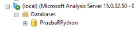

Luego, para crear nuestro modelo tabular, debemos Instalar Microsoft Visual Studio

 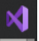

E instalar la extension  “Microsoft Analysis Services Projects” del marketplace de Visual Studio.

Al finalizar la instalación y ejecutar el aplicativo se nos desplegará una pantalla como la siguiente, en la cual elegiremos “Create New Project” 

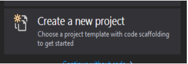

y luego elegimos “Analysis services Tabular Project”

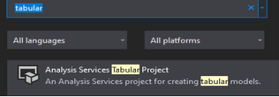

Lo único restante es conectarse al datawarehouse y cargar las tablas que sean necesarias.

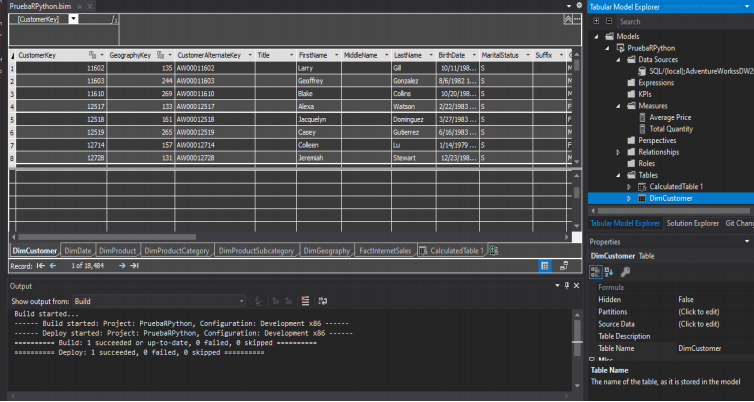

Cómo puede visualizarse, a este modelo lo nombre “PruebaRPython”, dicho nombre me servirá para instanciar las cadenas de conexión con R y Python.

El datawarehouse utilizado es “Adventure Works”, el mismo puede descargarse en la página de documentación oficial de Microsoft. Se descarga como backup y se restaura en SQL Server Management Studio.

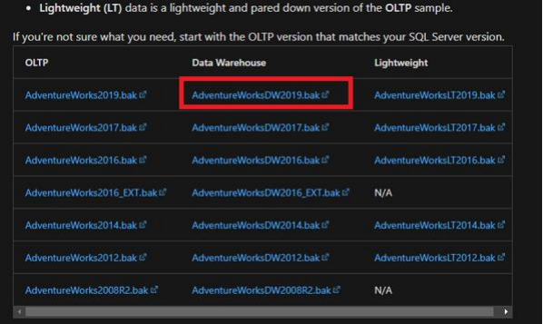

---

# Cómo conectar SSAS Con R?

Para lograr esto, se debe descargar el ide “RStudio” y además la extension “R for Microsoft Client” que permite conectar el modelo tabular con R.

Una vez instalado RStudio, ejecutamos el aplicativo  

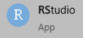

Luego, iniciamos un nuevo proyecto:

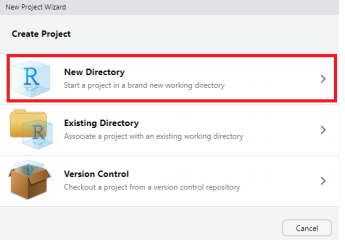

Librerías necesarias: tidyverse, janitor, olapR

Para instalar las librerías se debe ejecutar la instrucción “Install.packages”
Por ejemplo: install.packages(“tidyverse”)
Una vez instaladas las librerías, ejecutamos el siguiente Script:
 
~~~
>library(tidyverse)

>library(janitor)

>library(olapR)

> cnnstr <- "Data Source=(local); Provider=MSOLAP; initial catalog=PruebaRPython"

> ocs <- OlapConnection(cnnstr)

> dax_query <- "Evaluate VALUES(DimCustomer [CommuteDistance])"

>print(df_dax)
~~~

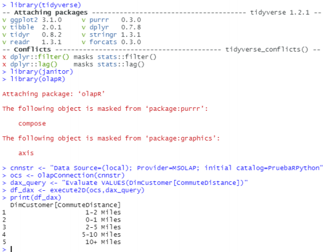

Si bien puede observarse el valor de la variable dax_query es nuestra consulta en formato DAX, lo que hace es consultar un campo de la tabla DimCustomer, podríamos realizar cualquier consulta directamente apuntando a nuestro SSAS, como así también, podríamos automatizar procesos utilizando el dataframe obtenido directamente de nuestro SSAS.

---
# Cómo conectar SSAS Con Python?

Para lograr conectar SSAS con Python en mi caso, descargué Pycharm Community como IDE de desarrollo y Python 3.8. 

Los mismos pueden descargarse en sus respectivas páginas oficiales.

Librerías necesarias: pyadodm, path
Una vez instalados Python 3.8 y Pycharm, ejecutamos Pycharm Community 

Luego, iniciamos un nuevo proyecto:

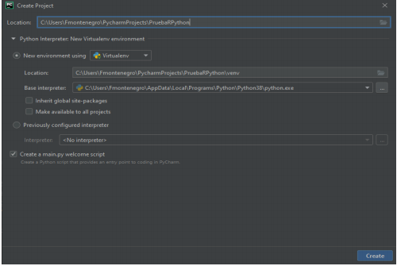

Para instalar las librerías se debe hacer clic en File -> Settings -> “NombreProyecto”: Python Interpreter

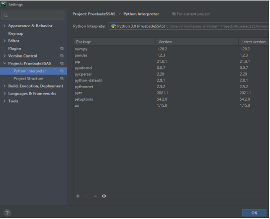

Finalmente, hacemos clic en “+” y buscamos nuestros paquetes a instalar finalizando con clic en “Install Package”:

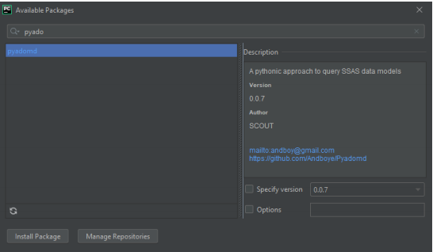

Una vez instalados los paquetes, ejecutamos el siguiente Script:

#Importación de librerías

~~~
from sys import path
path.append('\\Program Files\\Microsoft.NET\\ADOMD.NET\\150')

from pyadomd import Pyadomd

#Cadena de conexión y Query

conn_str = 'Provider=MSOLAP;Data Source=(local);Catalog=PruebaRPython;'

query = """Evaluate DimCustomer"""

#Muestra de resultados
with Pyadomd(conn_str) as conn:
    with conn.cursor().execute(query) as cur:
        print(cur.fetchall())
~~~

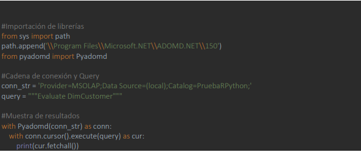

El resultado de seleccionar toda una tabla puede verse en la ventana de resultados:

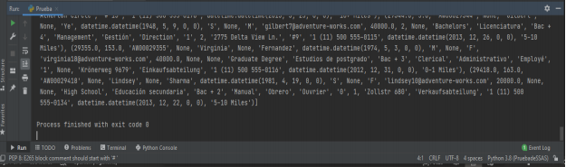

Nota: A diferencia de R, Python trae todos los campos de una tabla al invocar " Evaluate " de la tabla equivale a un " Select * " sin importar el tipo de dato. En R, se debe hacer una especificación o diferenciar en el SSAS los tipos de datos, si no, podría ocurrir algo como esto:

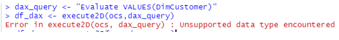
--- 

# Bibliografía

El paquete olapR solo disponible con R client de Microsoft https://docs.microsoft.com/en-us/machine-learning-server/r-client/install-on-windows
https://allentseng92.medium.com/querying-a-ssas-tabular-model-using-r-or-python-1edf46b25c63

https://docs.microsoft.com/en-us/machine-learning-server/r-reference/olapr/olapconnection

https://www.leehbi.com/blog/2019-05-17-Query-OLAP-Cubes-from-R

https://dataveld.com/2020/07/22/python-as-an-external-tool-for-power-bi-desktop-part-3-virtual-environments-and-tom-connection/

https://docs.microsoft.com/en-us/machine-learning-server/r-reference/olapr/olapconnection

https://medium.com/@michalmolka/tabular-model-python-6b2d5af290da

https://docs.microsoft.com/es-es/analysis-services/instances/install-windows/install-analysis-services?view=asallproducts-allversions

https://www.jetbrains.com/es-es/pycharm/download/

https://www.python.org/downloads/

https://pypi.org/project/pyadomd/ 

https://www.rstudio.com/ 

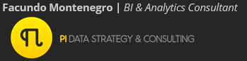