# Power BI - Administrando roles con RLS

Te ha sucedido que un usuario te pide ver sólo la información que le corresponde? Cómo se pueden aplicar filtros para poder controlar la información que pueden ver determinados usuarios?

La respuesta es, con RLS, o mejor conocido Row Level Security (Seguridad a nivel de filas) y lo veremos aplicado con un simple ejemplo.

Consideraciones: 
-Contamos con un proyecto en Power BI Desktop. 
-Contamos con un reporte creado y un workspace configurado en Power BI Service.
  

 
-Comenzamos:  
 
Nos dirigimos a Power BI Desktop dónde tenemos nuestro proyecto desarrollado.

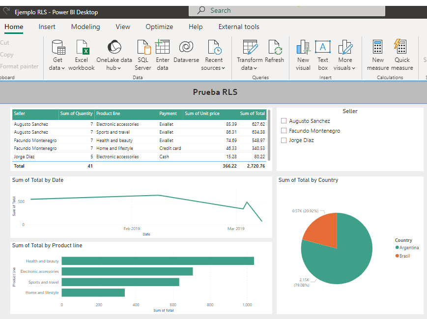

Tenemos nuestro reporte con sus gráficos y sus funcionalidades pero... en el slicer "Seller" podemos ver a tres usuarios diferentes que son de distintos países. Cómo podemos hacer que vean por ejemplo, la información SÓLO de su país?

Se debe hacer clic en Modeling y luego en Manage roles.

Luego definiremos la lógica a utilizar para lograr diferenciar a estos usuarios por países, en este caso, crearemos un rol por cada país.

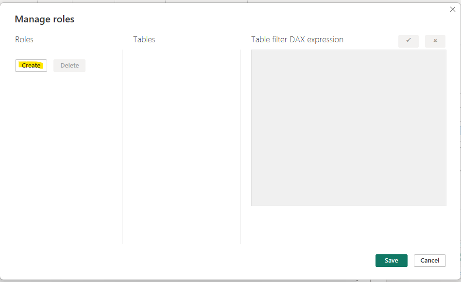

Creamos el primer rol y le agregamos un filtro por país.

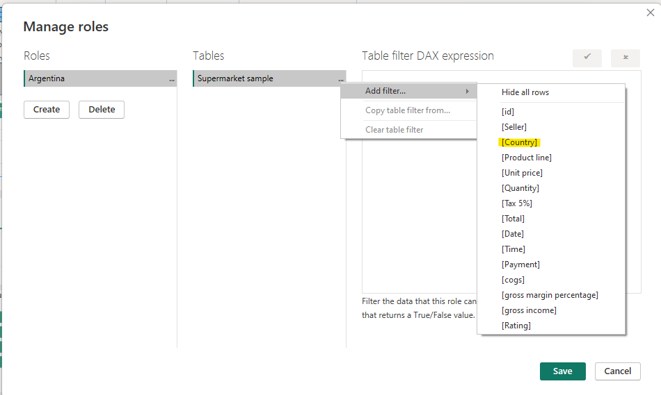

En la expresión, debemos cambiar el "Value" por el nombre del rol por el cuál vamos a filtrar, en este caso, "Argentina"

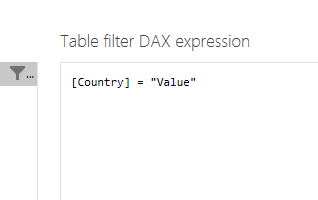

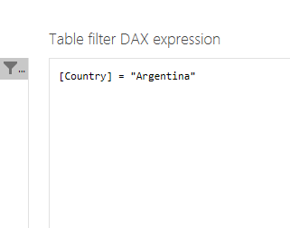

Entonces, continuamos con el siguiente país repitiendo la misma lógica.

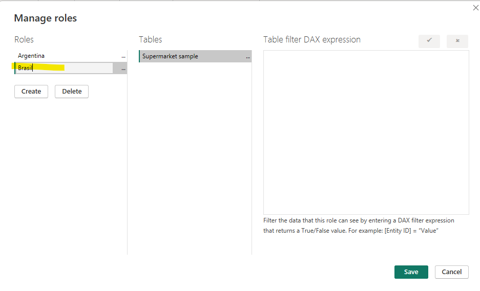

Agregamos el filtro por país.

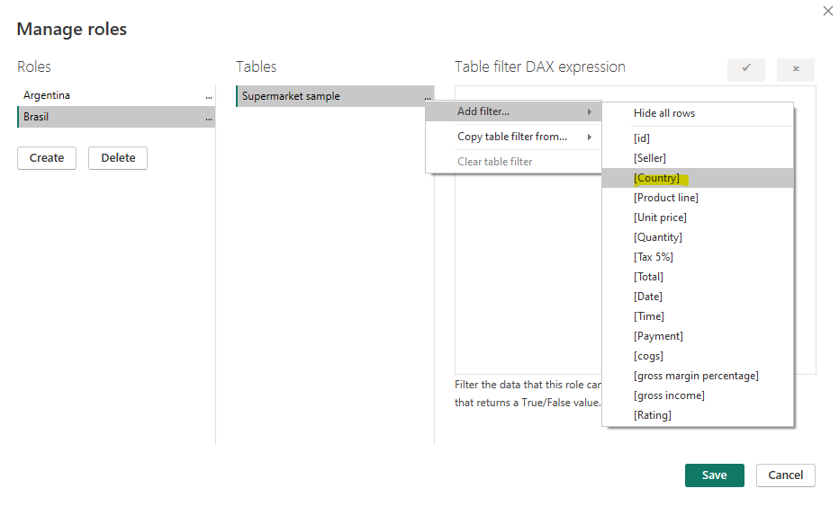

Y cambiamos el valor de la expresión por "Brasil"

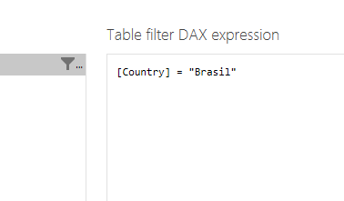

Lo siguiente es guardar los cambios.

Ahora, podemos testear que efectivamente funcionen estas reglas creadas haciendo clic en el botón "View as"

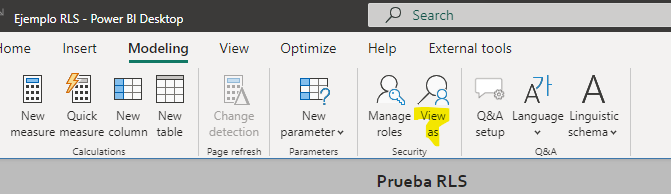

Elegimos uno de los roles para ver y hacemos clic en OK.

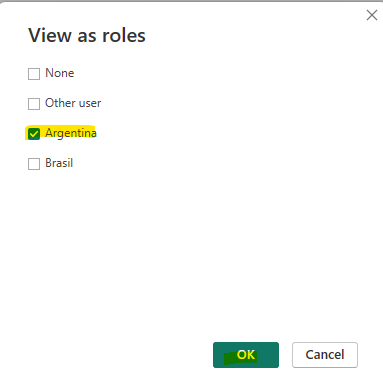

Se puede ver perfectamente que la información está filtrada por los usuarios de un determinado país.

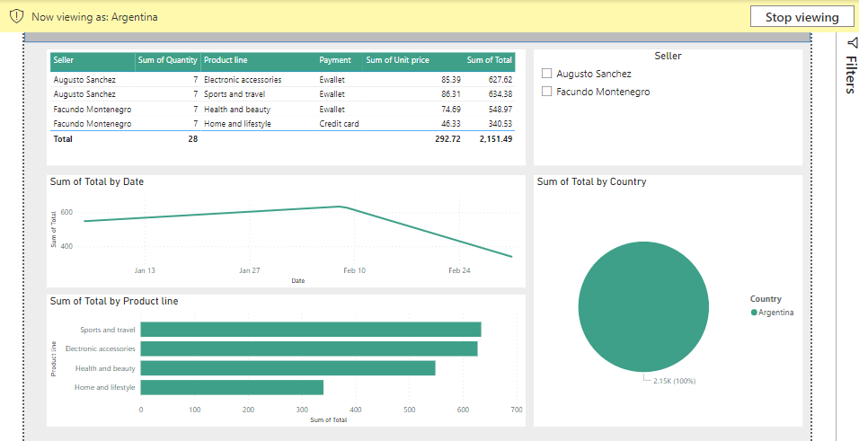

Ahora podemos probar esto Power BI Service publicando los cambios.

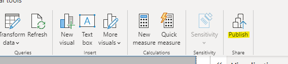

Se hace clic en "Save" para guardar los cambios.

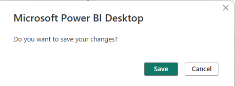

Elegimos el workspace dónde se publicará el reporte y publicamos.

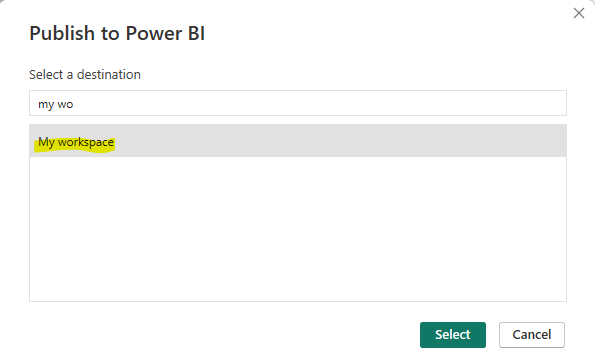

Ahora, nos dirigimos a la web app.powerbi.com e ingresamos nuestras credenciales de usuario.

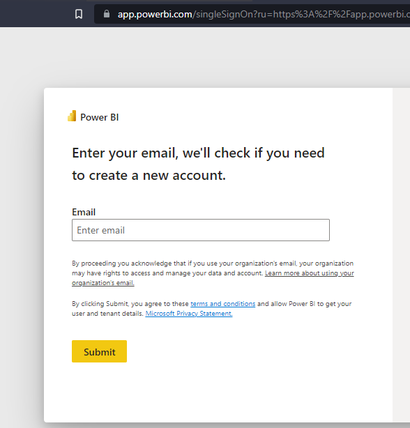

Una vez dentro de Power BI Service, buscamos nuestro workspace y el reporte que publicamos.

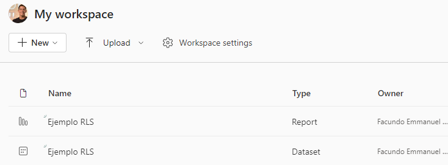

Acercamos el cursor sobre "More options" y buscamos la opción "Security"

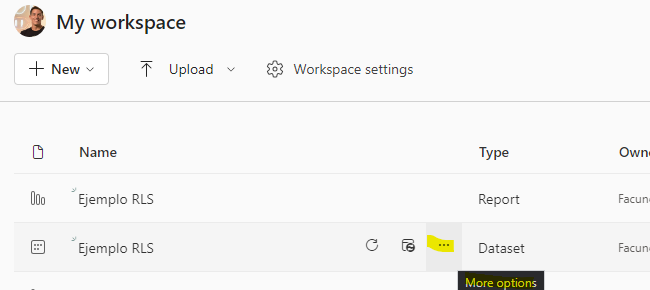

Seleccionamos dicha opción.

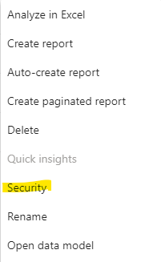

Ahí podremos ver los roles que creamos en Power BI Desktop y podremos agregarle los usuarios de cada rol, en este caso agregamos un usuario de Argentina.

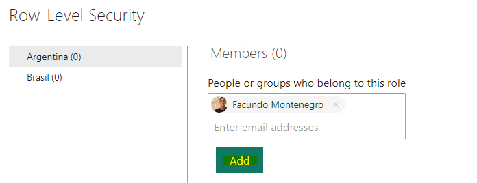

Guardamos los cambios.

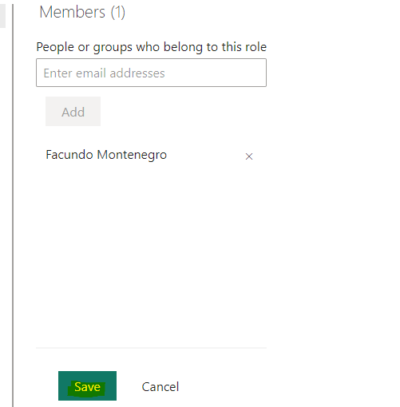

Ahora podremos probar el rol del usuario agregado en "More options"

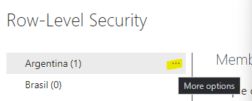

Seleccionamos la opción "Test as role"

Y asi queda configurado el RLS por países.

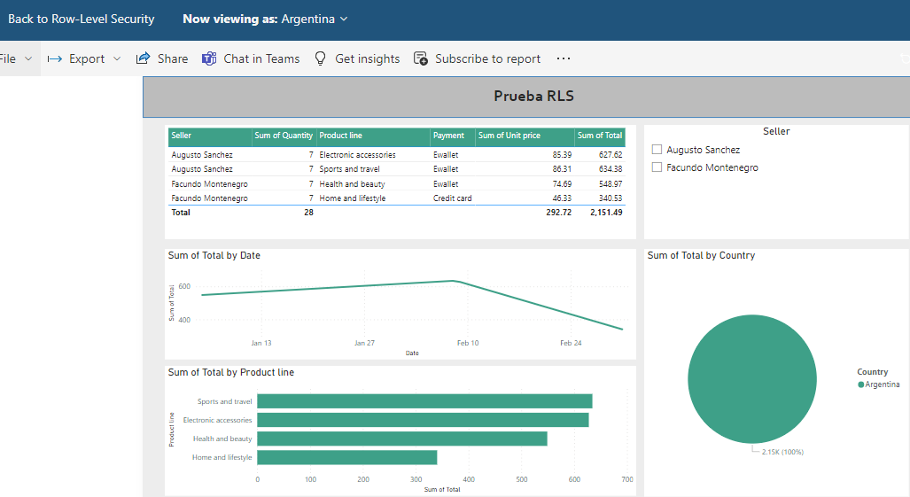

Se pueden seguir agregando filtros o definiendo nuevos roles para controlar el RLS de una manera más estricta y volver más complejo el dominio.

Se adjunta el archivo .pbix a la solución.

 

# Bibliografía

https://app.powerbi.com/

https://learn.microsoft.com/en-us/power-bi/enterprise/service-admin-rls

---

By **Facundo Montenegro**
