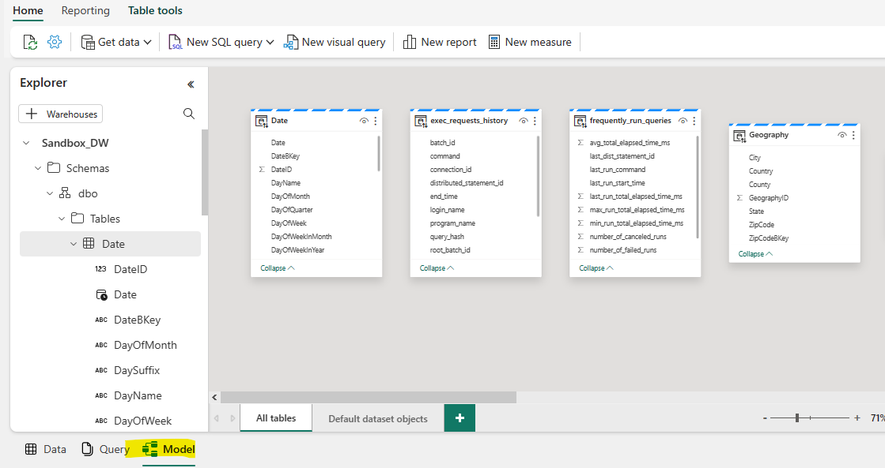
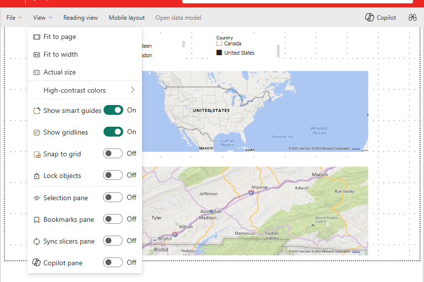

# Navegando por Synapse Data Warehouse en Fabric - Principales features y novedades

En este post estaremos explorando algunas de las características de Synapse Data Warehouse en Fabric con un sample. Novedades y qué se puede hacer en este producto de Fabric. 

Consideraciones: 
-Se debe contar con una suscripción de Fabric y acceso al workspace. 

 
-Comenzamos:  

Nos logueamos con nuestro usuario en https://app.powerbi.com/

Una vez que se inició sesión, en el margen inferior izquierdo de productos se selecciona la opción "Data Warehouse"

Esta opción nos permite conectarnos al Synapse Datawarehouse integrado a Fabric.

Crearemos un Data Warehouse de Sample con el nombre "Sandbox_DW"

Al mismo tiempo utilizaremos un sample disponible para este warehouse que ingestará la data y tendremos una vista de la herramienta como la siguiente:

A simple vista, podemos ver un front muy similar a Power Query, la diferencia es que, no podemos aplicar transformaciones directas a los datos que persisten en el Data Warehouse a menos que, lo hagamos con SQL y no con M.

<h2>Querys en el Data Warehouse</h2>

Cómo podemos hacer querys en SQL directo al Datawarehouse? Sencillo, Seleccionamos la opción "New SQL Query"

Elegimos una Blank New SQL Query.

Una vez que tenemos la nueva query, podemos escribir la siguiente consulta basado en la información que provee la tabla [Sandbox_DW].[dbo].[Geography]
~~~
SELECT * FROM
[Sandbox_DW].[dbo].[Geography]
WHERE Country = 'Canada'
~~~

<h2>Modelo de datos</h2>

En el margen inferior izquierdo de la pantalla encontramos la opción "Model" Que nos permite visualizar nuestras tablas del Datawarehouse.

Esta nueva función de visualización de datos es una innovadora característica del modelo semántico que se encuadra bajo el modo **"Direct Lake"** que nos permite analizar grandes volúmenes de datos en Power BI.

Si hacemos clic en la opción de los puntos suspensivos en el extremo superior de la tabla, se despliega el siguiente panel de opciones que nos permite crear medidas DAX  en la tabla, ocultar la tabla y sus campos.

Podemos crear una medida sobre una tabla. Por ejemplo, creamos la medida SMLY sobre la tabla Date.

Pero sin dudas, la feature más novedosa es la posibilidad de realizar el modelamiento de datos, lo cuál nos evita la creación de un modelo tabular cómo podria ser utilizando un SQL Server Analysis Services (SAAS)

Por ejemplo, arrastramos el campo DateId de la tabla Trip a la tabla Date para matchear con el campo DateId y asi generamos una relación many-to-one. Hacemos lo mismo con la tabla Geography.

Con esas simples acciones ya tendremos los datos de las tablas relacionados y podremos generar un reporte.

<h2>Reporting</h2>

Si nos posicionamos por debajo del nombre del Warehouse, podremos encontrar la opción de Home y Reporting. Seleccionamos reporting y luego hacemos clic en "New Report"

Lo que visualizamos ahora es, la herramienta de desarrollo de Power BI pero embebido en Synapse Data Warehouse. Por lo cual, podemos pasar a crear algunas visualizaciones de prueba con nuestra data almacenada en el Data Warehouse.

Por ejemplo, visualizamos las ciudades y paises de la tabla Geography con sus respectivos filtros.

Como se puede ver en la imagen, están presentes casi todas las funciones que existen en Power BI Desktop.

Inclusive vemos el formato para las visuales.

Algunas features interesantes como la inclusión de Copilot, explorar la data, agregar formas, editar interacciones y hasta 
analizar la data en Excel.

Una vez finalizado el diseño del dashboard, podemos guardar nuestro reporte y publicarlo en un Workspace al cual tendremos acceso.

<h2>Summary</h2>

Para resumir un poco la información sobre esta pequeña review, nos deberiamos hacer la siguiente pregunta.. ¿Podemos hacer todo un proceso end-to-end de data en Synapse Data Warehouse en Fabric? Exceptuando la orquestación de datos, la respuesta es **CASI**. Cómo bien lo dice el nombre del producto "Data Warehouse" tenemos la data almacenada en un DW lista para ser consumida y analizada. Pero cuál es la ventaja que agrega respecto de utilizar los productos de manera individual? Claramente la **comodidad** de la integración de aplicaciones. Tenemos la información en tablas que se pueden manipular con SQL, de ahi podemos pasar a modelar los datos y, como si fuera poco, realizar Dashboards de Power BI. un Combo muy interesante y que aún no ha mostrado todo su potencial, pero que, seguramente será muy utilizado en el corto-mediano plazo.

----------------------------

# Bibliografía

https://azure.microsoft.com/es-es/products/synapse-analytics

https://blog.fabric.microsoft.com/en-US/blog/introducing-synapse-data-warehouse-in-microsoft-fabric/

https://www.pythian.com/blog/understanding-the-differences-between-azure-synapse-analytics-and-microsoft-fabric

https://learn.microsoft.com/es-es/power-bi/enterprise/directlake-overview

---

By **Facundo Montenegro**
