# Fabric - Como trabajar con notebooks en PySpark SQL

En este post estaremos trabajando con un archivo .CSV como un dataframe y le aplicaremos transformaciones SQL, finalmente, lo guardaremos como una tabla Delta usando un ejemplo sencillo.

Consideraciones: 
-Se debe contar con una suscripción de Fabric y acceso al workspace. 
-Se debe contar con un Lakehouse y workspace de Data engineering configurado. 
-Se omite creación de Lakehouse. 

 
-Comenzamos:  

Nos logueamos con nuestro usuario en https://app.powerbi.com/

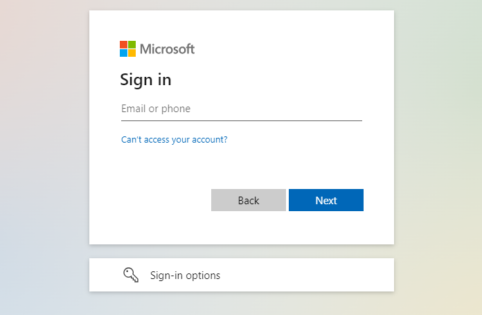

Una vez que se inició sesión, en el margen inferior izquierdo de productos se selecciona la opción "Data Engineering"

Esta opción nos permite conectarnos al espacio de ingeniería de datos integrado a Fabric.

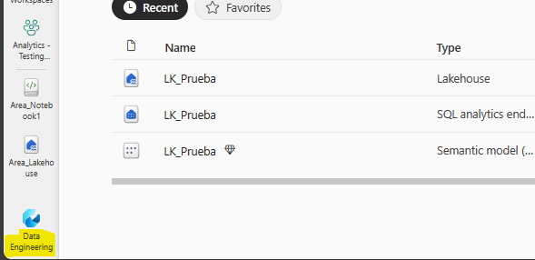

Ahí buscaremos nuestro Lakehouse nombrado "Lk_Prueba"

Qué es el Lakehouse de Fabric? 

Microsoft Fabric Lakehouse es una plataforma de arquitectura de datos para almacenar, administrar y analizar datos estructurados y no estructurados en una única ubicación. Es una solución flexible y escalable que permite a las organizaciones manejar grandes volúmenes de datos utilizando diversas herramientas y marcos para procesar y analizar esos datos. Combina la tecnología de Data Lake y Data Warehouse.

Nos ubicamos sobre el Lakehouse de prueba en cuestión y veremos dos carpetas una llamada "Tables" que pertenece a las tablas de SQL y otra llamada "Files" por dónde se pueden cargar files de manera manual. Aquí, cargaremos de manera manual nuestro archivo .CSV 

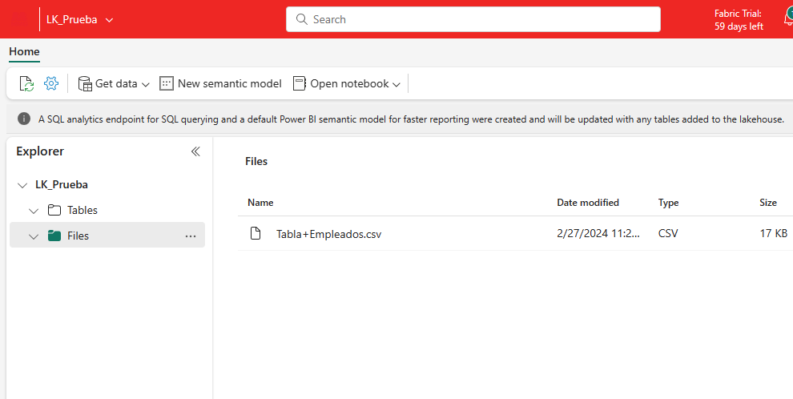

Haciendo clic en [Get Data --> Upload files] cargamos nuestro archivo .CSV de manera manual. El mismo es "Tabla+Empleados.csv"

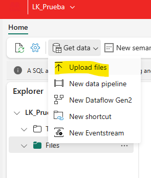

Luego, procedemos a crear nuestro Notebook para transformar nuestro archivo .csv

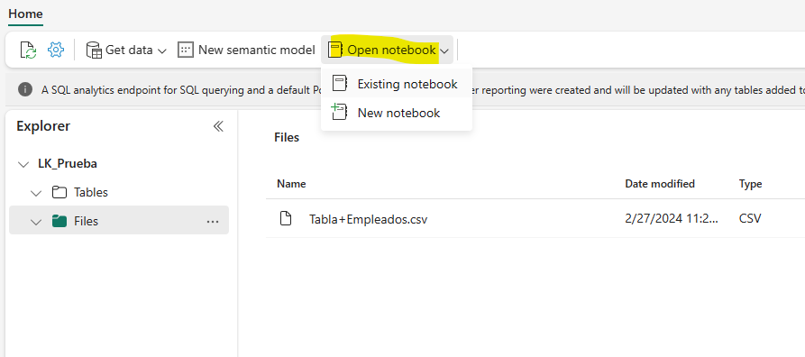

Nuestro notebook se llamará "SQL Empleados" y comenzaremos seteando variables de inicio para tomar el path del archivo del Lakehouse con el siguiente script: 

~~~
#Setear path del lakehouse
LAKEHOUSE_PATH = "su ruta"
START_DATE = "2024-01-20 18:00:00"
END_DATE = "2024-01-31 18:00:00"
ETL_EXECUTIONDATE = "20240126"

print(f"LAKEHOUSE_PATH: {LAKEHOUSE_PATH}")
print(f"START_DATE: {START_DATE}")
print(f"END_DATE: {END_DATE}")
print(f"ETL_EXECUTIONDATE: {ETL_EXECUTIONDATE}")
~~~

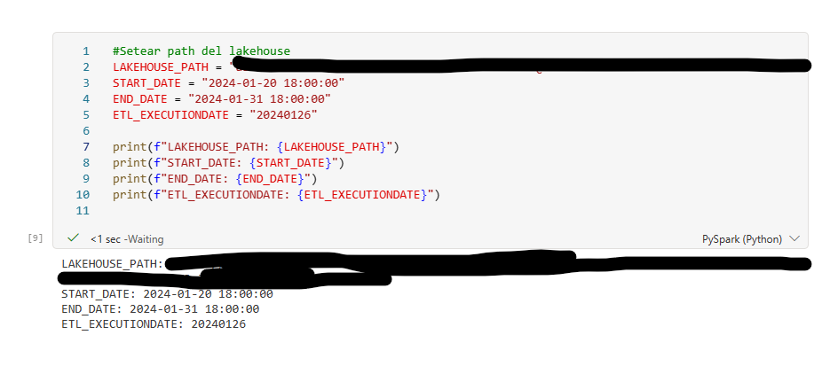

Luego, declaramos nuestro dataframe y tomamos el archivo csv:

~~~
#declaramos el dataframe y tomamos el archivo csv
df = spark.read.csv(LAKEHOUSE_PATH, header=True, inferSchema=True)
print(df)
~~~

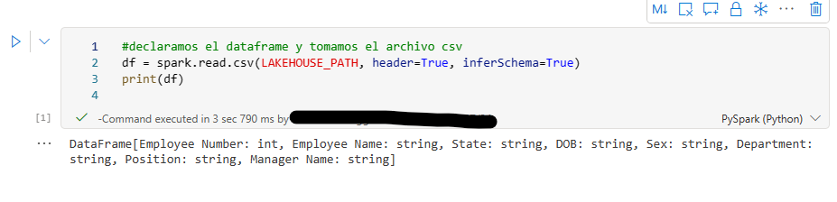

Ahora, creamos un tabla temporal:

~~~
# Registrar el DataFrame como una tabla temporal
df.createOrReplaceTempView("Tabla_Empleados")
~~~

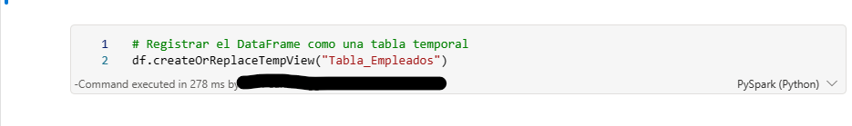

Ahora, ejecutamos una consulta Select con todos los campos de la tabla para verificar que estamos trayendo la data del archivo .csv pero ahora como una tabla de SQL:

~~~
# Ejecutar consultas SQL sobre el DataFrame
resultado = spark.sql("SELECT * FROM Tabla_Empleados")
resultado.show()
~~~

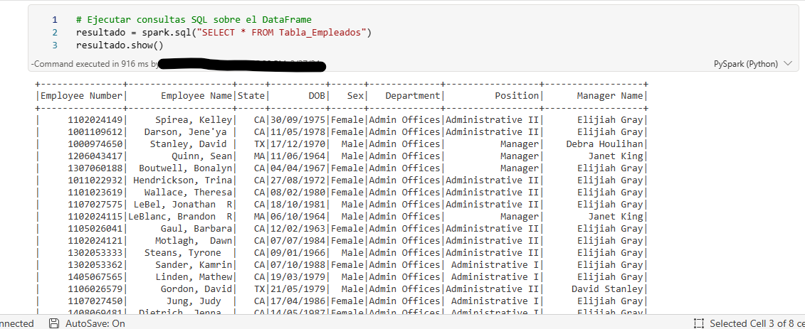

Ahora, podemos renombrar columnas de la tabla con el siguiente script:

~~~
from pyspark.sql.functions import to_date
#Renombrar columnas
resultado1 = resultado.withColumnRenamed("Employee Number","Employee_Number")  \
            .withColumnRenamed("Employee Name","Employee_Name")  \
            .withColumnRenamed("Manager Name","Manager_Name")
resultado1.show()
~~~

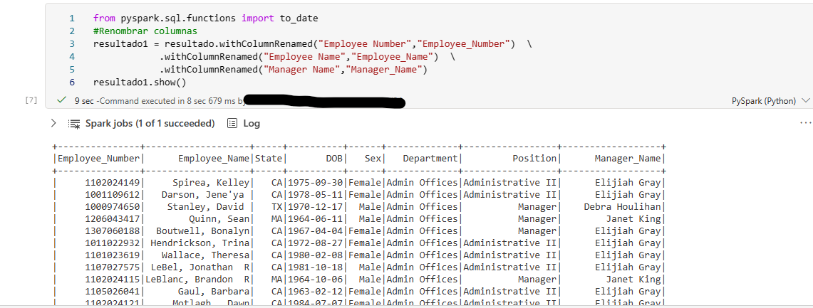

Ahora podemos realizar un cambio en las fechas con la función "to_date" realizando el siguiente código : 

~~~
from pyspark.sql.functions import regexp_replace, to_date
#Reemplazamos / por - en las fechas de la columna DOB 
resultado_final = resultado1.withColumn("DOB", to_date(regexp_replace("DOB", "/", "-"), "dd-MM-yyyy"))
resultado_final.show()
~~~

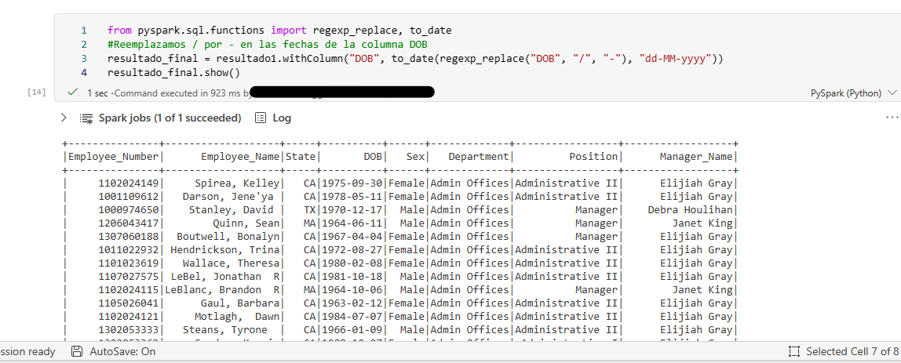

Finalmente, procedemos a guardar nuestra tabla creada en el formato "delta" con el siguiente código:

~~~
# Guardar el DataFrame como una tabla Delta
resultado_final.write.format("delta").mode("overwrite").saveAsTable("Tabla_Empleados")
~~~

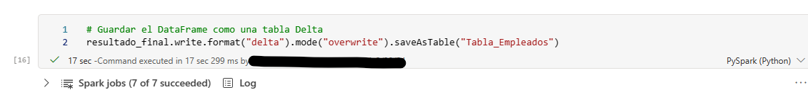

Si volvemos al lakehouse, podemos ver que ya tenemos nuestra tabla delta transformada y almacenada correctamente teniendo en cuenta que partimos desde un simple archivo .CSV:

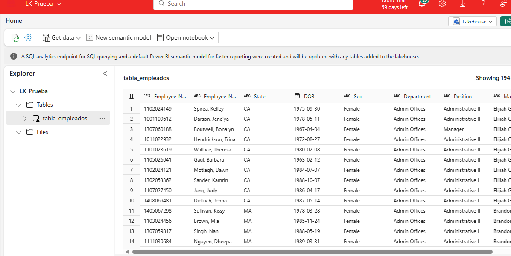

Ventajas de utilizar Fabric para este caso?

* Tenemos la integración de Synapse y Data Lakehouse.
* No necesitamos utilizar Databricks para transformar nuestros archivos, se puede hacer toda la limpieza y transformación desde los notebooks y podemos guardar nuestra data en tablas delta.
* Esta data puede ser consumida por cualquier integrante/member que tenga acceso al workspace.
* Una gran ventaja de utilizar delta tables es la integración con Spark y la eficiencia en las operaciones tanto de lectura como también de escritura.
----------------------------

# Bibliografía

https://azure.microsoft.com/es-es/products/synapse-analytics

https://learn.microsoft.com/en-us/fabric/data-engineering/lakehouse-overview

https://learn.microsoft.com/en-us/fabric/data-engineering/lakehouse-and-delta-tables

https://www.serverlesssql.com/delta-change-data-feed-in-fabric-lakehouses/

https://learn.microsoft.com/en-us/training/paths/get-started-fabric/

---

By **Facundo Montenegro**
