# Delta Tables - Importar Delta Tables de Databricks en Power BI  - Parte 1 

Hace tiempo se viene utilizando el delta lake como formato de almacenamiento y capa de gestión de transacciones reemplazando al antiguo Apache parquet, si bien tienen similitudes, no son lo mismo.

En este post veremos como cargar un archivo .CSV desde un Azure datalake Gen 2, transformarlo en databricks y guardarlo en una tabla delta, finalmente, lo tomaremos en Power BI desde el server de Databricks y en otro post, veremos como tomarlo desde el mismo datalake.

Consideraciones: 
-Contar con un workspace de Databricks.  
-Contar con un blob storage. 
-Contar con un punto de montaje realizado en Databricks.  
-Contar con recursos de Databricks  y Data lake Gen 2 creados en Azure. 
-Contar con un cluster o unidad de computación configurada en Databricks.
  

 
-Comenzamos:  
 
Nos dirigimos al portal Azure y hacemos el login en https://portal.azure

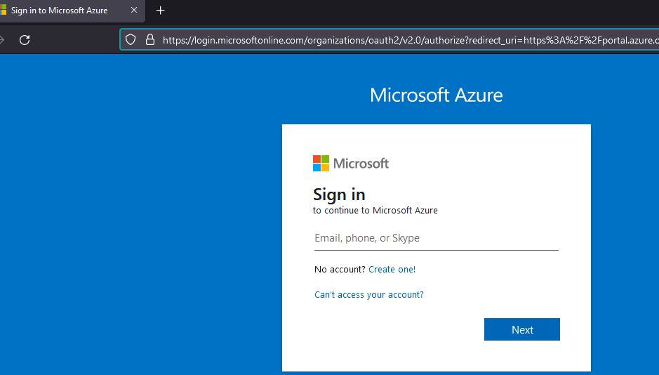

Buscamos nuestro Storage account, en nuestro caso "mvpdemos"

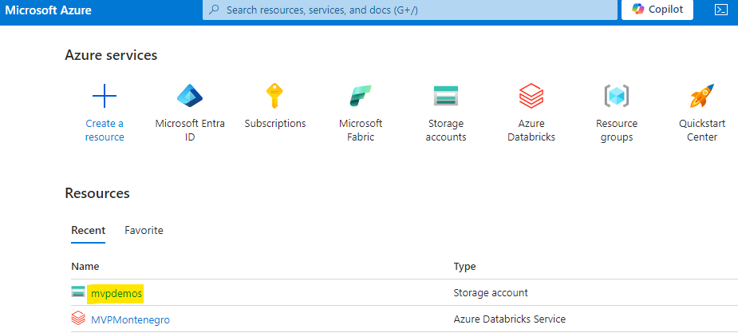

Nos dirigimos a Containers, una vez dentro, buscaremos landing que contiene nuestro archivo (Este mismo proceso se puede hacer desde la herramienta Azure Storage Explorer)

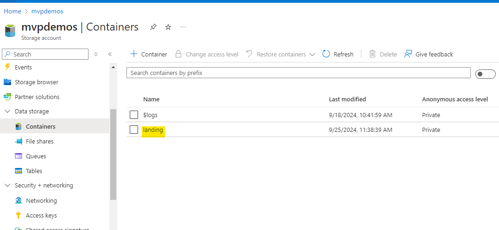

Una vez dentro de landing, podemos ver nuestro archivo "Movies_data.csv"

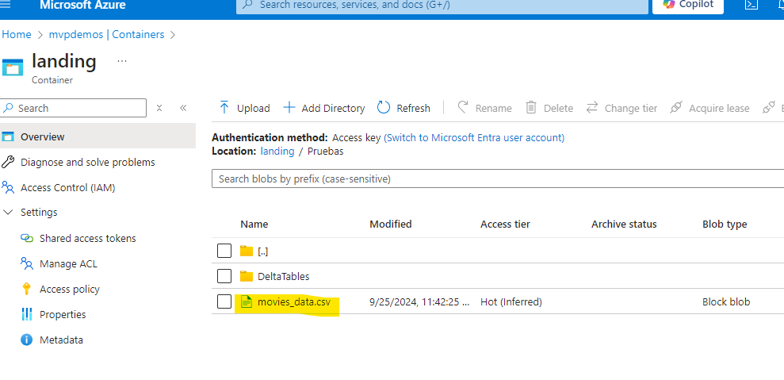

Una vez verificado nuestro archivo, iremos a nuestro recurso Azure databricks que lo lanzaremos desde el portal Azure.

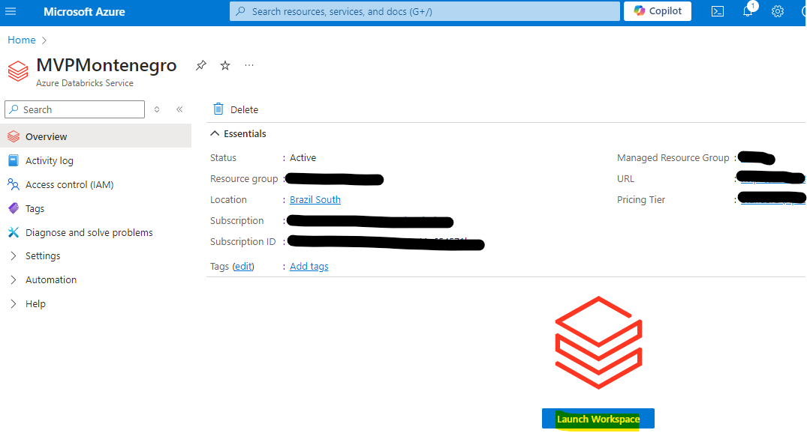

Una vez dentro de Databricks, crearemos un notebook que tomará  el archivo csv alojado en el datalake y comenzaremos a transformarlo con PySpark.

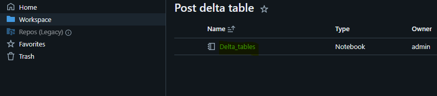

Importamos todas las funciones necesarias, declaramos el path de source, el path de destination y leemos el archivo csv, finalmente hacemos un display() para mostrarlo.

<pre><code>
import pyspark
from pyspark.sql.functions import *
from pyspark.sql.functions import col
from pyspark.sql.types import *
import re
from pyspark.sql.functions import monotonically_increasing_id
import pyspark.sql.functions as F  
from pyspark.sql.types import StructType, StructField, StringType, IntegerType, LongType

#Declaración del path del datalake en una variable 

FullSource = '/mnt/landing/Pruebas/movies_data.csv'
FullDestination = '/mnt/landing/Pruebas/DeltaTables/Movies'
#Lectura del path con PySpark

DF_Movies = spark.read.format("csv") \
                .option("header", "true") \
                .option("inferSchema", "true") \
                .option("delimiter", ",") \
                .load(FullSource)

display(DF_Movies)

</code></pre>

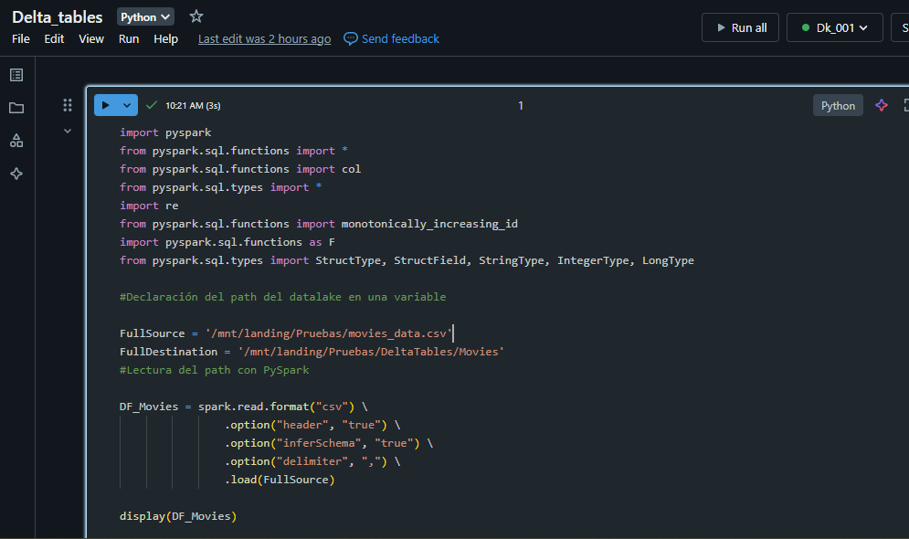

Resultado del display().

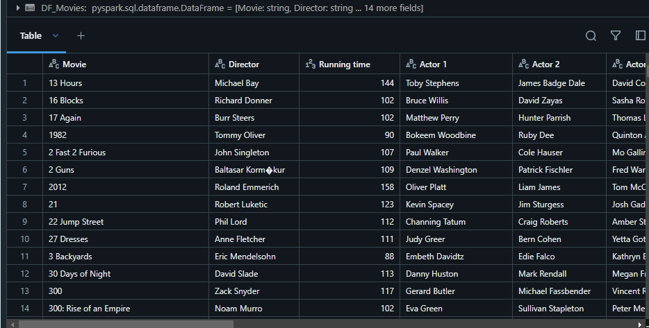

Luego, continuamos tomando solo las columnas que necesitamos.

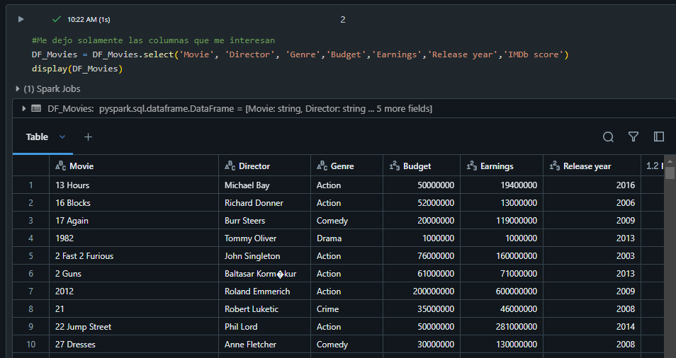

Aparecen caracteres especiales en la columna Director, por lo que, utilizamos la función regexp para reemplazar estos caracteres.

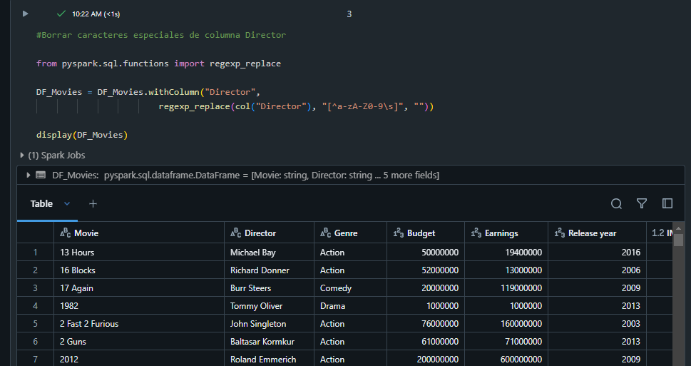

Luego, borramos los espacios en blanco de las columnas.

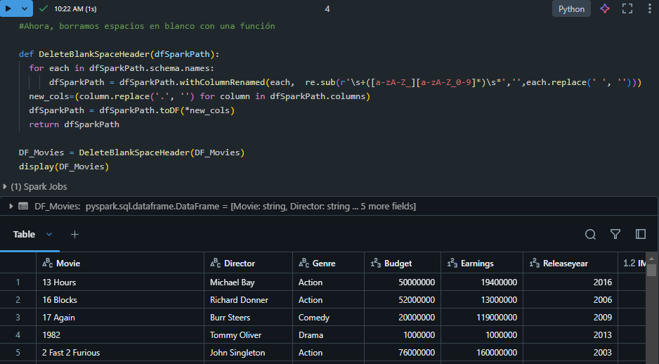

Definimos el diccionario de datos de las columnas con el nombre final y mostramos el dataframe.

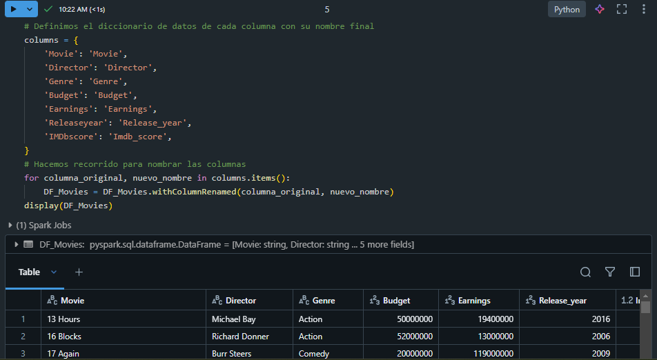

Vemos el resultado del dataframe.

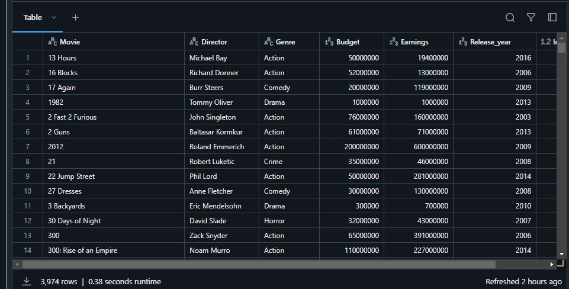

Verificamos el schema con sus columnas y tipos de datos.

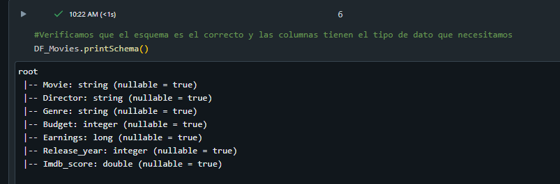

Ahora, de los pasos mas importantes, creamos el esquema dentro del Catálogo de Databricks que va a direccionar la ruta del lake.

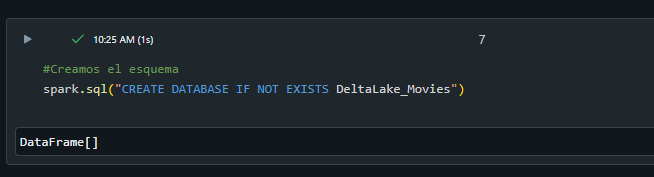

Finalmente, guardamos nuestro dataframe en una tabla delta.

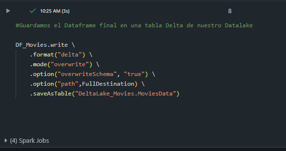

Ahora vamos al catálogo y verificamos que nuestra tabla existe.

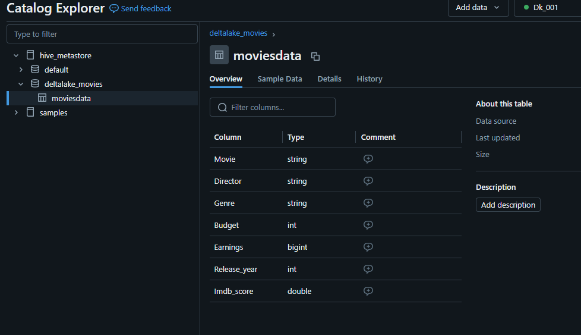

Podemos ver en los detalles de la tabla que nuestra tabla delta está almacenada en el datalake en la ruta que especificamos.

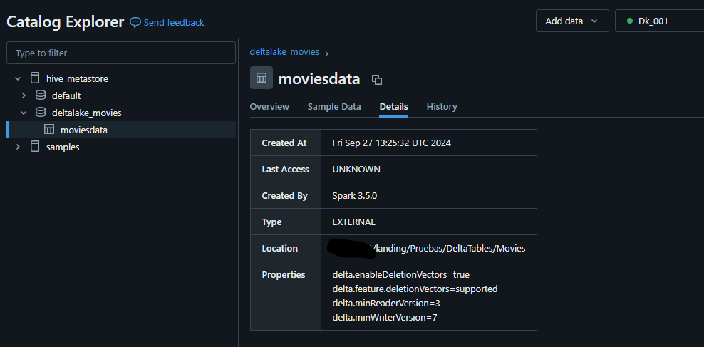

# Cómo importamos estos datos en Power BI?

En esta segunda entrega, lo que haremos será, importar los datos utilizando una función para tratar Delta Tables y conectando directamente con el data lake storage gen 2:

**Adjunto la función en un .txt dentro de los files de la carpeta de solución.**

Debemos crear una query en blank con la función con nombre "ReadDeltaTable" y luego crear otra Query para invocar esta misma función.

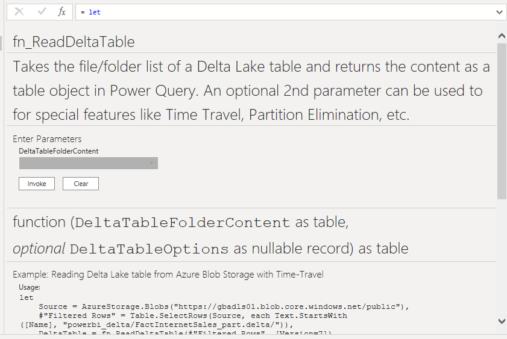

A la nueva query le pondremos de nombre "Movies" y el código que escribiremos invocando a la función "ReadDeltaTable" en el editor de consultas será este: 

<pre><code>

let
    RutaBlob = AzureStorage.DataLake("Debe insertar la dirección de su blob storage),
    Origen = ReadDeltaTable(RutaBlob, [])
 

in
    Origen
</code></pre>

Finalmente, podemos verificar que la función impactó correctamente y se puede leer la delta table en Power BI.

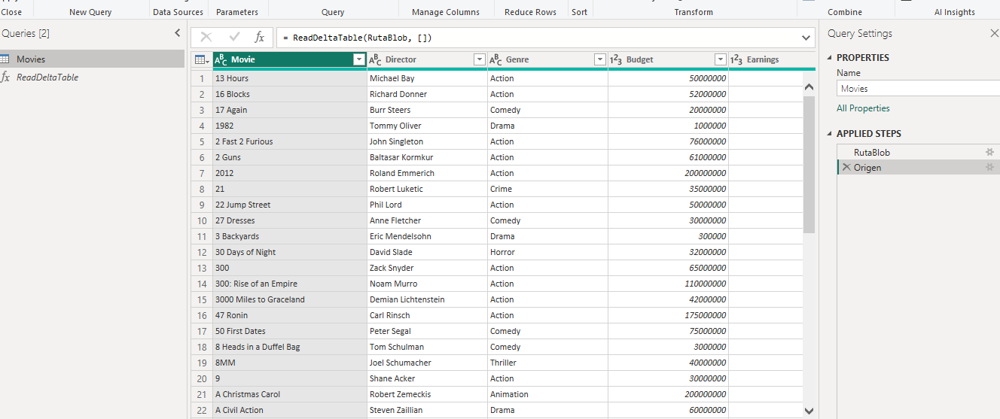

**Importante**!!! la versión del conector de Power BI solo soporta delta tables hasta la version 2. Es probable que la versión sea superior en las delta tables que utilizamos en Databricks, en dicho caso, es necesario ingresar al json inicial y modificar el protocolo "a mano"

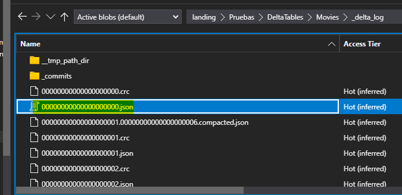

Aquí se modifica el protocolo, con cuidado, se debe tener en cuenta en caso de que surgieran problemas al trabajar luego con una versión anterior de minreader. Una opción alternativa, es tomar el ultimo archivo parquet generado por la delta table utilizando un filtro en Power Query.

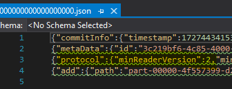

# Síntesis

En resumen, lo que hicimos fue, cargar un archivo en el blob storage landing, este archivo csv lo leímos en databricks (cabe destacar que ya teníamos el lake montado) y comenzamos a transformarlo como un dataframe, y luego lo guardamos en una tabla delta que redirecciona al datalake, esto en cuanto a transformación.  
Finalmente, para cargarlo en Power BI, creamos una función con un código que ya se encuentra documentado, invocamos esa función en Power Query y luego, creamos nuestra tabla con el último archivo delta generado de manera automática.

Podríamos automatizar este proceso si tengo que hacer varias cargas?
Claro! Utilizando Data Factory podemos crear pipelines que realicen este mismo proceso para una secuencia de archivos determinada o indeterminada.

 

# Bibliografía

https://app.powerbi.com/

https://www.databricks.com

https://portal.azure

https://blog.fabric.microsoft.com/es-AR/blog/

https://learn.microsoft.com/en-us/azure/databricks/partners/bi/power-bi

https://learn.microsoft.com/en-us/azure/storage/blobs/data-lake-storage-introduction

https://github.com/orgs/delta-io/repositories

---

By **Facundo Montenegro**
