# Fabric - Integración PBI con Azure DevOps usando GIT

Hace meses se generó una gran revolución con la aparición de Fabric como una plataforma integral para el desarrollo de proyectos de Data, pero hace unos pocos meses se generó algo totalmente disruptivo: su integración con Git. Ahora los Analistas de BI son DEVs? Los Data Engineer también son DEVs?

En este post veremos como utilizar Fabric integrado a Git realizando versionados de nuestro código con un reporte de PBI y con un ejemplo sencillo. 

Consideraciones: 
-Se requiere contar con una capacidad de Fabric  
-Contamos con un reporte creado y un workspace configurado. 
-Se requiere contar con una organización creada en Azure DevOps  
-La organización debe estar asociada al Workspace de Fabric
  

 
-Comenzamos:  
 
Nos dirigimos a Fabric y hacemos el login en https://app.powerbi.com/

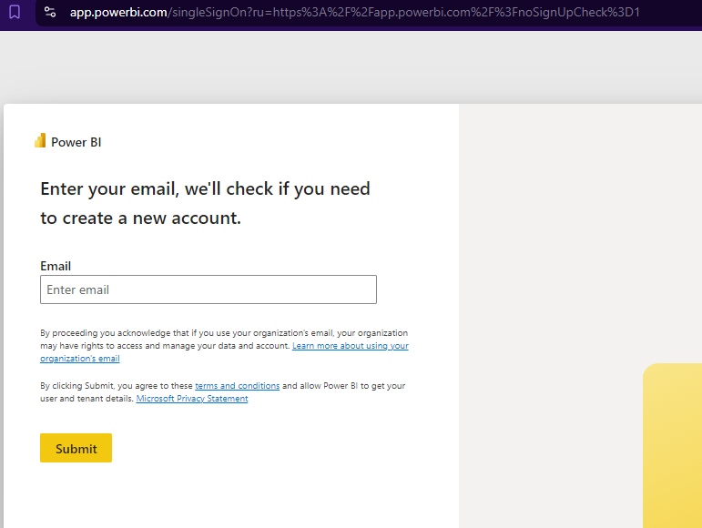

Usamos nuestras credenciales para ingresar a Fabric.

Una vez que ingresemos, buscaremos nuestro reporte en el workspace correspondiente (En este caso, el reporte es "DemoFabric" en el Workspace "Demo_Git")

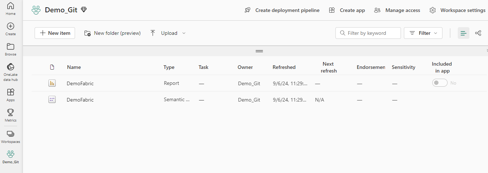

Ahora seleccionamos las settings del Workspace y verificamos su conexión con Azure DevOps.

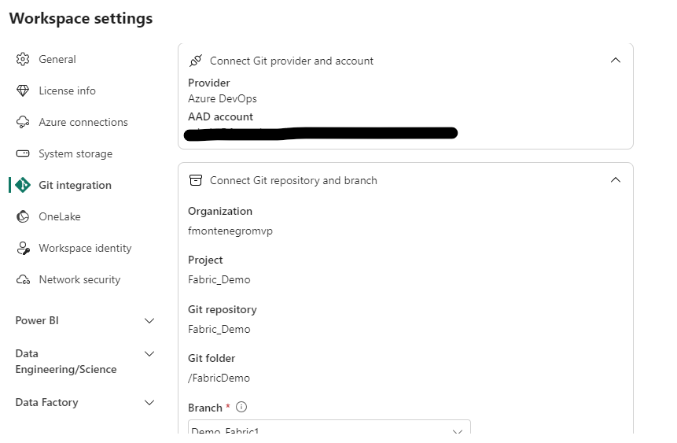

Una vez que el workspace está conectado y sincronizado con el repositorio de Azure DevOps, veremos nuestro versionado de código y el status de cada item del Workspace.

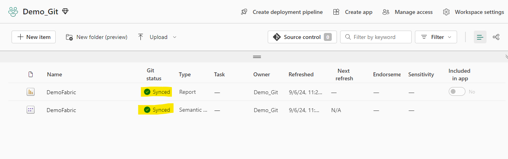

Como puede verse, el item está sincronizado. Podemos visualizar además, los últimos cambios realizados en "Source control"

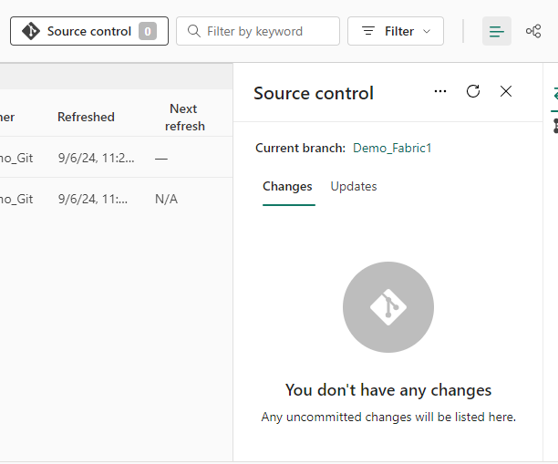

Como se ve, no hay ningún cambio realizado, ahora.. Cómo hacemos para agregar un cambio en este reporte de Power BI y versionarlo?

Abrimos nuestro reporte en Power BI Desktop.

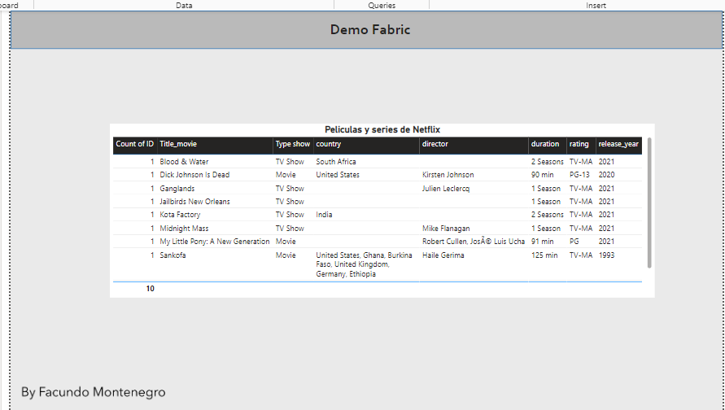

Lo que haremos en este reporte será quitar la columna "Count of ID" de la tabla y pondremos todos los titulos de columnas en mayúscula.

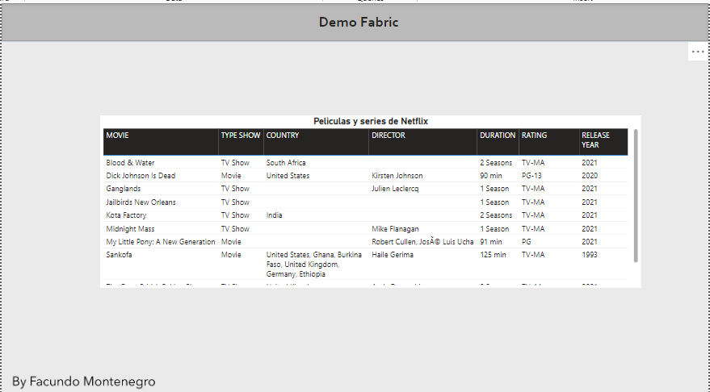

Guardamos nuestro reporte y publicamos en el workspace que estamos trabajando.

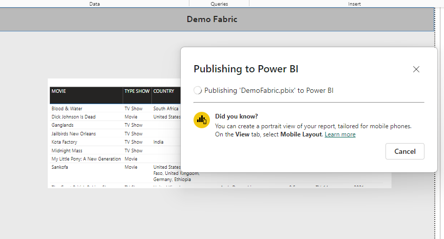

Nos dirigimos nuevamente a Fabric en la web y podremos ver que pasó algo en el status del reporte... se guardaron cambios publicando pero estos no han sido reflejados  en la versión final por que no se hizo aún el commit trabajando desde nuestra branch.

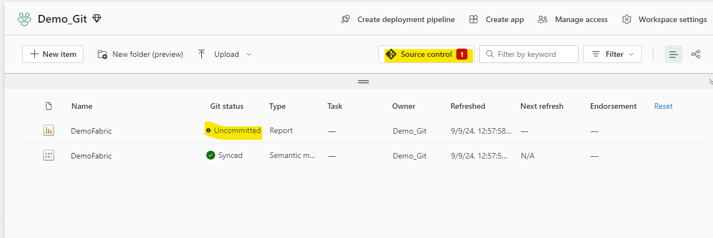

Veamos... Primero hay qué definir qué es un <b>commit</b> y una <b>branch</b> y luego <b>qué debemos hacer</b> para que la versión que publicamos se refleje en la app de Fabric. 

<b>Qué un commit?</b> 
En el contexto de versionado de código, commit es una acción que registra los cambios de los archivos en un momento determinado y permite rastrear un histórico con un identificador (Hash)

<b>Que es una branch?</b> 
Es una línea de desarrollo que permite trabajar en una versión separada sin afectar la rama principal (main) 

Entonces.... teniendo estos conceptos en mente, lo que haremos será realizar el commit desde Source control:

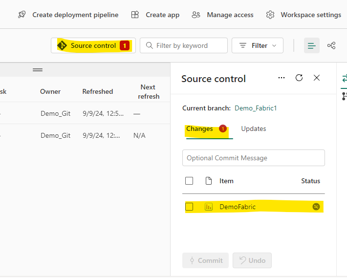

Seleccionamos el item y dejamos un comentario sobre el cambio que realizamos.

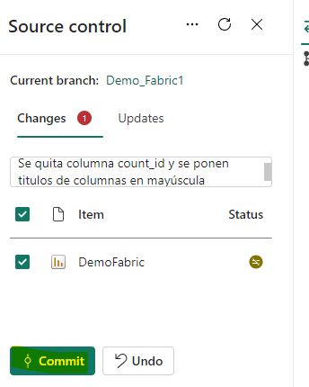

Listo! Tenemos nuestro item sincronizado con el último cambio. Ahora... esto es todo? <b>No, falta aún crear el pull request en Azure DevOps.</b>

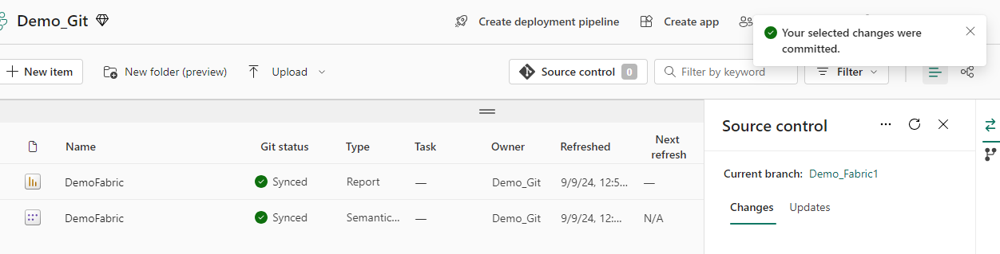

Nos dirigimos entonces a Azure DevOps y nos logueamos con nuestra cuenta.

Allí podremos ver los commits realizados en el proyectos y podemos ver el último cambio realizado sobre nuestro reporte.

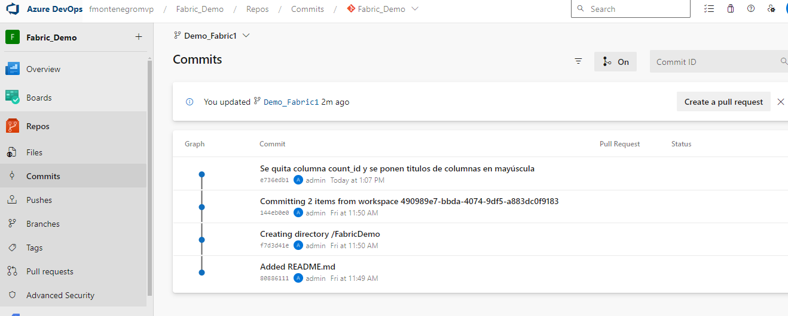

Lo que debemos hacer ahora es crear un pull request para agregar esta rama de desarrollo propia (branch) a la rama principal (main)

<b>Qué es un pull request?</b>
Es un petición de cambios en un repositorio de código, un desarrollador crea un pull request que solicita al reviewer que revisen y consideren la incoporación de nuevos cambios a la rama principal.

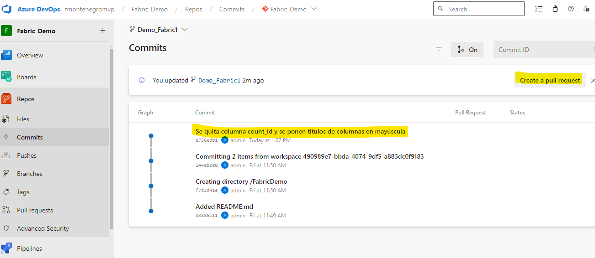

Al crear el pull request, verificamos que nuestra branch se unirá a la rama principal y especificamos los detalles de los cambios realizados.

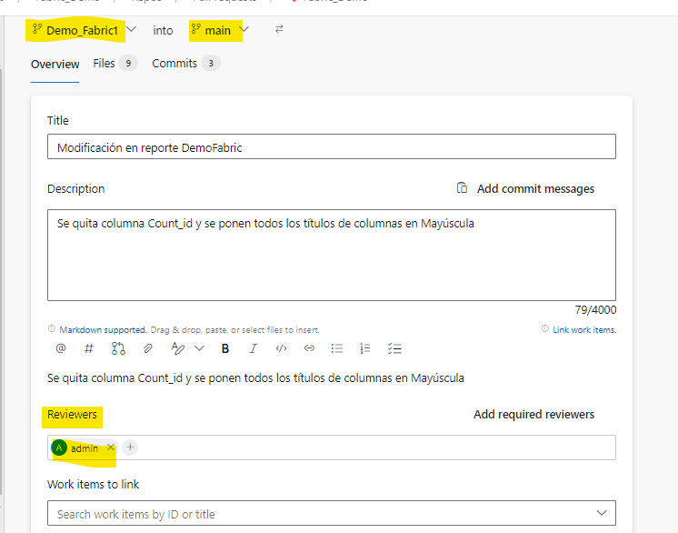

Finalmente, creamos el pull request esperando que el reviewer lo apruebe.

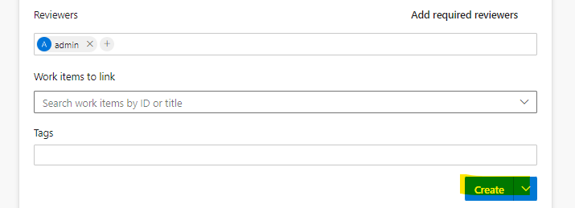

De manera automática, la herramienta verifica que no existen conflictos en el merge del código de la branch a la rama principal y se puede aprobar la petición.

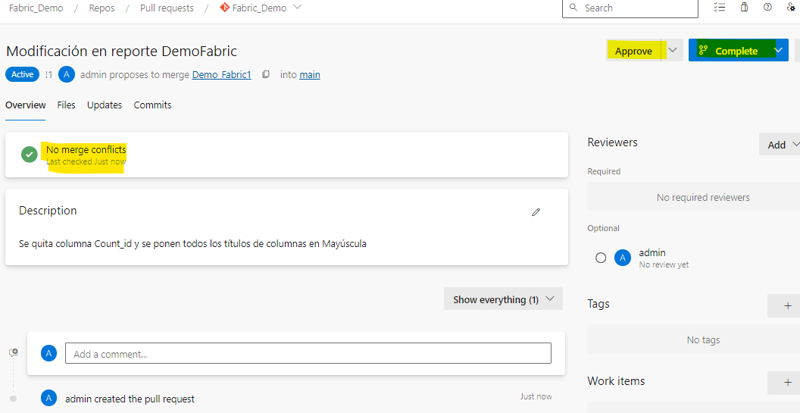

Para terminar, se puede hacer un check de eliminar la branch al realizar el merge y luego crear una nueva si fuese necesario. Finalizamos el merge.

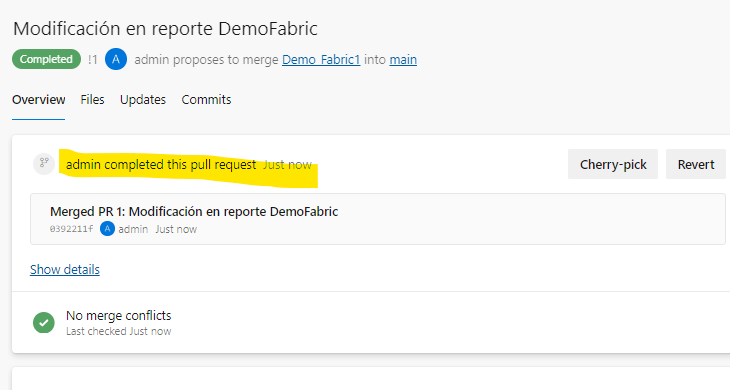

Podemos verificar que ahora sí, nuestro reporte e item de Fabric está correctamente sincronizado y actualizado con los últimos cambios.

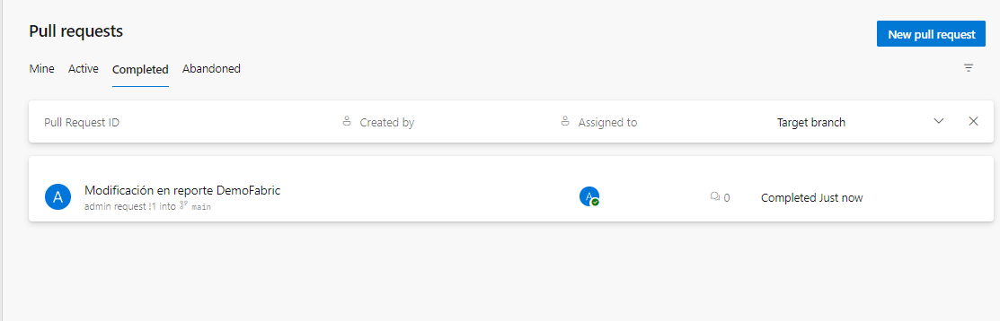

 

Cómo una pequeña síntesis, me gustaría agregar mis observaciones respecto de esta nueva posibilidad de trabajo en equipos interdisciplinarios (De´s,BI´s,Ds´s,etc..)
Está claro que, el versionado de código ya no es sólo para los programadores puros WinDesk o Webs, y hoy, Fabric permite esta posibilidad de trabajar de manera distribuida y sincronizada usando las últimas tecnologías disponibles (en este caso agregamos versionado de código)
Queda en los usuarios y las compañías poder adaptarse a estos nuevos cambios e implementar reglas y técnicas para poder realizar desarrollos de una manera más eficiente y profesional.

 

# Bibliografía

https://app.powerbi.com/

https://azure.microsoft.com/es-es/products/devops

https://git-scm.com/

https://blog.fabric.microsoft.com/es-AR/blog/

---

By **Facundo Montenegro**
