# Probando la integración de PBI con One Drive

Hace un tiempo que se anunció la integración de Power BI con One Drive y se lanzó la feature, desde ese momento se han visto personas a favor y detractores pero... quien probó realmente estas features? Para qué sirven?  
 En este post estaremos explorando un poco las cosas que podemos hacer con One Drive integrado a PBI y si realmente sirve.

Consideraciones: 
-Contar con Power BI Desktop instalado.  
-Contamos con un tenant de Office 365. 

 
-Comenzamos:  
 
Nos dirigimos a Power BI Desktop dónde tenemos un reporte abierto en un dashboard que tiene una tabla con distintos campos:

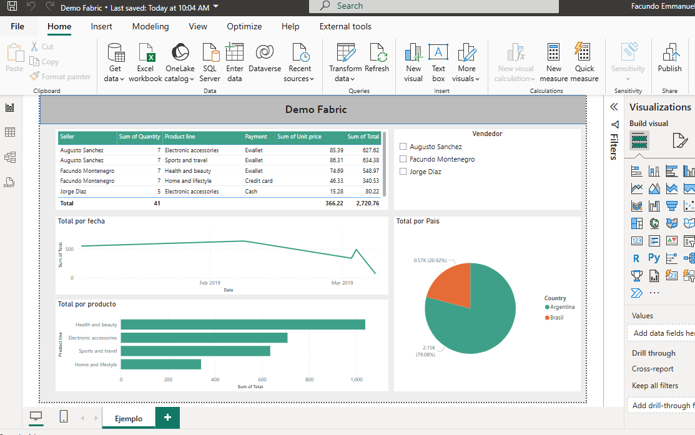

Luego, hacemos clic en "Save as" -> "My files" y guardamos el reporte en un repositorio de One Drive. 

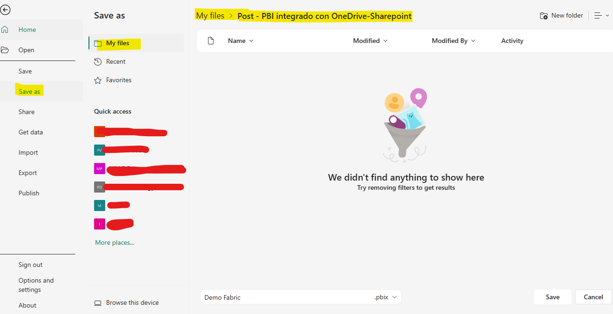

Nos dirigimos a nuestro repositorio en One Drive y encontramos el reporte de Power BI. Ahora, simplemente es hacer clic y abre el reporte? Así es!

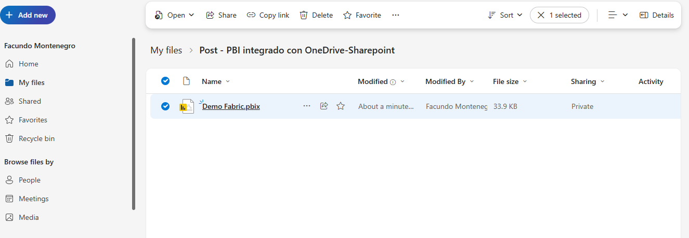

Haciendo clic en el mismo, se abre el reporte de Power BI como si estuviesemos en Power BI Service pero en One Drive. 

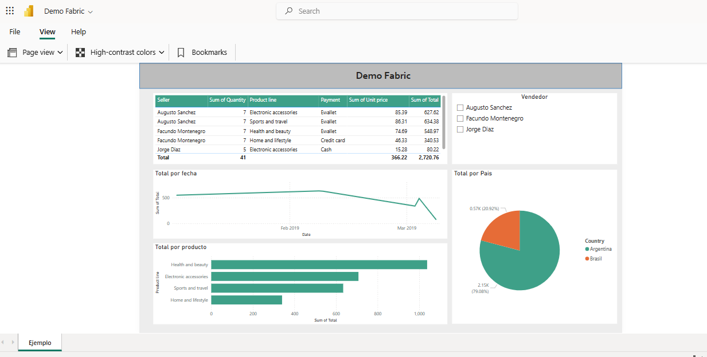

Y eso qué significa? Lo puedo editar? la respuesta es No. No se pueden editar los reportes guardados en One Drive, para eso, será necesario editarlo en Power BI Desktop o en Power BI Service.

* Qué cosas si podemos hacer entonces?

Veamos:

- Podemos Compartir el link de nuestro reporte con otros usuarios para que puedan visualizarlo.

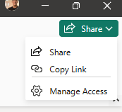

Haciendo clic en "Copy link" Nos mostrará un link para poder compartir nuestro reporte almacenado en One Drive.

- Otra feature!  Podemos descargar nuestro archivo una vez que nos comparten el link. Ya no es necesario estar pasandose el archivo .pbix

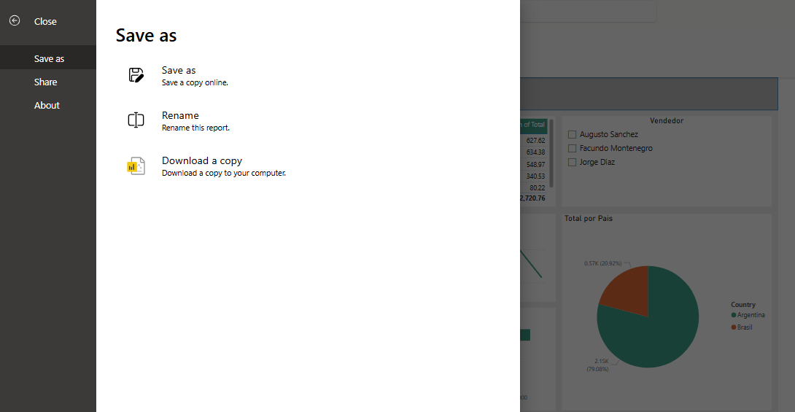

* Otra cuestión, podemos guardar el archivo tanto en One Drive como en Sharepoint.

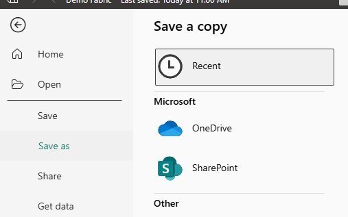

- Para habilitar todas estas features es necesario habilitarlas desde "Option and Settings"

Se debe hacer clic en File -> Option and Settings -> Options

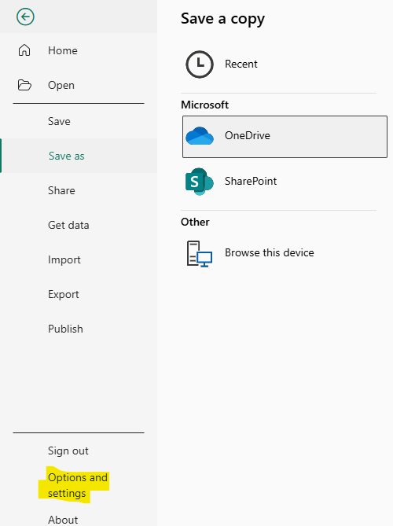

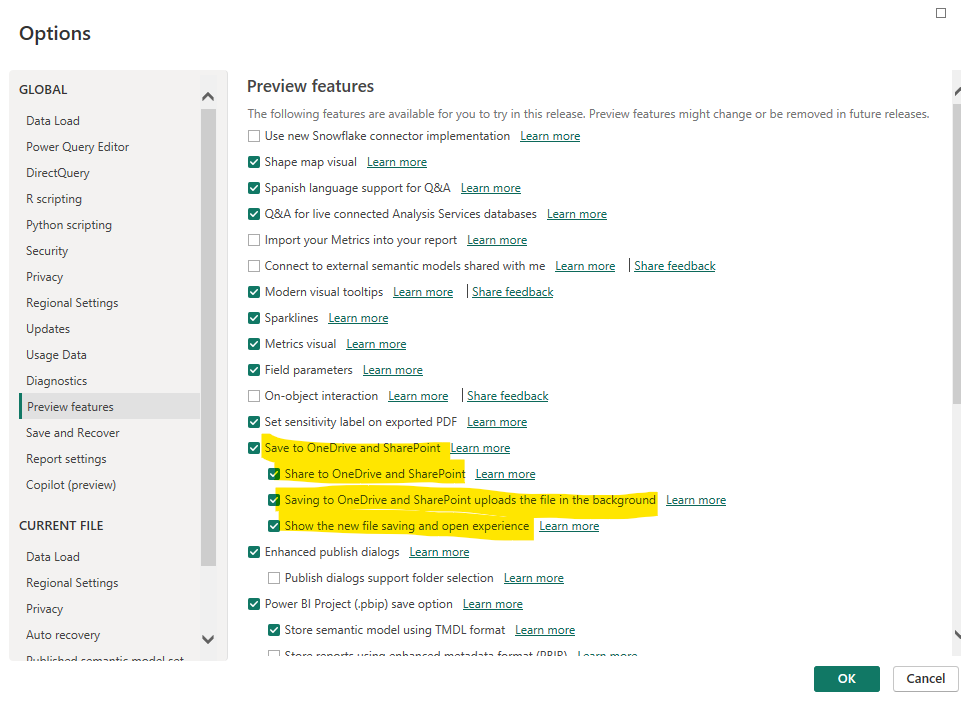

* Carga en segundo plano, una vez que el archivo esta subido a One Drive y se realiza un cambio en el mismo, se guarda en Power BI Desktop y automaticamente se carga en One Drive.

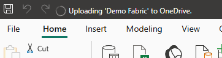
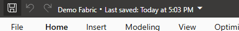

- Pero cual es la feature que realmente es muy interesante?
El historial de versiones y la posibilidad de poder utilizar One Drive como un repositorio de Archivos de PBI.

Ingresamos a nuestro One Drive y nos fijamos el historial de versiones podemos ver esto:

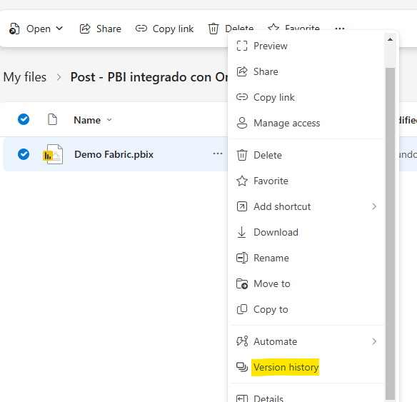

Y podemos restaurar antiguas versiones o abrirlas para ver cual era su contenido. Sin dudas una feature bastante interesante.

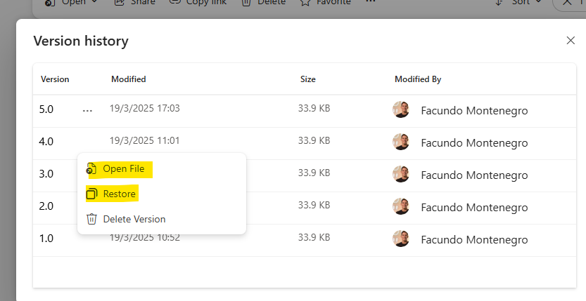

Conclusión

Se puede utilizar One Drive como repositorio y de versionado de código, lo cual, resulta la feature más interesante de esta integración de Power BI con One Drive - Sharepoint, si bien tenemos alguna que otra feature, lastimosamente para algunos usuarios no se puede editar el reporte desde One Drive (en mi opinión personal, creo que está bien que sea solamente editable en Power BI Desktop o Power BI service)

# Bibliografía

https://app.powerbi.com/

https://powerbi.microsoft.com/en-us/blog/announcing-live-connect-for-power-bi-report-integration-with-onedrive-and-sharepoint/

https://learn.microsoft.com/en-us/power-bi/create-reports/desktop-sharepoint-save-share

---

By **Facundo Montenegro**
