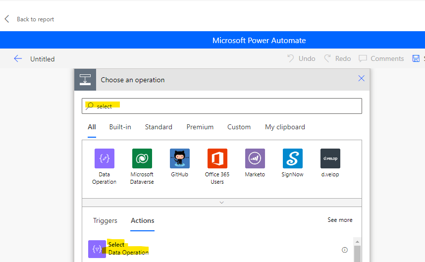
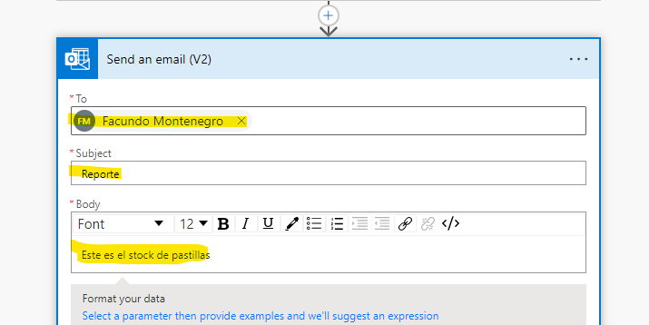

# Envío de Emails En Power BI - Parte 2

Te ha pasado que un gerente o un líder te pida un status diario por correo a las 8 am? Power BI provee esa posibilidad! Se puede programar envíos de dashboards de los reportes creados.
En la primera entrega hablamos de Envíos de mails con Power BI Service. 
En este caso, estaremos trabajando con un flujo de *Power Automate* para programar el envío de correos.

Consideraciones: 
-Contar con Power BI Desktop instalado.  
-Contamos con un reporte creado.
  

 
-Comenzamos:  
 
Nos dirigimos a Power BI Desktop dónde tenemos un reporte abierto en un dashboard que tiene una tabla con distintos campos:

Utilizaremos la visual de "Power Automate" que se encuentra en el menú de visualizaciones:

Hacemos clic en el mismo para agregarlo al dashboard:
Veremos que se da un instructivo de cómo se debe utilizar esta visual.

Lo primero que debe hacerse es, agregar los campos que queremos enviar por correo. Usaremos los mismos que están en la tabla del medio.

Luego, se debe hacer clic en los "3 puntitos" de la visual y editarla.

Luego se debe hacer clic en "New" y elegir la opción "Instant cloud flow" para crear  un nuevo flujo.

Luego que está creado, lo primero que vemos es un paso por defecto de power BI, seguiremos creando un nuevo step.

Escribimos en el campo de búsqueda de objetos "select" y seleccionamos el objeto select de "Data Operation"

En el campo "From" buscamos seleccionar el componente dinámico "Power BI data"

Luego, empezamos a mapear los campos de la tabla que necesitamos enviar por correo.

Debería quedar algo así:

Ya seleccionamos los datos, ahora pasamos a crear un nuevo paso.

Buscamos la actividad "html table" y seleccionamos "Create HTML table"

En el campo "From" seleccionamos el output que es el paso que corresponde a la actividad "select"

Por último, creamos el cuarto paso.

Buscamos la actividad "send an email" y seleccionamos "Send an email (V2)"

Le damos formato al correo escribiendo la dirección del mail, el asunto y el body.

Seleccionamos el output de la tabla HTML:

Luego de finalizar dichos pasos, hacemos clic en "save" para guardar el flujo. 

Luego que se guardó, hacemos clic en "Apply"

El mensaje que debe aparecer es este en color verde informado que se ha creado el flujo de actividades con éxito:

Ahora, si hacemos clic en "Back to report" podemos observar que nuestro botón cambió su presentación:

Si hacemos clic en dicho botón creado "Run Flow" veremos que se ejecuta y se envía correctamente:

Si abrimos nuestro correo, veremos que llegó el correo exitosamente:

*Importante:* Si se quiere programar el envío diario de correos como en el post anterior, es necesario utilizar Power Automate de manera independiente, desde la visual de Power BI NO puede hacerse ya que, Power BI se utiliza para interactuar con flujos existentes y mostrar información relevante en el informe.

Aclaraciones:
- Se puede personalizar el botón de flujo y controlar las ejecuciones históricas del flujo.
- Se puede formatear los campos de data que se envían en el correo.

# Bibliografía

https://app.powerbi.com/

https://learn.microsoft.com/en-us/power-automate/

https://learn.microsoft.com/en-us/power-automate/format-data-by-examples

---

By **Facundo Montenegro**
