# Envío de Emails En Power BI - Parte 1

Te ha pasado que un gerente o un líder te pida un status diario por correo a las 8 am? Power BI provee esa posibilidad! Se puede programar envíos de dashboards de los reportes creados. Ahora, cómo se puede hacer para personalizar el cuerpo del mensaje enviado? Cuál es el límite de uso de HTML? 

Vamos a dividir este post en **2 partes diferentes** debido a la cantidad de contenido que demanda dicho tópico.

En este primer post, usaremos **la suscripción de Power BI Service**.

Consideraciones: 
-Se requiere contar con una licencia Pro o Premium Per User (PPU)  
-Contamos con un reporte creado y un workspace configurado.
  

 
-Comenzamos:  
 
Nos dirigimos a Power BI Service y hacemos el login en https://app.powerbi.com/

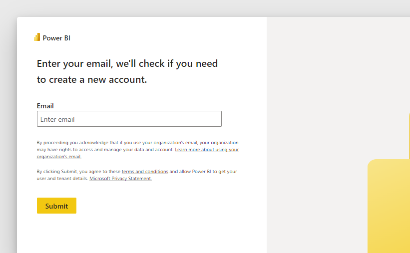

Usamos nuestras credenciales y podremos ingresar a Power BI Service.

Una vez que ingresemos, buscaremos nuestro reporte en el workspace correspondiente (En este caso, el reporte es "Test paises del mundo")

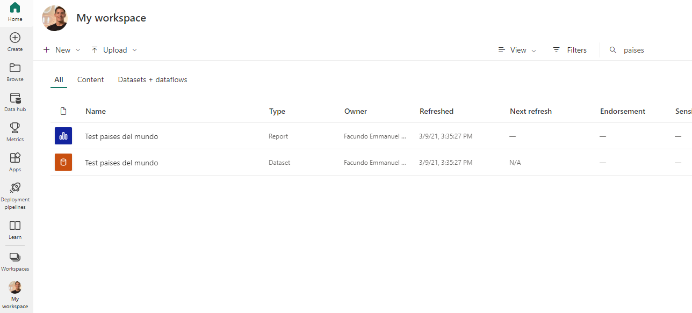

Ingresamos al reporte, y buscamos la opción "Subscribe to report", dicha funcionalidad es la encargada de administrar la/las suscripciones de envío de correos.

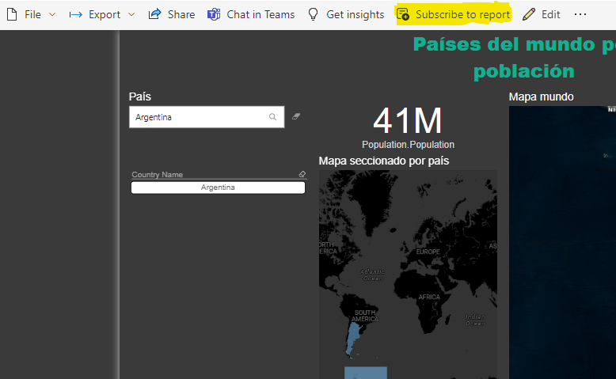

Se debe hacer clic en el botón " + Add new subscription " para generar una nueva suscripción de envío de correos.

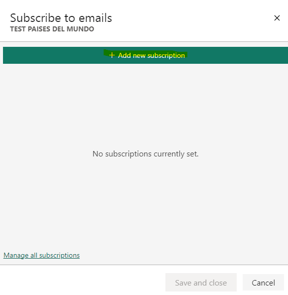

Veremos una serie de campos que hacen referencia a la programación del correo como son :

1: Nombre del reporte en la cabecera del correo.  
2: Contactos que recibirán el correo.  
3: Frecuencia con la que se enviaran los correos (Diaria,semanal,mensual,etc...)  
4: Hora y zona horaria en la que se recibirá el correo.  

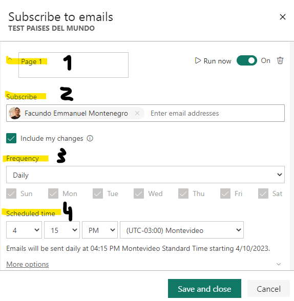

Cabe destacar la existencia del botón que dice "More options", al hacer clic en el mismo, podemos ver la información que hace referencia al cuerpo del correo.

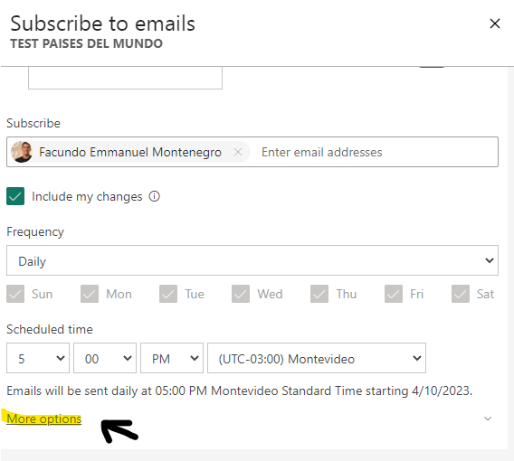

1: Asunto del correo.   
2: Body o cuerpo del correo.   
3: Pagina del reporte que aparecerá como una foto en el cuerpo del correo.   
4: Fecha de inicio y finalización del envío de correos.   

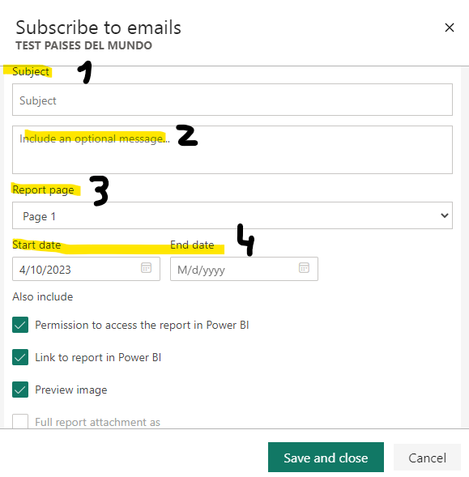

Entonces. Procedemos a programar el envío de correos y crear la suscripción. Comenzamos por la programación:

A modo de ejemplo rellenamos los siguientes campos:

Titulo: "Prueba de envío"  
Suscriptor: [Correo de usuario]   
Frecuencia: Semanal (un sólo dia)   
Horario de envío: [1 pm]   

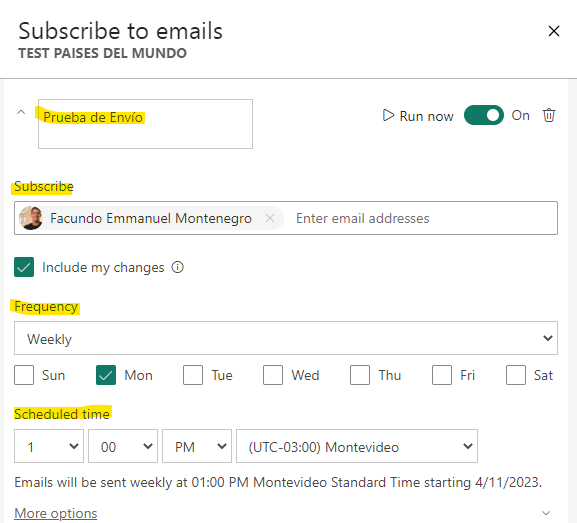

Y ahora pasamos al cuerpo del correo en "More options" 

Asunto del correo: "Reporte semanal Paises del mundo"   

Cuerpo: 
~~~
<h2>Estimado:</h2>
En el siguiente <a href="https://acortar.link/gsv6VA">LINK</a> podrá acceder al reporte deseado.
~~~
Report Page: Página que queremos que se vea como foto del correo.   
Fecha de inicio y fin de envíos de correos: [Fecha deseada]

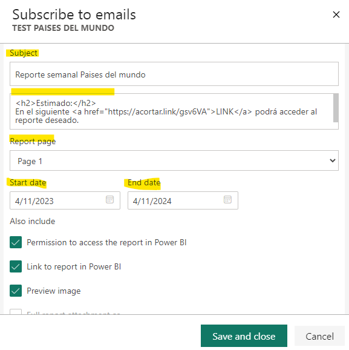

Una vez finalizada la programación, debemos guardar los cambios con el botón "Save and close"

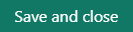

Podremos verificar en el momento como llega el correo haciendo clic en "Run now"

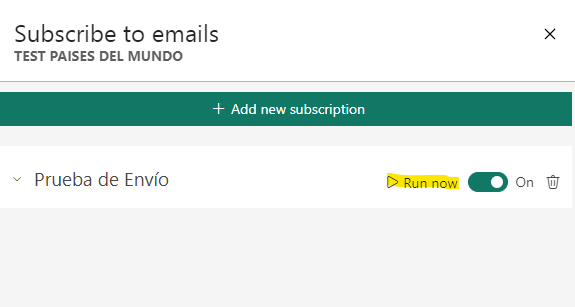

Veamos nuestro correo:

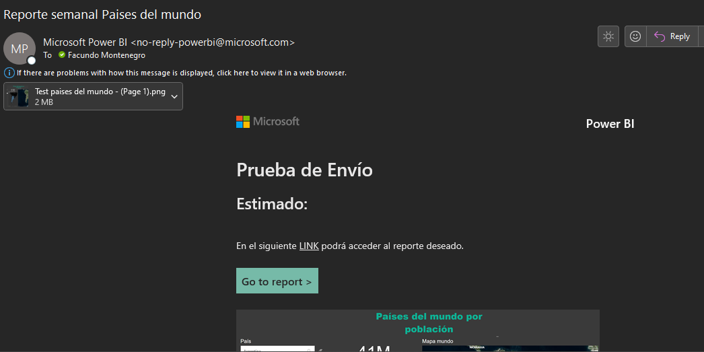

<h2>Uso de HTML</h2>

Algo que seguramente resultó curioso al ver el cuerpo del mensaje fue el HTML ingresado en el siguiente texto:

~~~
<h2>Estimado:</h2>
En el siguiente <a href="https://acortar.link/gsv6VA">LINK</a> podrá acceder al reporte deseado.

~~~

Vamos por parte, 

En el siguiente fragmento de código se utiliza un elemento título:
~~~
<h2>Estimado:</h2>
~~~

y en este fragmento se utiliza un elemento link (en este caso, el link que lleva al reporte en PBI Service con un acortador de URL)

~~~
<a href="https://acortar.link/gsv6VA">LINK</a>
~~~

<b>QUÉ TANTO MÁS HTML PUEDO UTILIZAR EN ESTOS CORREOS?</b>

<b>Desafortunadamente no mucho más</b>, se pueden insertar imagenes por medio de URL, pero no modificar su tamaño, como así tampoco modificar las fuentes de las letras.  
 

- Este es un ejemplo de código de una imagen insertada en el body del correo y de cómo se ve cuando llega a la bandeja de entrada:

~~~

~~~

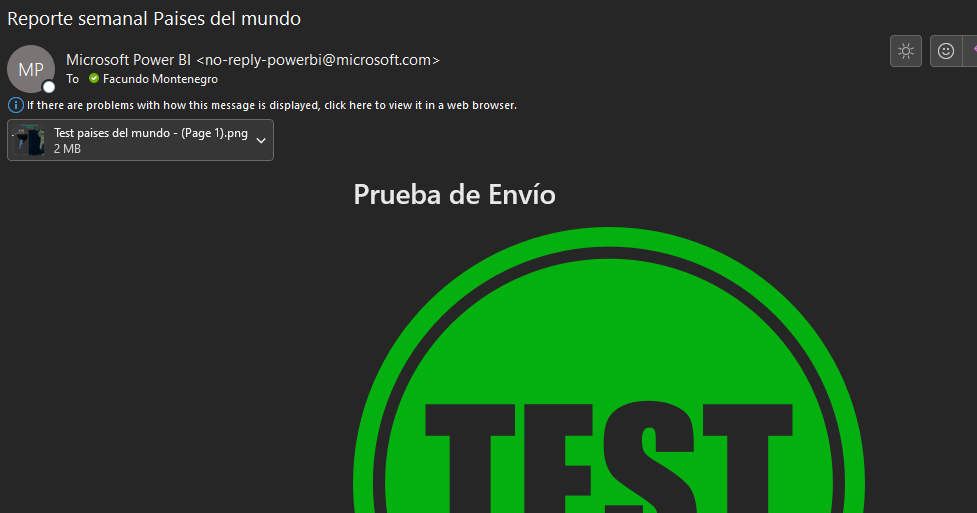

Cómo puede apreciarse, el uso de HTML es bastante limitado desde el uso de la herramienta automatizada de suscripción de mails.

 

En el siguiente post, veremos una alternativa para realizar este tipo de modificaciones en HTML a los correos enviados con el status de nuestro reporte.

 

# Bibliografía

https://app.powerbi.com/

https://learn.microsoft.com/en-us/power-bi/collaborate-share/end-user-subscribe?tabs=creator

https://codepen.io/

https://acortar.link/

---

By **Facundo Montenegro**
