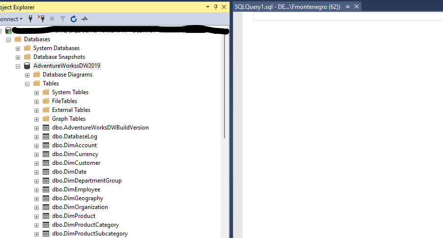
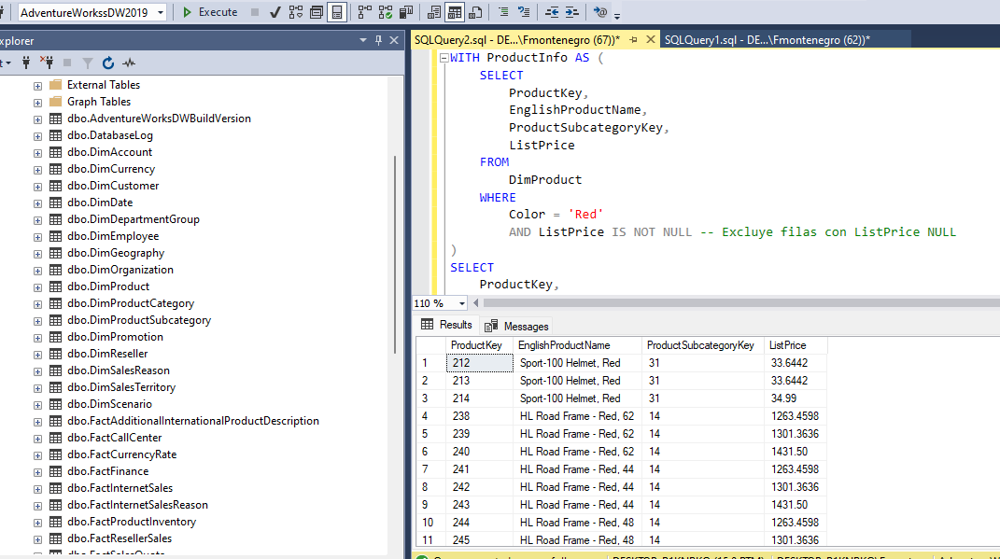
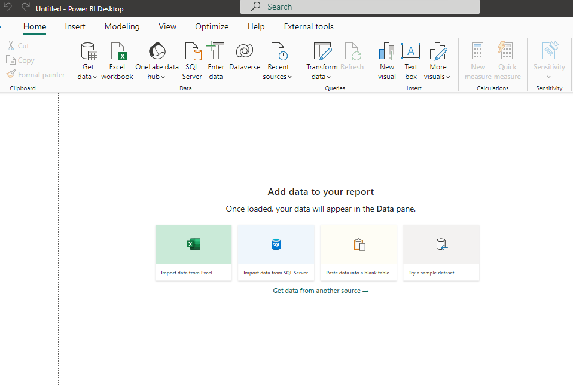
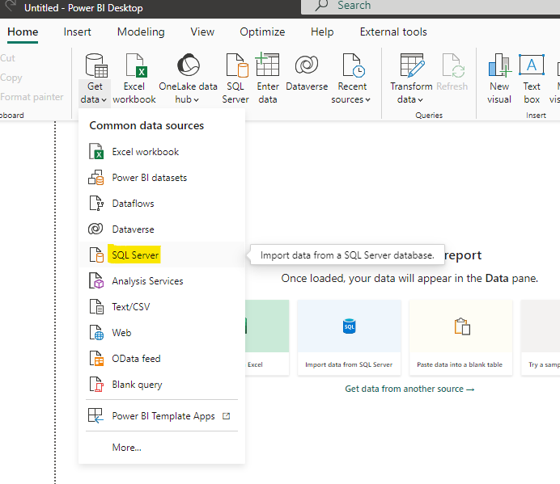
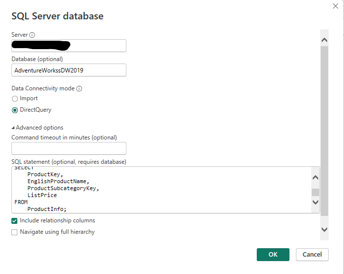
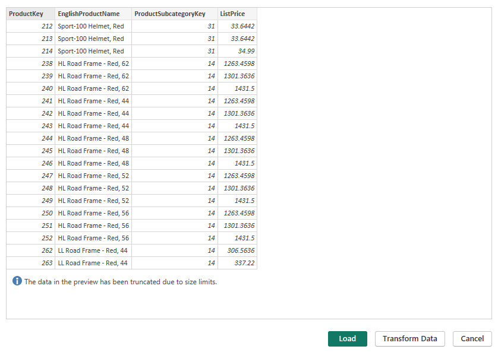

# SQL - Uso de CTE y su conexión a Power BI

Qué es CTE? Cuándo se utilizan? Cómo puedo importar la data en Power BI?

Consideraciones: 
-**Contamos con  Power BI Desktop.** 
-**Contamos Con SQL Server Management Studio.** 
-**Contamos con la DB Adventure Works 2019.**
  

 
-Comenzamos:  
 

Previo a comenzar con las queries en SQL se definen algunos conceptos importantes.

**Qué es CTE?**

Las Common Table Expressions (CTE) en SQL son subconsultas temporales y con nombre que se pueden utilizar dentro de una consulta principal. Las CTE son especialmente útiles para mejorar la legibilidad, la mantenibilidad y la organización del código SQL, ya que permiten definir partes lógicas de la consulta y reutilizarlas.

**Para qué se utilizan CTEs?**

1. Legibilidad y Mantenibilidad:  
	Las CTE permiten dividir una consulta compleja en partes más manejables y autoexplicativas. Esto facilita la comprensión del código y su mantenimiento.
2. Reutilización de Subconsultas: 
	Se puede definir una CTE y luego hacer referencia a ella varias veces dentro de la consulta principal o en subconsultas posteriores, lo que evita escribir la misma lógica varias veces.
3. Facilita la Construcción de Consultas Complejas: 
	Las CTE son útiles cuando se necesita realizar operaciones complicadas o recursivas en una consulta y desglosarlas en pasos más simples. 

4. No Generan Persistencia de Datos:  
	Las CTE no almacenan datos de manera persistente en la base de datos. Son temporales y solo existen durante la ejecución de la consulta.

**Un ejemplo sencillo de una CTE?**

<pre><code>
-- Declaración de la CTE
WITH EmpleadosConSalarioAlto AS (
  SELECT ID, Nombre, Salario
  FROM Empleados
  WHERE Salario > 50000
)

-- Consulta principal que hace uso de la CTE
SELECT ID, Nombre, Salario
FROM EmpleadosConSalarioAlto;
</code></pre>

En este codigo tengo una tabla llamada empleados y quiero obtener una lista de empleados con salarios superiores a $50000. En el primer bloque de código se declara la CTE con los datos que vamos a seleccionar y en el segundo bloque de código se hace la consulta principal.

 
 

**Veamos algunos casos más elaborados.**

Nos dirigimos a SQL Server Management Studio dónde tenemos la DB y el server.

Abriremos una nueva query y utilizaremos la base de datos "AdventureWorksDW2019"

Con las tablas de la base de datos, escribimos la siguiente query:

<pre><code>
WITH ProductInfo AS (
    SELECT
        ProductKey,
        EnglishProductName,
        ProductSubcategoryKey,
        ListPrice
    FROM
        DimProduct
    WHERE
        Color = 'Red'
        AND ListPrice IS NOT NULL -- Excluye filas con ListPrice NULL
)
SELECT
    ProductKey,
    EnglishProductName,
    ProductSubcategoryKey,
    ListPrice
FROM
    ProductInfo;
</code></pre>

Revisamos la Query en detalle:

1. La CTE ProductInfo selecciona las siguientes columnas de la tabla DimProduct:
- ProductKey: La clave del producto.
- EnglishProductName: El nombre del producto.
- ProductSubcategoryKey: La clave de la subcategoría de producto.
- ListPrice: El precio de lista del producto.

2. En la cláusula WHERE de la CTE, se aplican dos condiciones:
- Color = 'Red': Se seleccionan solo los productos que tienen el color 'Red'.
- ListPrice IS NOT NULL: Se excluyen las filas donde el precio de lista (ListPrice) es nulo.

3. Luego, en la consulta principal, se seleccionan las mismas columnas de la CTE ProductInfo. Para este ejemplo particular, la query principal no agrega ninguna otra condición, por lo que simplemente selecciona los productos que cumplieron con las condiciones establecidas en la CTE.

**Esta query selecciona productos de color 'Red' que tienen un precio de lista que no es nulo y muestra la información de esos productos, tanto su clave, nombre, clave de subcategoría y precio de lista.**

Ahora , veremos una CTE aún más compleja:

<pre><code>
WITH TotalVentasPorCategoria AS (
    SELECT
        pc.EnglishProductCategoryName AS CategoriaProducto,
        SUM(fs.SalesAmount) AS TotalVentas
    FROM
        dbo.FactInternetSales fs
    JOIN
        dbo.DimProduct dp ON fs.ProductKey = dp.ProductKey
    JOIN
        dbo.DimProductSubcategory spc ON dp.ProductSubcategoryKey = spc.ProductSubcategoryKey
    JOIN
        dbo.DimProductCategory pc ON spc.ProductCategoryKey = pc.ProductCategoryKey
    GROUP BY
        pc.EnglishProductCategoryName
)
SELECT
    CategoriaProducto,
    TotalVentas
FROM
    TotalVentasPorCategoria
ORDER BY
    TotalVentas DESC;
</code></pre>

Revisamos la Query en detalle:

**1.Se define una CTE llamada TotalVentasPorCategoria**:
- Se selecciona EnglishProductCategoryName de la tabla DimProductCategory como CategoriaProducto.
- Se calcula la suma de SalesAmount de la tabla FactInternetSales como TotalVentas.
- Se realizan operaciones JOIN para relacionar las tablas FactInternetSales, DimProduct, DimProductSubcategory y DimProductCategory a través de sus claves.
- Se agrupa el resultado por la categoría de producto (EnglishProductCategoryName).

**2. En la query principal**:
- Se selecciona CategoriaProducto y TotalVentas de la CTE TotalVentasPorCategoria.

**3. Los resultados se ordenan en orden descendente (ORDER BY TotalVentas DESC), de manera que se muestran las categorías de productos con las mayores ventas totales en la parte superior.**

**Esta consulta SQL utiliza una CTE para calcular el total de ventas por categoría de producto en la base de datos "AdventureWorksDW2019". Luego, muestra esta información ordenada por las categorías de productos con las mayores ventas.**

 
 

# Cómo puedo importar la data en Power BI?

Nos dirigimos a Power BI Desktop:

Hacemos clic en Get Data y buscamos el origen de datos SQL Server.

Se especifica el Server, luego opcionalmente podemos especificar la base de datos (AdventureWorkssDW2019) y en Advanced options se escribe la query.

Hacemos clic en Ok y podremos ver la tabla generada a partir de la CTE creada previamente.

 

Para cerrar, Utilizar CTE mejora la lógica y la gestión de las consultas. No necesariamente están enfocadas en performance, pero, si realizamos una buena optimización de las consultas, se podrían verificar mejoras en el rendimiento. La optimización incolucra la estructura de la base de datos, manejo de índices, capacidad de la db, entre otras cuestiones.

# Bibliografía

https://app.powerbi.com/

https://learn.microsoft.com/es-es/sql/samples/adventureworks-install-configure?view=sql-server-ver16&tabs=ssms

https://learn.microsoft.com/es-es/sql/ssms/download-sql-server-management-studio-ssms?view=sql-server-ver16

https://www.sqlshack.com/es/expresiones-comunes-de-tabla-de-sql-server-cte/

https://learn.microsoft.com/es-es/sql/t-sql/queries/with-common-table-expression-transact-sql?view=sql-server-ver16

---

By **Facundo Montenegro**
