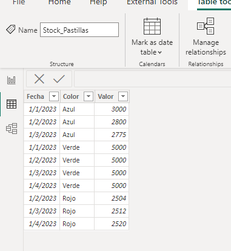
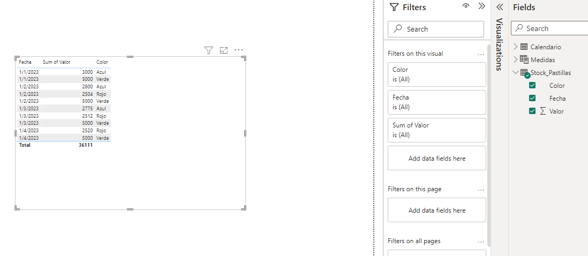
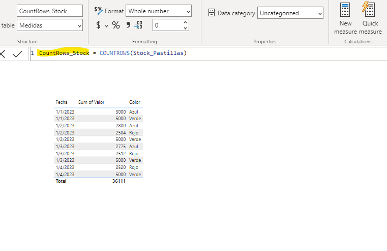
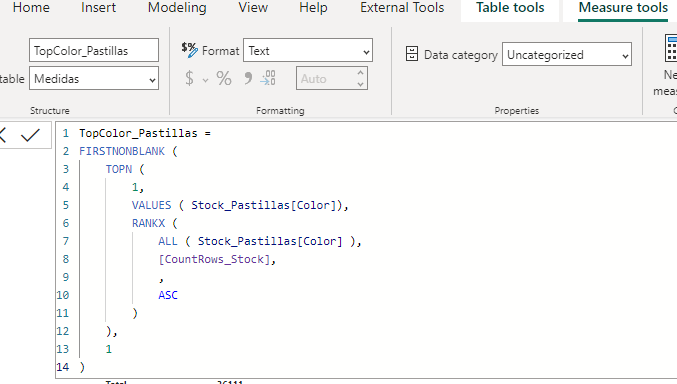
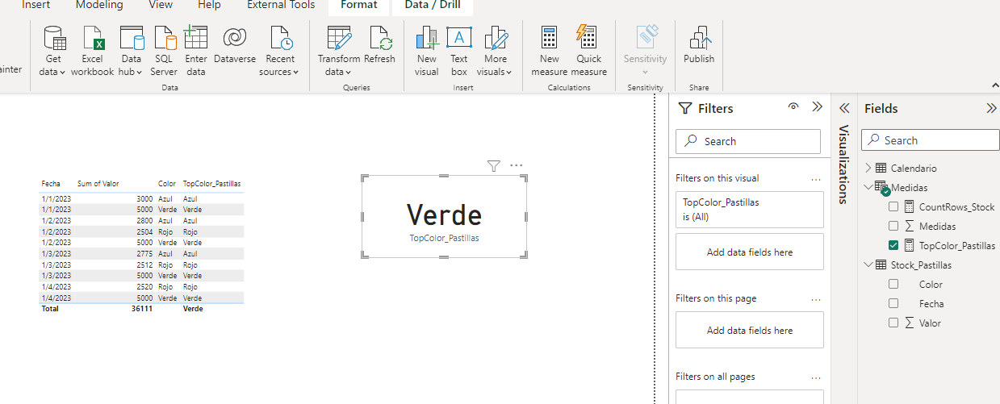
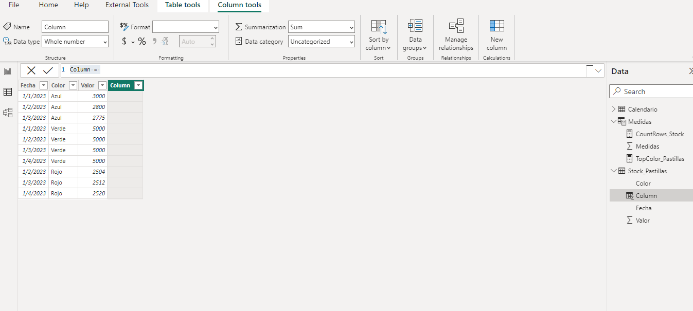
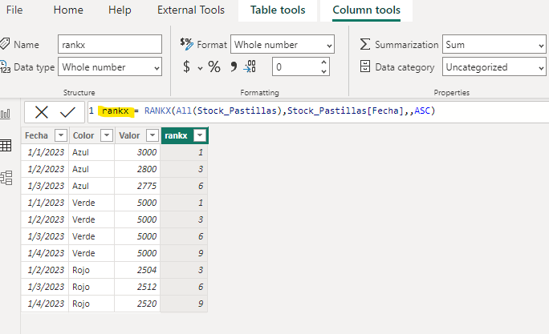
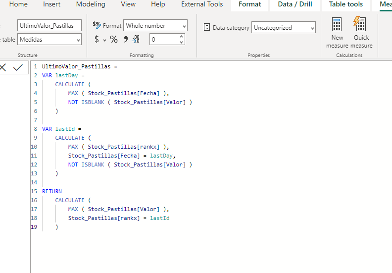
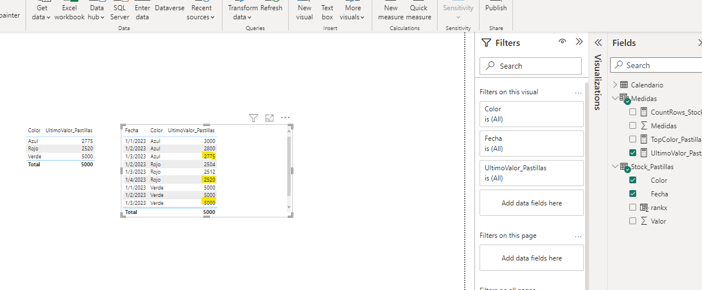
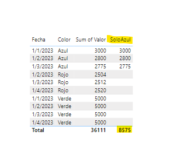

# DAX - Medidas útiles (Casos y ejemplos)

Muchas veces el cliente nos pide cosas que parecen bastante evidentes y simples de realizar tales cómo "Cuál es el último valor del día? ¿Cuál es el valor que más se repite? Parecen arreglos sencillos pero se complejiza al pensar en cómo llevamos esto a DAX en Power BI?

Vamos a ver algunos casos útiles que pueden servir para tratar este tipo de cuestiones.

Consideraciones: 
-Veremos casos específicos sin relación entre sí. 
-En los casos ya contamos con una estructura de modelado. 
 
-Comenzamos:  

* Caso 1: Tenemos un conjunto de colores de pastillas de hornos industriales. Queremos saber cuál es el color que MÁS se repite y en **texto**.

Ok, tenemos entonces la tabla "Stock_Pastillas", la cuál tiene tres colores diferentes. Queremos saber por medio de DAX cuál es el color más repetido.

Podemos ver que la tabla tiene tres campos, fecha, el color y el valor del stock de pastillas de cada color.

Colocamos todos los campos en una tabla para tener más claro el contexto de la data.

Creamos una medida que se llamará "CountRows_Stock"
Queremos contar la cantidad de filas de la tabla Stock_Pastillas para luego poder diferenciar el color más repetido. Para eso escribimos este código:

~~~

CountRows_Stock = COUNTROWS(Stock_Pastillas)

~~~

Ahora crearemos una nueva medida llamada "TopColor_Pastillas" que tendrá el siguiente código:

~~~

TopColor_Pastillas = 
FIRSTNONBLANK (
    TOPN (
        1,
        VALUES ( Stock_Pastillas[Color]),
        RANKX (
            ALL ( Stock_Pastillas[Color] ),
            [CountRows_Stock],
            ,
            ASC
        )
    ),
    1
)
~~~

Cómo se entiende esto?
FIRSTNONBLANK() del primer renglón, hace referencia a que se haga un cálculo teniendo en cuenta que no hay valores blancos, seguido de eso aparece el TOPN() llamando al valor top del campo "color" para que traiga el valor que más veces se repite, finalmente se hace un RANKX() ignorando el contexto de filtro de la tabla con un ALL() y "rankeando" por la medida creada en el paso anterior.

Esto termina dando por resultado el color más repetido (Verde) y que lo colocamos en una Card.

----------------------------

* Caso 2: Cuál es el último valor registrado para las pastillas? Seguimos trabajando con la misma tabla "Stock_Pastillas" pero esta vez queremos calcular el **Último Valor**. Cómo hacemos?

Veamos.. Si necesitamos el último valor. Necesitamos una "Marca" que es la columna que contiene los valores para averiguar cuál es el último. Para esto suele utilizarse un ranking.

Creamos así una columna calculada llamada "rankx" que tendrá el siguiente código:

~~~
rankx = RANKX(All(Stock_Pastillas),Stock_Pastillas[Fecha],,ASC)
~~~

Lo siguiente es crear nuestra medida de último valor a la cual nombraremos "UltimoValor_Pastillas" y escribimos el siguiente código:

~~~
UltimoValor_Pastillas = 
VAR lastDay =
    CALCULATE (
        MAX ( Stock_Pastillas[Fecha] ),
        NOT ISBLANK ( Stock_Pastillas[Valor] )
    )
    
VAR lastId =
    CALCULATE (
        MAX ( Stock_Pastillas[rankx] ),
        Stock_Pastillas[Fecha] = lastDay,
        NOT ISBLANK ( Stock_Pastillas[Valor] )
    )

RETURN
    CALCULATE (
        MAX ( Stock_Pastillas[Valor] ),
        Stock_Pastillas[rankx] = lastId
    )
~~~

Cómo se explica este código? Sencillo! 
* El primer bloque de código es una variable que calcula la última fecha en la cuál valor del stock no sea blanco.
* El segundo bloque de código es una variable que toma esa "marca" del último día del rank y además que el valor no sea blanco.
* El último bloque retorna el último valor del stock tomando en cuenta el último valor del ranking.

Si arrastramos nuestra última medida creada en una tabla, podemos verificar que en la tabla de la izquierda efectivamente sí se trae el último valor comparando con todos los registros de la tabla derecha.

* Caso 3: Finalmente y no menos importante, siempre se debe destacar la importancia de dominar la función Calculate()

Para este caso necesitamos que se sumen los valores de stock que sean sólo de color "Azul"

Cómo se pasa a lenguaje DAX? Veamos..

Creamos una medida para sumar el stock en general que se llamará "SumaStock" y lleva el siguiente código:

~~~
SumaStock = SUM(Stock_Pastillas[Valor])
~~~

Luego crearemos la medida "SoloAzul" que tendrá este código:

~~~
SoloAzul =
CALCULATE (
    [SumaStock],
    FILTER ( Stock_Pastillas, Stock_Pastillas[Color] = "Azul" )
)
~~~

Explicación: Se utiliza calculate y dentro la medida suma stock, se hace un filter para hacer referencia a la tabla Stock_pastillas especificando que quiero solo el color Azul en dicha suma..

Vemos cómo queda esa medida en una tabla.

* Por qué no utilicé una variable para "SumaStock"? Depende el funcionamiento que se requiera del cálculo para cada caso, hay que tener en cuenta que las variables son atómicas y solo viven en el contexto de la medida y para este caso es mejor generalizar cálculos en medidas diferentes.

Se adjunta el .pbix a la solución.

# Bibliografía

https://learn.microsoft.com/en-us/dax/dax-function-reference

https://learn.microsoft.com/en-us/dax

https://support.microsoft.com/en-us/office/quickstart-learn-dax-basics-in-30-minutes-51744643-c2a5-436a-bdf6-c895762bec1a

https://community.powerbi.com/

https://www.daxformatter.com/

---

By **Facundo Montenegro**
