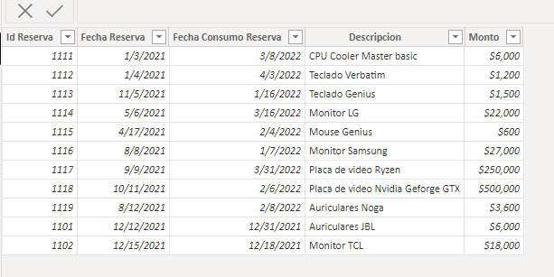
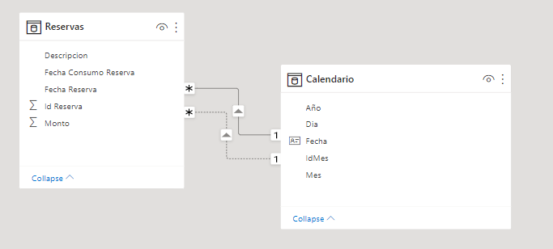
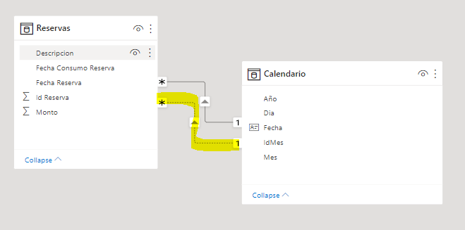
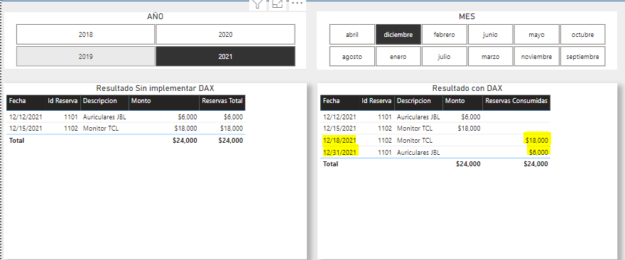

# Cómo calcular un valor en una fecha seleccionada cuando tengo más de un campo fecha? 

Para los desarrolladores de BI se suele presentar un escenario frecuente en el cual necesitamos calcular un valor en una fecha seleccionada de una tabla que tiene **más de una fecha**. Esto podremos hacerlo con la función **USERELATIONSHIP()**.

Antes de comenzar a escribir código, es necesario explicar que este problema es de **modelado** , es decir, debemos revisar nuestro modelo de datos y comprobar si, efectivamente, es necesario implementar una medida que calcule el valor en una fecha seleccionada.

Para eso, se muestra este sencillo ejemplo en Power BI:

Tenemos la tabla Reservas con dos fechas, **Fecha Reserva** y **Fecha Consumo Reserva** , la primera fecha en que se realizó la reserva y la segunda en la que efectivamente se descontó del stock. 

Si a esta tabla la relacionamos a una tabla fecha, en **la vista de modelo de datos** tendremos algo así:

Qué es lo raro? Claramente se ve una relación en **línea de puntos**. Esto quiere decir que la relación se encuentra **inactiva**

Aquí viene el problema, cómo puedo hacer para calcular el monto de las reservas que se **consumieron** en Diciembre de 2021?

* Sencillo! Activamos la relación de Fecha Consumo Reserva [Reservas] --> Fecha [Calendario] por medio de **USERELATIONSHIP()**

Pero antes de eso, debemos calcular el monto total de reservas:

~~~
Medida 1:

Reservas_Total = 
SUM ( Reservas[Monto] )
~~~

Ahora creamos la medida que relaciona el monto de las reservas **consumidas** con el calendario

~~~
Medida 2:

Reservas_Consumidas = 
CALCULATE (
    [Reservas_Total],
    USERELATIONSHIP ( Calendario[Fecha], Reservas[Fecha Consumo Reserva] )
)
~~~

Si llevamos estas medidas a una tabla y aplicamos filtros aleatorios de fecha, podremos ver entonces que no sólo tenemos el monto en la fecha en **que se realizó la reserva** , tenemos también la fecha en la que **se consumió la reserva** 

Como comentario final, se puede decir que lo más importante es verificar **siempre** primero nuestro **modelado** , una vez identificadas las relaciones y determinado el problema, podremos proceder a utilizar DAX.

**Aclaración: No debemos modificar nada del modelado.**

**Se adjunta el archivo .PBIX en la presente Folder para poder probar el ejemplo**

# Bibliografía

Dax USERELATIONSHIP https://docs.microsoft.com/en-us/dax/userelationship-function-dax

Dax Guide https://dax.guide/userelationship/

SQL BI  https://www.sqlbi.com/articles/using-userelationship-in-dax/

---

By **Facundo Montenegro**
