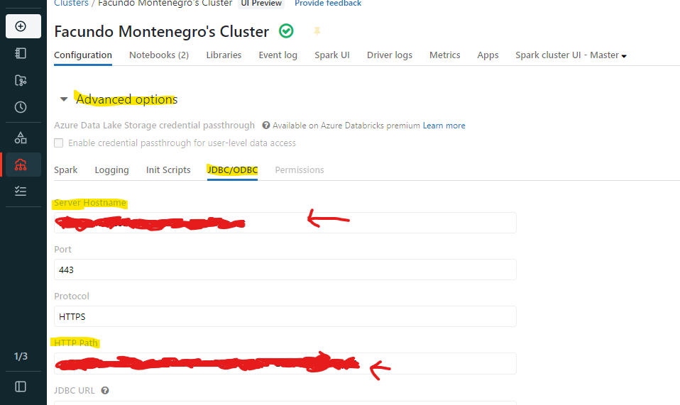

# Databricks - Cómo transformar un archivo parquet con Python-SQL y cargarlo como una tabla en Power BI? 

En este primer post de Databricks y con un ejemplo sencillo, nos meteremos a escribir código de Python y SQL en un notebook dónde se realizarán las transformaciones necesarias para limpiar un archivo de tipo parquet y dejar lista la tabla para consumirlas en Power BI.

Consideraciones: 
-Se omite el proceso de montaje del datalake.  
-Ya contamos con recursos creados de azure. 
-Contamos con una DB y un cluster en Databricks.
  

Aclaración: *Estas últimas tareas no serían especificamente de Data Analysis, estarían mas centradas en Data Engineering.* 

 
-Comenzamos:  
 
Buscamos nuestro recurso de Databricks desde azure:

Una vez que se encuentra el recurso, se hace clic en "Launch worskpace" para ingresar en el espacio de trabajo de Databricks.

Ya nos encontramos en el workspace de Databricks.

Lo siguiente será crear un nuevo Notebook.

Se escribe un nombre, se selecciona un lenguaje por defecto (Luego veremos que puede cambiarse entre los commands) y no menos importante, seleccionar el cluster que ejecutará nuestro notebook.

Esta es la interfaz que se visualiza de nuestro notebook vacío y que queremos utilizar para transformar nuestro archivo.

En el primer comando, escribiremos la siguiente línea de código para verificar que nuestro archivo existe en el datalake montado.
~~~
%python
ls /mnt/landing/DataPrueba/data_centers_q2_q3.snappy.parquet
~~~

Una vez comprobado su existencia, continuamos con python creando una variable "path" que aloja al archivo parquet.

~~~
%python
path = "/mnt/landing/DataPrueba/data_centers_q2_q3.snappy.parquet"
print(path)
~~~

Lo que sigue es llamar a la libreria de pyspark sql y definir una variable que creará un **objeto** de tipo **Dataframe** y que tomará nuestro archivo parquet.

~~~
%python
from pyspark.sql.functions import*
df = spark.read.parquet(path)
~~~

Ejecutamos un display de nuestro Dataframe con el siguiente código:
~~~
%python
display(df)
~~~

Ya tenemos data!! El tema ahora es... ¿Cómo transformamos la información que viene desde la columna source?

**Ok, vamos a otra línea de comando y empezamos a ejecutar SQL queries:**

La siguiente query, creará una tabla llamada "tablapost" que usara la información que hay dentro del archivo parquet y que vimos en el paso anterior:

~~~
%sql
use dbacademy_fmontenegro;
create table tablapost
using parquet
options (path "/mnt/landing/DataPrueba/data_centers_q2_q3.snappy.parquet")
~~~

Y ahora lo interesante.. Vamos a segmentar toda esta información mediante el uso de la función **Explode** y utilizando una tabla existente que contiene la misma información llamada "tablacurso".  
Finalmente, llamamos con un Select * a la "tablapost" mostrando todas las columnas que contiene ya transformadas.

~~~
%sql
DROP TABLE IF EXISTS tablapost;

CREATE TABLE tablapost 
USING delta
PARTITIONED BY (device_type)
WITH explode_source
AS
  (
  SELECT 
  dc_id,
  to_date(date) AS date,
  EXPLODE (source)
  FROM tablacurso
  )
SELECT 
  dc_id,
  key `device_type`, 
  date,
  value.description,
  value.ip,
  value.temps,
  value.co2_level
  
FROM explode_source;

SELECT * FROM tablapost
~~~

Este es el resultado: 

Finalmente, y no menos importante, nótese que las columnas "temps" y "co2_level" son arrays y de distinto tamaño, en este primer post sólo tomaremos "co2_level" y la segmentaremos en filas diferentes con **Explode()**

Ejecutamos en un notebook en **Python** definiendo la siguiente variable df, que ahora hará un **SELECT** de las columnas que necesitamos de tablapost.
~~~
%python
df = spark.sql("select dc_id,device_type,date,description,ip,temps,co2_level FROM tablapost")

~~~

Ahora aplicamos el **Explode()** a a la columna "co2_level" para convertir el array en filas separadas.

~~~
%python
import pyspark.sql.functions as F
transformation_df = df.select('dc_id','device_type','date','description','ip',F.explode('co2_level').alias('niveles de co2'))
~~~

El resultado final es el siguiente:

Genial! Ya tenemos nuestra tabla limpia y lista para consumir en Power BI!

<h2>Cómo tomar una tabla de Databricks en Power BI?</h2>

Sencillo!! Debemos ir a **Compute**, buscar nuestro **Cluster** y hacer clic en el mismo.

Aquí buscamos en opciones avanzadas y hacemos clic en "JDBC/ODBC" , esta sección nos dará el Server y el HTTP PATH. Copiamos los mismos y nos vamos a Power BI Desktop.

En Get Data, buscamos el conector "Azure Databricks" e ingresamos los paths copiados en el paso anterior:

Listo!! Ya tenemos nuestra tabla transformada desde un archivo parquet.

# Bibliografía

https://www.geeksforgeeks.org/pyspark-split-multiple-array-columns-into-rows/

https://spark.apache.org/docs/latest/api/python/

https://spark.apache.org/sql/

https://docs.databricks.com/sql/language-manual/functions/explode.html

https://docs.databricks.com/partners/bi/power-bi.html

https://www.edureka.co/blog/spark-sql-tutorial/

---
By **Facundo Montenegro**
