# Data Pipelines en Microsoft Fabric - Es más sencillo que Data Factory usado de forma individual?

En este nuevo post estaremos navegando sobre funcionalidades de Fabric y en particular, creando un pipeline de Data Factory pero desde Fabric. Es más facil orquestar información en Fabric que en Data Factory usado individualmente? Cuáles son sus ventajas y desventajas de incorporar un producto así en una compañía? Cómo afecta al analista de datos? Lo veremos con un simple ejemplo.

Aclaraciones:  
- *Fabric aún se encuentra en preview y en constante desarrollo. La versión utilizada probablemente no sea la definitiva.*
- *Fabric es un producto individual que podrá utilizarse como un recurso indepediente en Azure.*

 
-Comenzamos:  
 
Ingresamos al portal de Power BI con nuestras credenciales en https://app.powerbi.com/

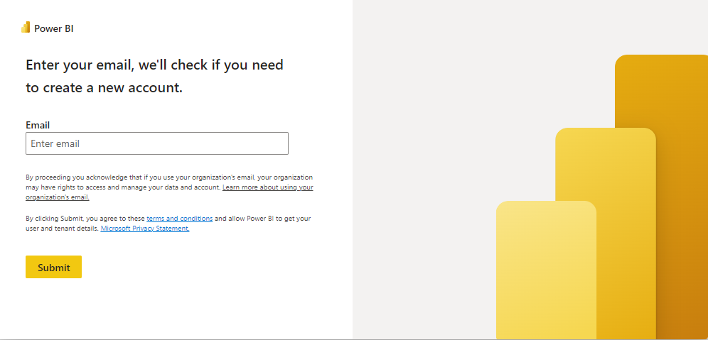

Es importante señalar que en el margen inferior izquierdo, debemos seleccionar "Data Factory" para salir de Power BI y dirigirnos a Data Factory.

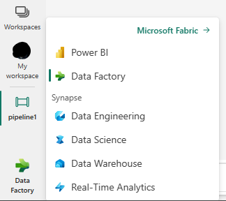

Hecho una vez el paso de plataformas, Crearemos una simple pipeline con la actividad "Copy data"

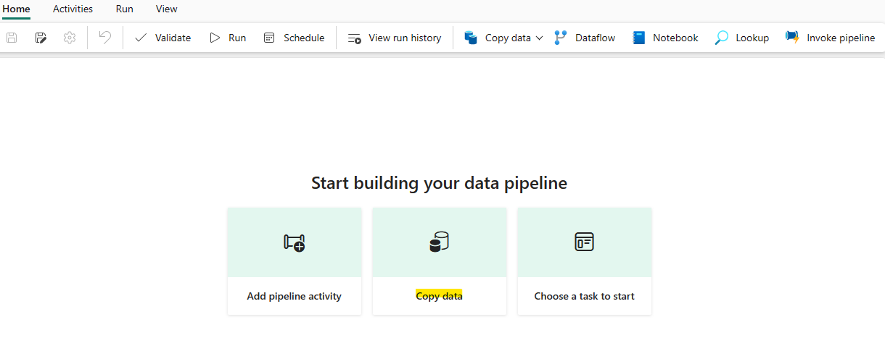

Le ponemos un nombre a la pipeline y hacemos clic en "Create"

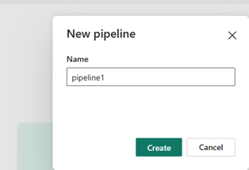

Automáticamente, se generará el siguiente cuadro con opciones, dónde podremos seleccionar la fuente de datos a utilizar. Para este caso utilizamos un sample de COVID alojado en un datalake llamado "COVID-19 Data Lake"

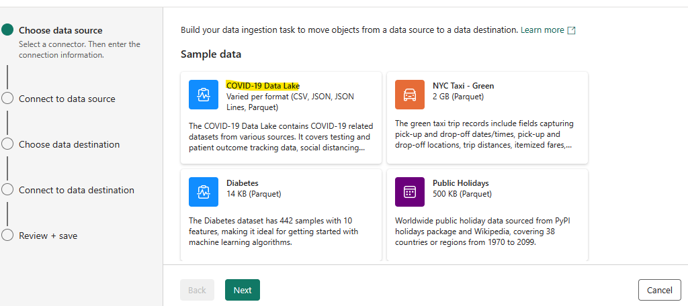

Seleccionamos el sample "Bing COVID-19"

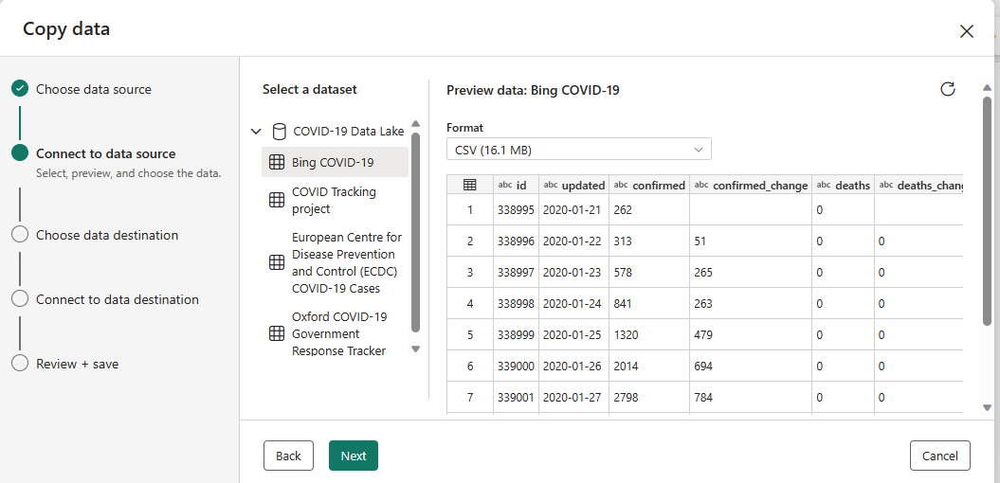

Ahora debemos elegir el destino a dónde se copiará la data del sample. Para este caso utilizaremos Azure Blob Storage.

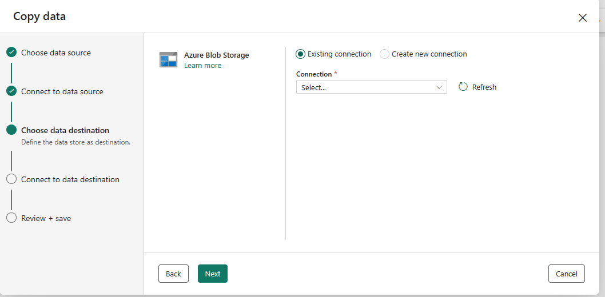

Si la conexión no existe, es necesario crearla.

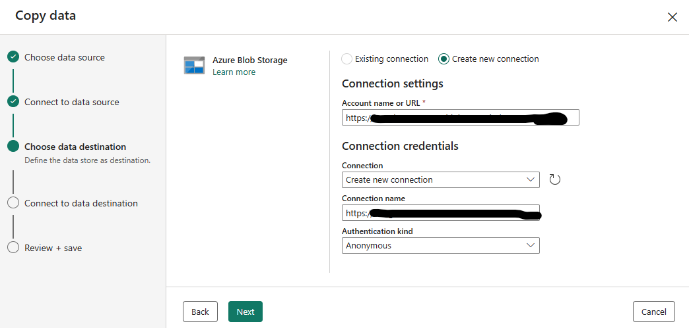

Le ponemos un nombre al file y especificamos el file path a dónde se copiará.

Revisamos que la información sea correcta previo a crear la actividad.

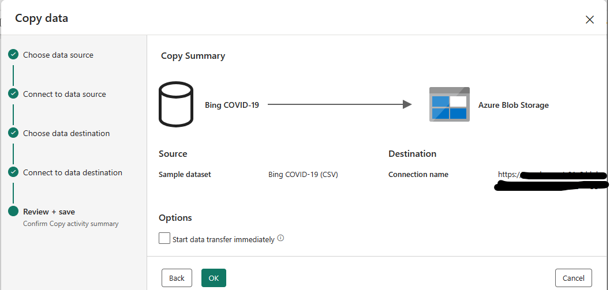

Aquí podemos ver nuestra simple actividad tal cual se vería en una pipeline de Data Factory utilizado en el portal de Azure.

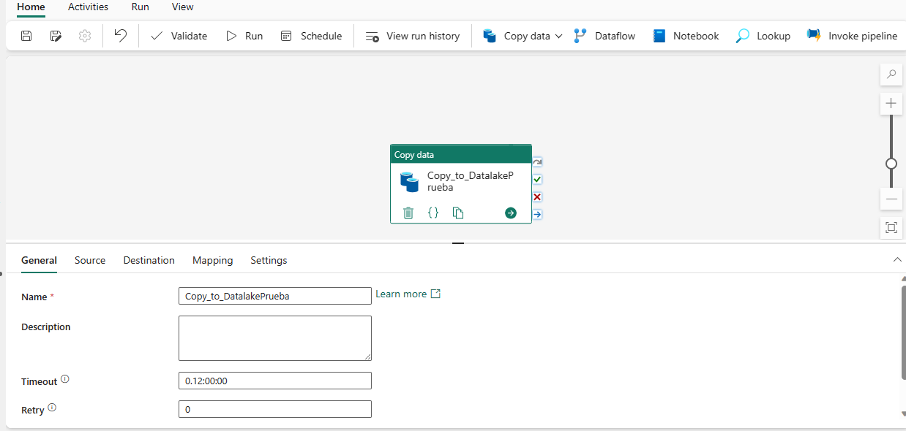

Podemos revisar que el origen de la fuente es el mismo que configuramos.

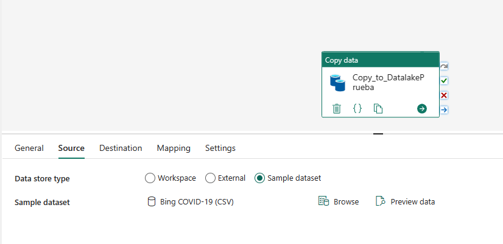

Revisamos que el destino de copia de data sea el correcto.

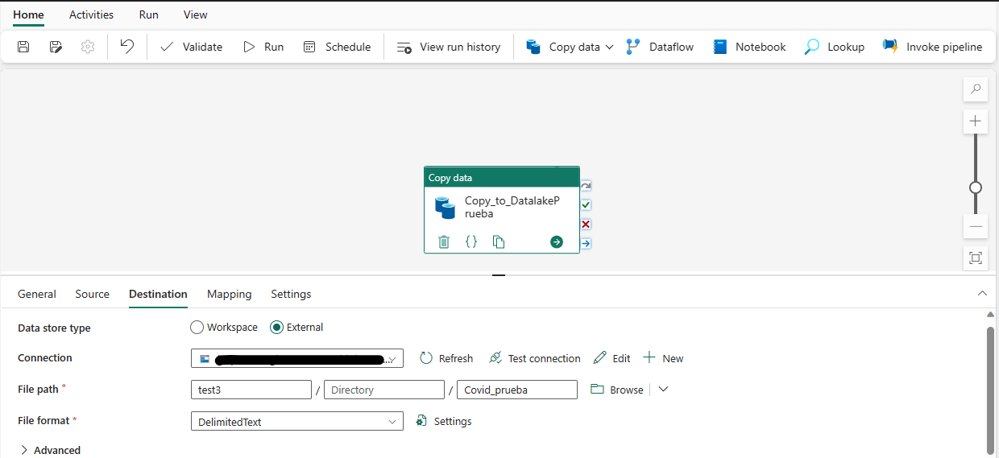

Guardamos los cambios de igual manera que en Data Factory.

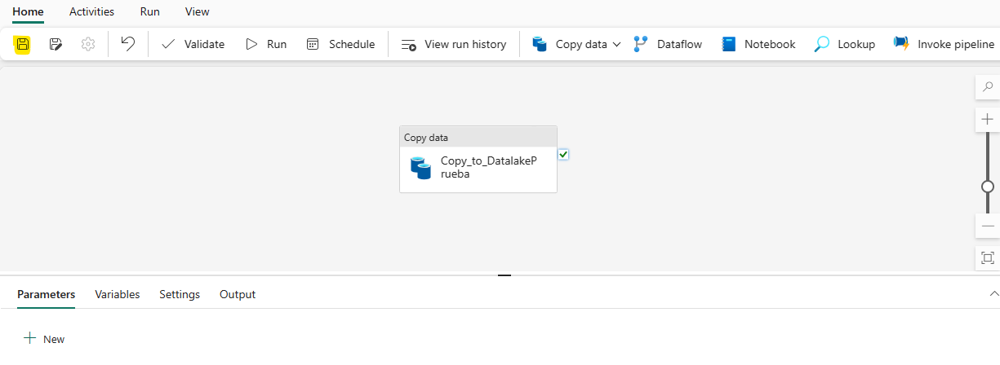

Iniciamos la ejecución del pipeline.

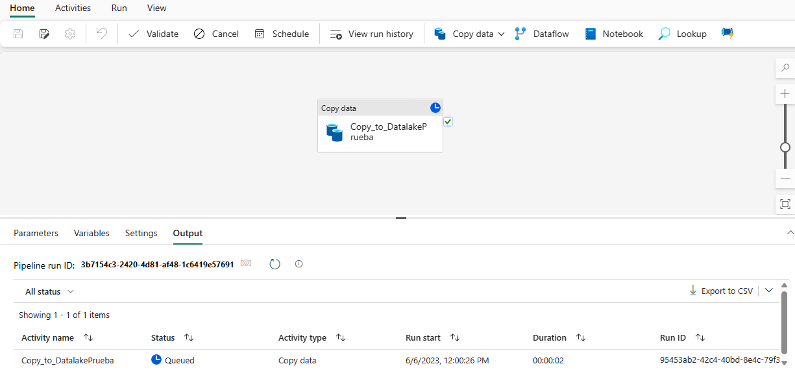

Luego de un momento, podemos ver que la ejecución del pipeline finalizó correctamente.

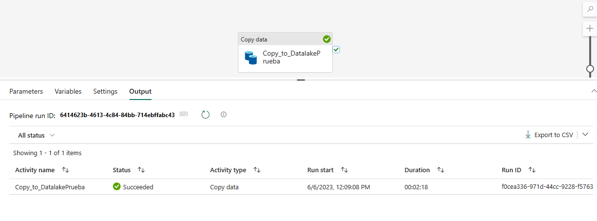

Revisamos en el blob storage y efectivamente la información se copió correctamente.

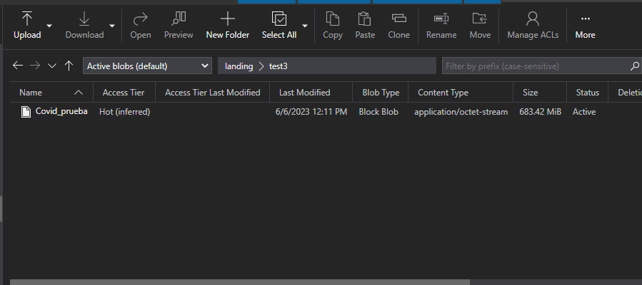

Entonces, cuáles son las ventajas y desventajas de utilizar un producto así hasta el momento?

Ventajas:
* No es necesario crear recursos individuales en Azure para poder orquestar nuestro proceso en Data Factory.
* La interfaz es muy interactiva y amigable para el usuario.
* Permite que más usuarios no tan relacionados a la ingeniería de datos puedan colaborar en el desarrollo de pipelines de Data Factory en Fabric.

Desventajas:
* Implementar de golpe Fabric en una compañía no sería algo muy acertado si la compañía tiene una estructurada consolidada en data. Sería provechoso iniciar ese camino de manera gradual.
* Si bien hay una estructura de niveles de acceso a usuarios en el portal de admin, es necesario definir a qué productos y que tipo de actividades podrá realizar cada usuario (Cómo en Power BI)
* No se permite interactuar con más de un pipeline abierto en simultáneo. En Data Factory individual si se puede hacer.
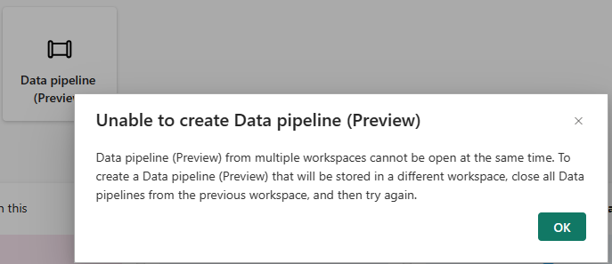 
  

- **Opinión personal respecto al rol del Data Analyst** 

 Microsoft Fabric ha sido un boom desde su anuncio en la última Microsoft Build y su posterior lanzamiento en preview para todo el mundo de la data. Está claro que contar con una herramienta de tal nivel en un contexto tecnológico desafiante y con la ayuda de la inteligencia artificial es realmente un avance muy grande en el desarrollo tecnológico. Para el Data analyst es una herramienta que viene a potenciar nuestras habilidades en el manejo de data debido a que, ya estamos acostumbrados a trabajar con plataformas integradas (cómo es el caso de Power BI) y por que estamos en constante actualización del negocio (por nuestro día a día con usuarios cada vez más exigentes)   
 Cabe destacar, que hace muchos años atrás, el rol que cumplen hoy los data scientists y los Data engineers lo ocupaba el Data analyst, de ahí puede que se compriman roles, que se expandan o que (lo más probable) se creen nuevos puestos en el mundo de data, todo es cuestión de seguir capacitandose y adaptandose a un mundo dónde la IA toma principal relevancia.
 

# Bibliografía

https://learn.microsoft.com/en-us/fabric/data-engineering/lakehouse-overview

https://learn.microsoft.com/en-us/training/paths/get-started-fabric/

https://learn.microsoft.com/en-us/fabric/data-factory/tutorial-end-to-end-pipeline

https://app.powerbi.com/

---

By **Facundo Montenegro**
