# Power BI - Cómo trabajar con listas online de Sharepoint?

Normalmente se utiliza un archivo .csv o excel colgado en un repositorio de Sharepoint, incluso se suelen utilizar carpetas de Sharepoint para ingestar una secuencia de archivos pero, alguna vez utilizamos las listas **Online** de Sharepoint? En este post veremos la forma de ingestar data desde Microsoft Lists con un ejemplo simple.

Consideraciones: 
-Se debe contar con una suscripción de Power BI Pro O PPU y acceso al workspace en PBI Service. 

 
-Comenzamos:  

Nos logueamos con nuestro usuario en nuestro dominio de sharepoint https://[dominio]-my.sharepoint.com/personal/[usuario]/

En este site se debe crear una lista en blanco de Sharepoint con Microsoft Lists:

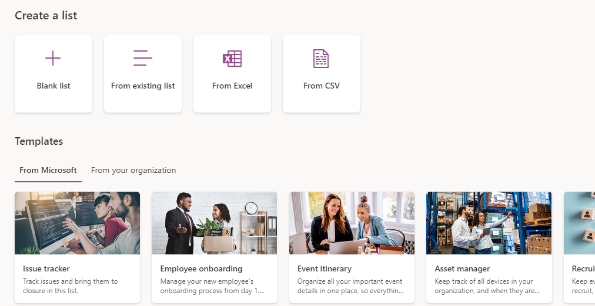

Seleccionamos blank list.

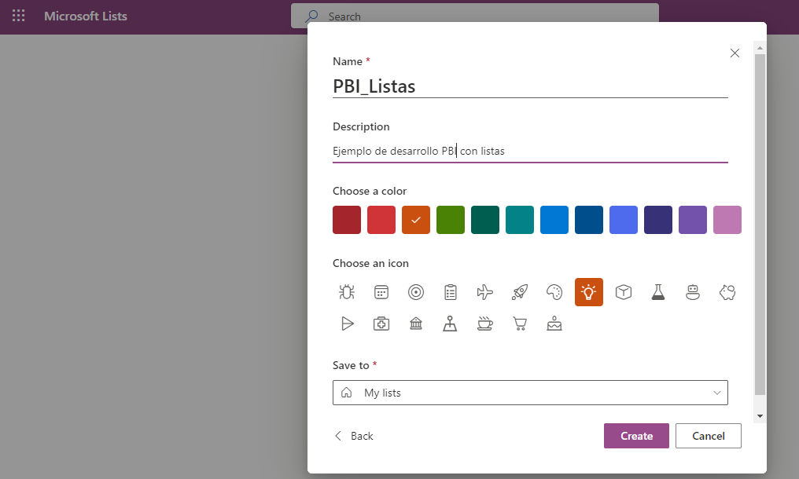

Colocamos un nombre, descripción y la carpeta dónde se guardará la lista.

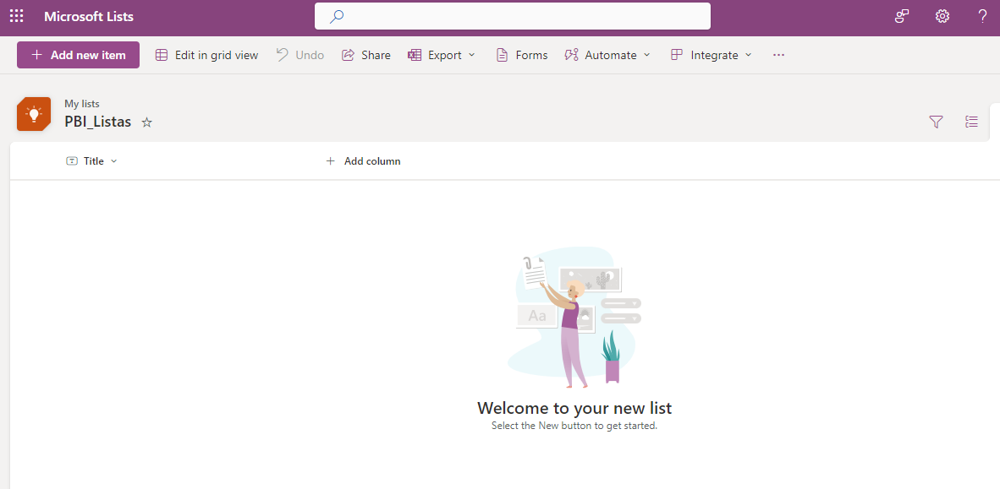

Una vez que creamos nuestra lista en blanco empezaremos a cargar data.

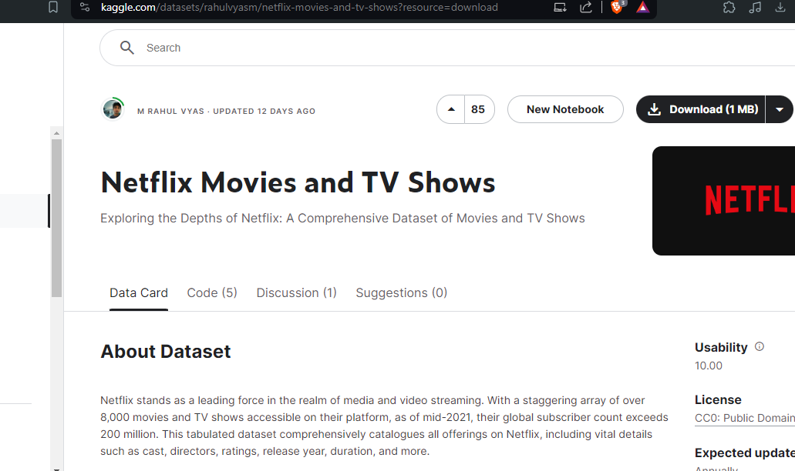

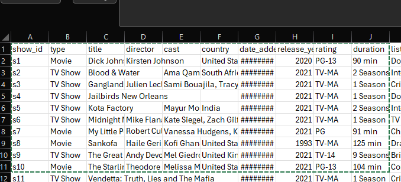

En este caso usaremos un sample de Kaggle con el catálogo de peliculas de Netlix, de las cuáles solo tomaremos 10 filas.

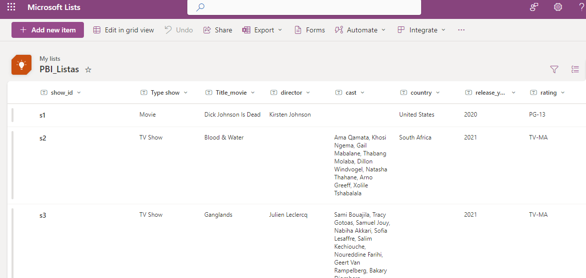

Una vez cargados los datos que necesitamos, abriremos Power BI Desktop, iremos a "Get data" y buscaremos el tipo de origen de datos "Sharepoint Online Lists"

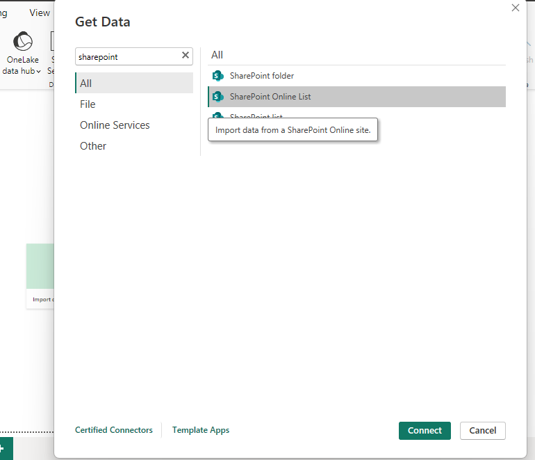

Ingresamos el link de la fuente de nuestra carpeta en Sharepoint, ahí buscaremos la lista creada y la importamos en el modelo.

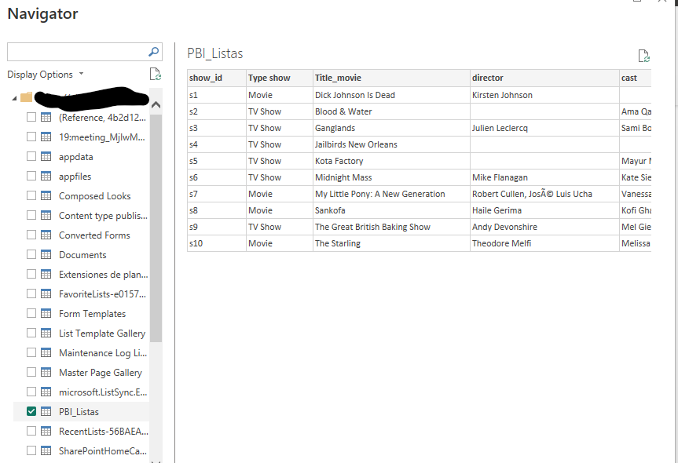

Cómo vemos, resulta sencillo trabajar con la data online y ya podemos comenzar con el diseño de nuestro dashboard.

**Dato a tener en cuenta**: Es necesario ser Owner de la lista online, de lo contrario, no será posible ingestar la fuente en Power BI Desktop.

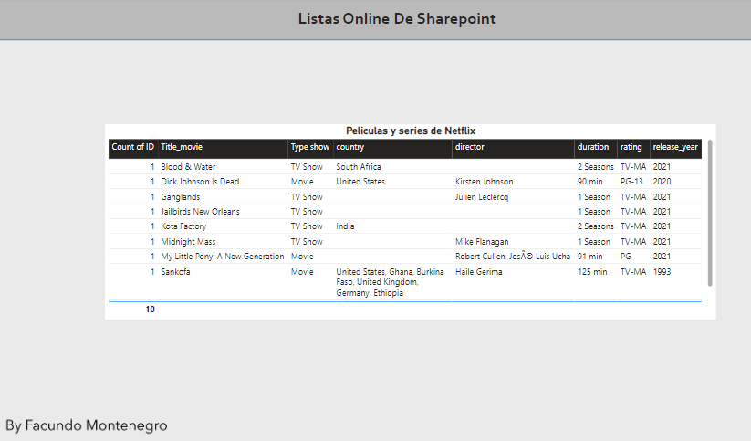

<h2>Otras formas de trabajar con Power BI tomando listas de Sharepoint</h2>

**Utilizando la función de integración con Power BI** (Sólo  disponible para el Owner)

Para esto debemos hacer clic en Integrate -> Power BI -> Visualize the list

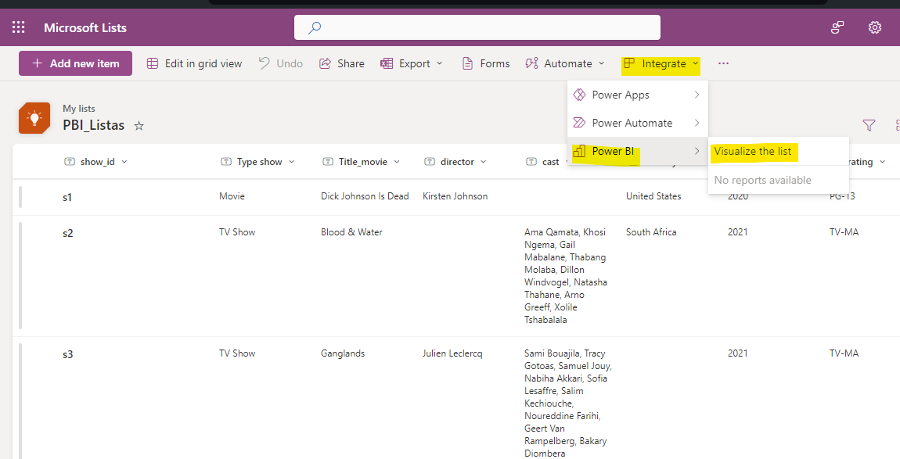

Esta opción nos dirige a Power BI Service en dónde nos crea el semantic model y el reporte de Power BI de manera automática.

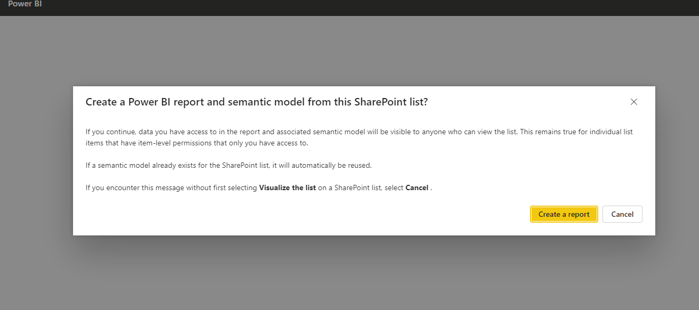

Claro que el reporte se crea de manera automática con la data que el algoritmo recoleta de nuestra lista online. Allí podremos editarlo desde Power BI service y guardarlo.

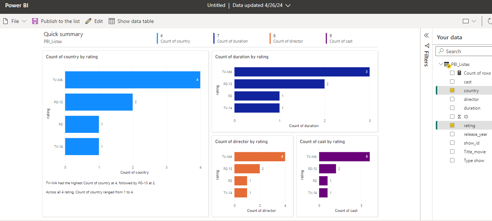

**Otra opción: Crear el Semantic Model en Power BI Service y conectarlo desde Power BI Desktop.**

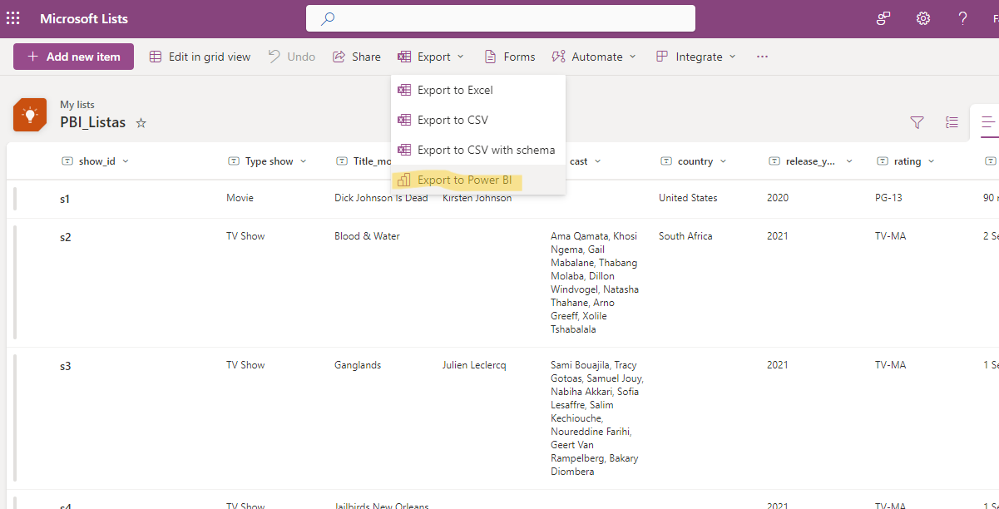

Para eso debemos hacer clic en Export -> Export to Power BI

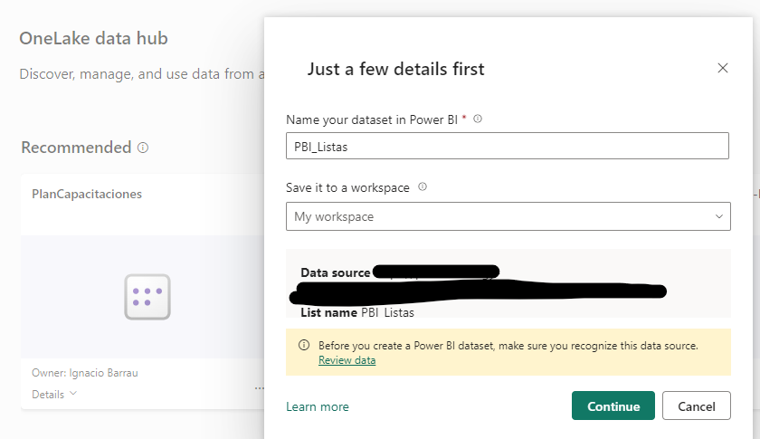

Elegimos un nombre para nuestro modelo semántico y seleccionamos el Workspace.

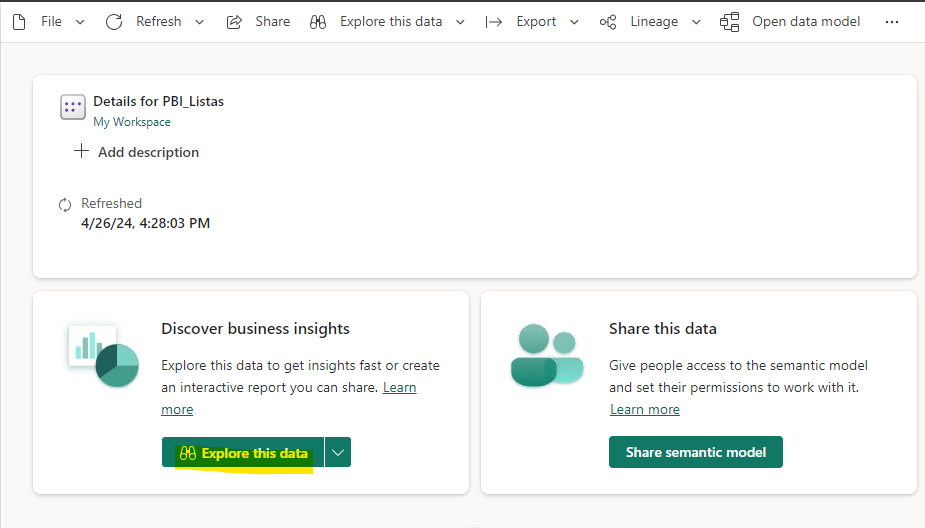

Y aquí podemos explorar la data desde Power BI Service.

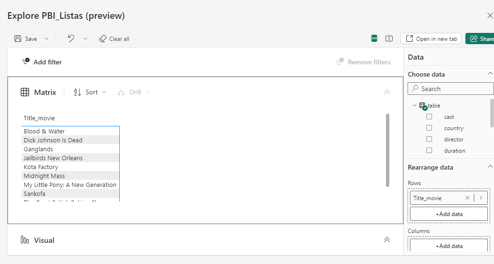

Si intentamos conectarnos desde Power BI Desktop, veremos que en "get data" tenemos la opción de conectar a un origen llamado "Power BI Semantic Models"

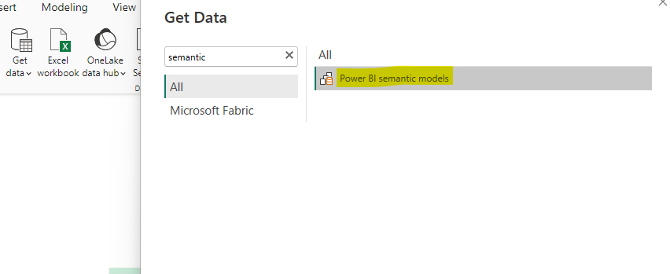

Y ahi veremos nuestro Semantic Model almacenado en OneLake.

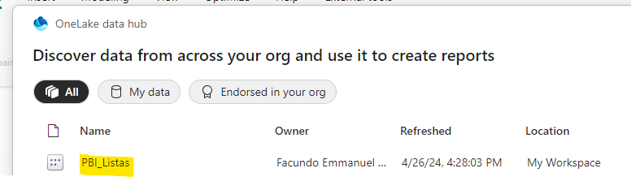

<h2>Summary</h2>

Para resumir un poco, vimos distintas formas de trabajar con listas de Sharepoint. Qué recomiendo yo? La **primera opción** por lejos, un gran mentor me dijo siempre **"Mientras antes,mejor"**  y esto por que siempre es mejor trabajar con la data en su estado original o llamado burdamente "data cruda" 
La integración de Sharepoint con Power BI lo vuelve una herramienta mucho más escalable a la hora de gestionar origenes de datos, sin embargo, hasta el momento Power BI Desktop sigue siendo la mejor opción para construir nuestros reportes utilizando este tipo de listas online.

----------------------------

# Bibliografía

Dataset : https://www.kaggle.com/datasets/rahulvyasm/netflix-movies-and-tv-shows?resource=download

https://powerbi.microsoft.com/fr-ca/blog/integrate-power-bi-reports-in-sharepoint-online/

https://learn.microsoft.com/en-us/power-bi/create-reports/desktop-sharepoint-save-share

https://app.powerbi.com/signin

By **Facundo Montenegro**
