# Cómo aplicar Data Transformation a un archivo .csv con Python Scripting y luego importarlo en Power BI?

Para los usuarios de Power BI es normal utilizar el editor de consultas (Power Query Editor) para el proceso de limpieza de archivos o tambien llamado data cleaning y luego data transformation. Pero, cómo podemos hacerlo utilizando python? Es más beneficioso que utilizar el Power Query Editor?

Vamos a ver un ejemplo sencillo y en pocos pasos para visualizar cuál es poder qué tiene realmente Python en data analysis.

Consideraciones: 
-Se debe contar con Jupyter Notebooks instalado. 
-Se debe contar una versión estable de Python instalada. 
-Tener instalada la librería Pandas. 
-Contar con Power BI Desktop instalado. 
 
-Comenzamos:  

Abrimos un símbolo de sistema y escribimos en la consola: jupyter notebook

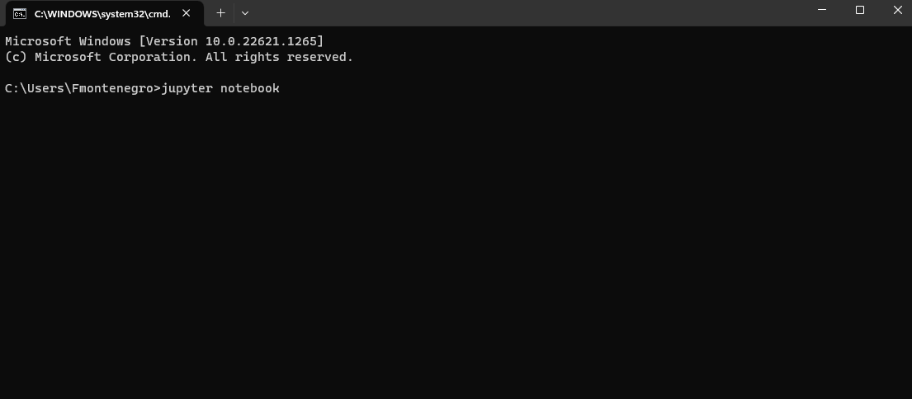

Esta instrucción abrirá el browser predeterminado del sistema en una instancia local del ide Jupyter

Una vez levantada la instancia local, se debe abrir un nuevo notebook que reconozca el lenguaje Python (En este caso, Python 3)

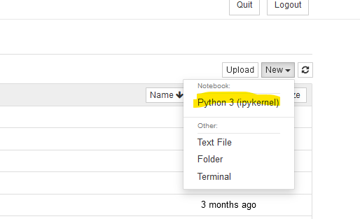

Bien! Ya tenemos el notebook creado y podemos empezar a importar las librerías que necesitamos.

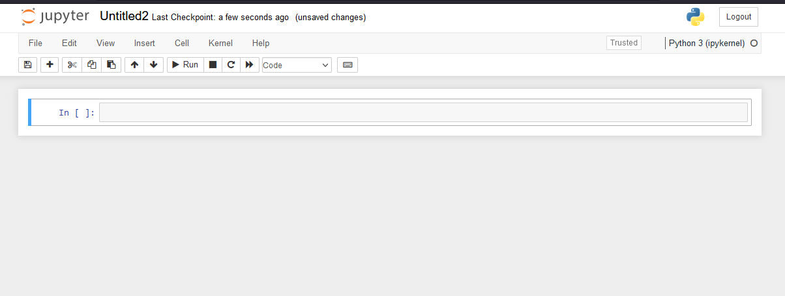

Comenzamos instalando la librería Pandas con la siguiente línea:

~~~

!pip install pandas

~~~

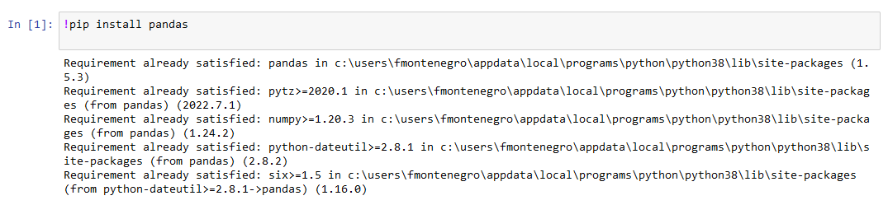

Ahora debemos leer el path, la dirección será la que tenga el directorio en la ruta local.

~~~

#carga del path
import pandas as pd
df = pd.read_csv(Path dónde se almacena el archivo .csv)

~~~

Para ver las cabeceras de las columnas que tienen las columnas del archivo se puede usar la siguiente instrucción:

~~~

df.head()

~~~

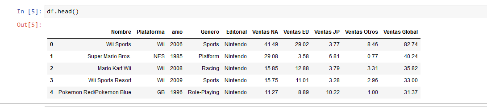

Ok, ya tenemos el archivo .csv cargado, vemos que nuestro dataframe es una tabla que hace referencia a la venta de videojuegos por zona geográfica. Haremos algunas transformaciones de este archivo. Empezamos por eliminar la columna "Ventas Global" con el siguiente código:

~~~

#dropeo columna ventas Global
df.drop(['Ventas Global'],axis =1)

~~~

Luego, haremos un pivoteo de las columnas ventas para poder tenerlas en una *ÚNICA* columna Ventas con el siguiente código:

~~~

df_unpivot = pd.melt(df,id_vars=['Nombre','Plataforma','anio','Genero','Editorial']
,value_vars=['Ventas NA','Ventas EU','Ventas JP','Ventas Otros'])

~~~

Este será el resultado:

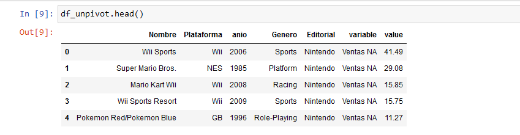

Qué más podemos hacer? Bueno, podemos renombrar las columnas variable y valor por sus respectivos nuevos nombres, es decir,
"anio" será "Año" , "variable" será "Región" y "value" será "Total":

~~~

df_int = df_unpivot.rename(columns ={'anio':'Año','variable':'Region','value':'Total'})

~~~

Ahora podemos definir un dataframe final reemplazando los valores de nombre abreviados por los nombres de cada región de ventas:

~~~
df_final = df_int.replace({'Ventas NA':'Norte América','Ventas EU':'Europa','Ventas JP':'Japón','Ventas Otros':'Otros'})
~~~

El resultado será el siguiente:

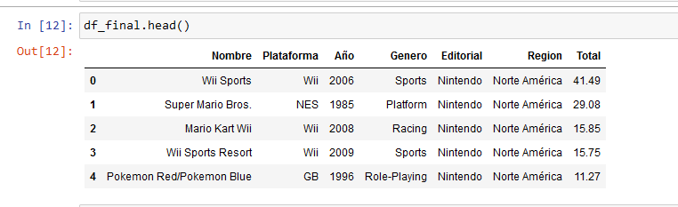

Y Entonces, cómo podemos importar esta tabla final generada en Power BI?

Bueno, lo primero es abrir Power BI Desktop y realizar la configuración para Python Scripting:

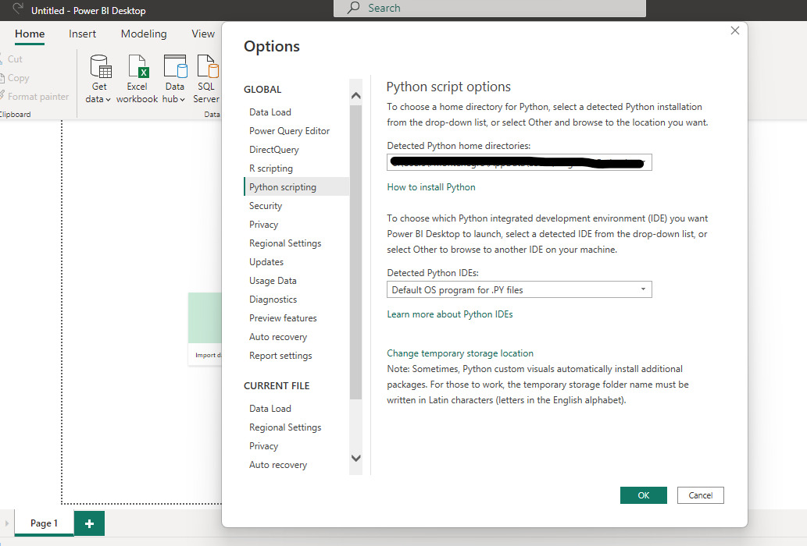

De estar todo ok, pasamos a la opción "Get Data" y buscamos el tipo de fuente Python Script:

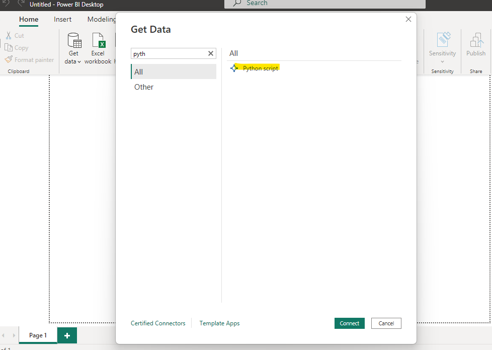

y Ahora? bueno, debemos solamente copiar los pasos de los notebooks en un sólo script de python:

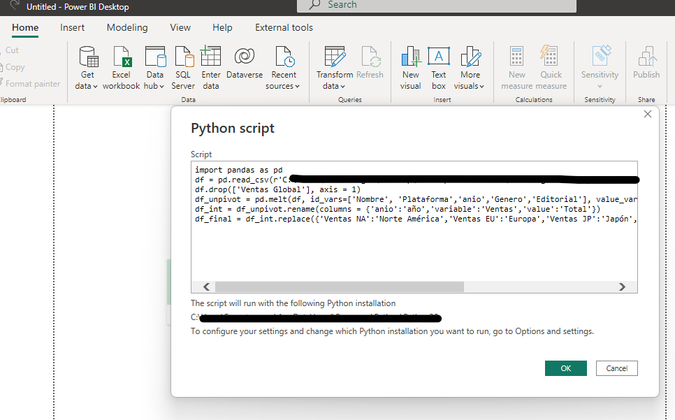

~~~
import pandas as pd
df = pd.read_csv("Ingrese su path")
df.drop(['Ventas Global'], axis = 1)
df_unpivot = pd.melt(df, id_vars=['Nombre', 'Plataforma','anio','Genero','Editorial'], value_vars=['Ventas NA', 'Ventas EU', 'Ventas JP','Ventas Otros'])
df_int = df_unpivot.rename(columns = {'anio':'año','variable':'Ventas','value':'Total'})
df_final = df_int.replace({'Ventas NA':'Norte América','Ventas EU':'Europa','Ventas JP':'Japón','Ventas Otros':'Otros'})
~~~

Una vez que hacemos clic en OK nos apareceran distintos dataframes generados. El que nos interesa es el df_final.

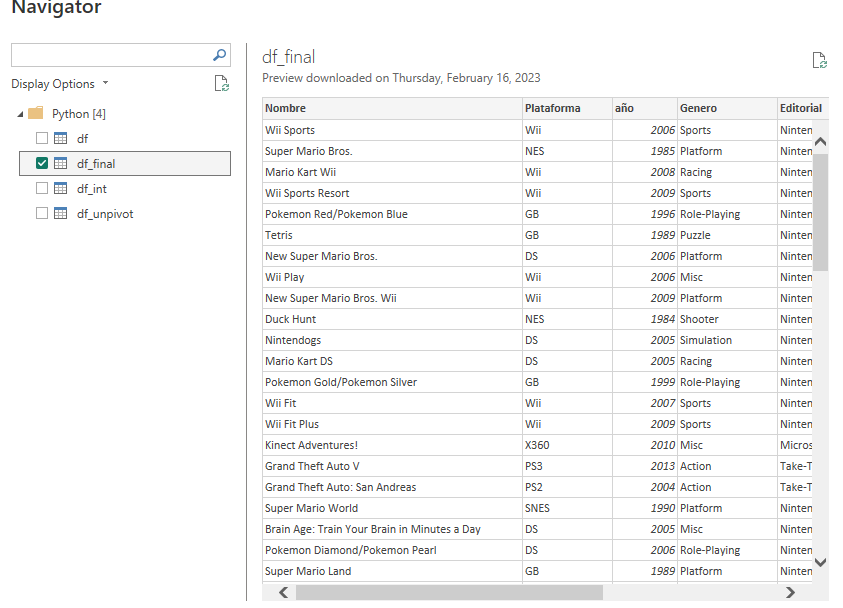

Finalmente podemos importar la data a Power BI con solo aplicar los cambios y verificar que tarda solo segundos en cargarse.

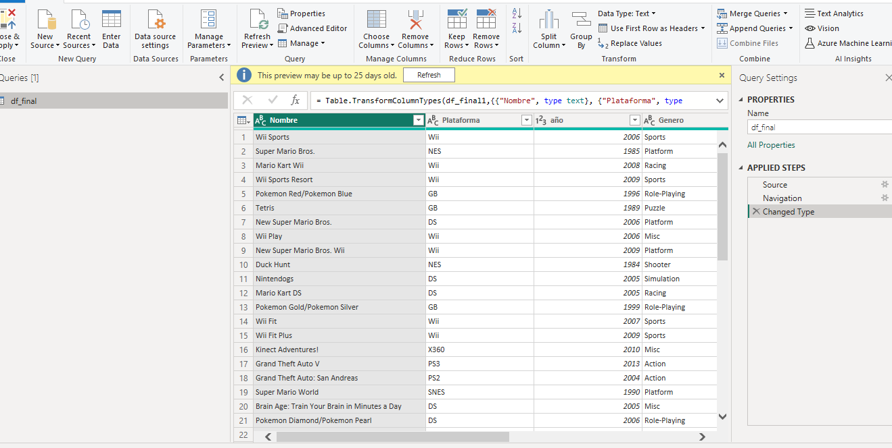

Con esto podemos comprobar la potencia y velocidad que genera el scripting en python, sin necesidad de realizar transformaciones en Power Query y proporcionando una mayor performance al desarrollo del modelado de datos y creación de tableros en Power BI.

Se adjunta .pbix y Dataset

----------------------------

# Bibliografía

https://www.python.org/downloads/

https://jupyter.org/

https://pandas.pydata.org/

https://learn.microsoft.com/en-us/power-bi/connect-data/desktop-python-scripts

https://www.kaggle.com/datasets/felipemourentin/videojuegos

---

By **Facundo Montenegro**
