# SQL - Cómo hacer un "Copy Data" manual de una tabla a otra en SQL e importar sus resultados en Power BI?

En este nuevo post se abordan conceptos de Stored Procedures, Qué son? Para qué sirven? Cómo puedo copiar la data de una tabla a otra? Cómo importar los resultados en Power BI? Lo veremos con sencillos ejemplos.

Beneficios del manejo de Stored Procedures:
- Manejo de Históricos.
- Mover grandes volúmenes de datos de tablas temporales a tablas reales.
- Gestionar el almacenamiento de nuestra DB garantizando performance. 
- Reutilización de código y garantía de seguridad.
- Fácil mantenimiento.

Consideraciones: 
-Contamos con SQL Server Management Studio. 
-Contamos con la BD AdventureWorksDW2019 instalada. 
-Contamos con Power BI Desktop.
  

 
-Comenzamos:  
 
Abrimos SQL Server y buscamos la base de datos AdventureWorksDW2019.

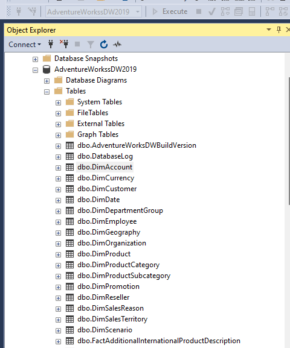

Cómo podemos ver, esta DB posee muchas tablas, nos centraremos en el uso de la tabla *[dbo].[FactInternetSales]*

Podemos hacer un Select sencillo para ver los datos que posee creando una New Query:

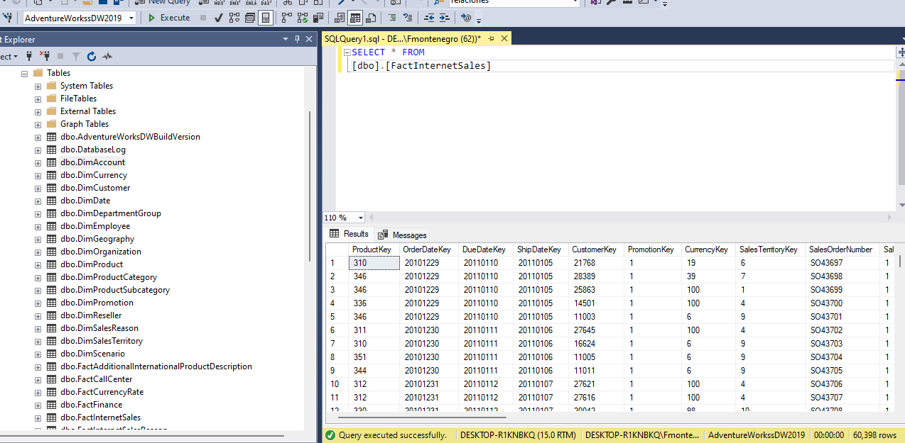

*Cómo sería el procedimiento si queremos copiar estos datos en una tabla nueva?* Veamos. Primero debemos crear una nueva tabla que posea **Exactamente** los mismos campos que la tabla *[dbo].[FactInternetSales]*.

Ejecutamos el siguiente Script para crear nuesta tabla de copia:

<pre><code>
CREATE TABLE [dbo].[FactInternetSales_Copy](
	[ProductKey] [int] NOT NULL,
	[OrderDateKey] [int] NOT NULL,
	[DueDateKey] [int] NOT NULL,
	[ShipDateKey] [int] NOT NULL,
	[CustomerKey] [int] NOT NULL,
	[PromotionKey] [int] NOT NULL,
	[CurrencyKey] [int] NOT NULL,
	[SalesTerritoryKey] [int] NOT NULL,
	[SalesOrderNumber] [nvarchar](20) NOT NULL,
	[SalesOrderLineNumber] [tinyint] NOT NULL,
	[RevisionNumber] [tinyint] NOT NULL,
	[OrderQuantity] [smallint] NOT NULL,
	[UnitPrice] [money] NOT NULL,
	[ExtendedAmount] [money] NOT NULL,
	[UnitPriceDiscountPct] [float] NOT NULL,
	[DiscountAmount] [float] NOT NULL,
	[ProductStandardCost] [money] NOT NULL,
	[TotalProductCost] [money] NOT NULL,
	[SalesAmount] [money] NOT NULL,
	[TaxAmt] [money] NOT NULL,
	[Freight] [money] NOT NULL,
	[CarrierTrackingNumber] [nvarchar](25) NULL,
	[CustomerPONumber] [nvarchar](25) NULL,
	[OrderDate] [datetime] NULL,
	[DueDate] [datetime] NULL,
	[ShipDate] [datetime] NULL,
	ETL_LAST_UPDATE [datetime] NULL
 CONSTRAINT [PK_FactInternetSales_SalesOrderNumber_SalesOrderLineNumber_Copy] PRIMARY KEY CLUSTERED 
(
	[SalesOrderNumber] ASC,
	[SalesOrderLineNumber] ASC
)WITH (PAD_INDEX = OFF, STATISTICS_NORECOMPUTE = OFF, IGNORE_DUP_KEY = OFF, ALLOW_ROW_LOCKS = ON, ALLOW_PAGE_LOCKS = ON, OPTIMIZE_FOR_SEQUENTIAL_KEY = OFF) ON [PRIMARY]
) 
</code></pre>

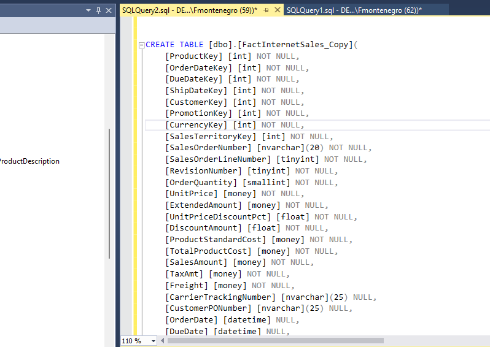

Si buscamos la tabla creada [dbo].[FactInternetSales_Copy] y le hacemos un Select, podremos ver que existe pero que no tiene datos (lo cuál es lógico para los fines de esta actividad)

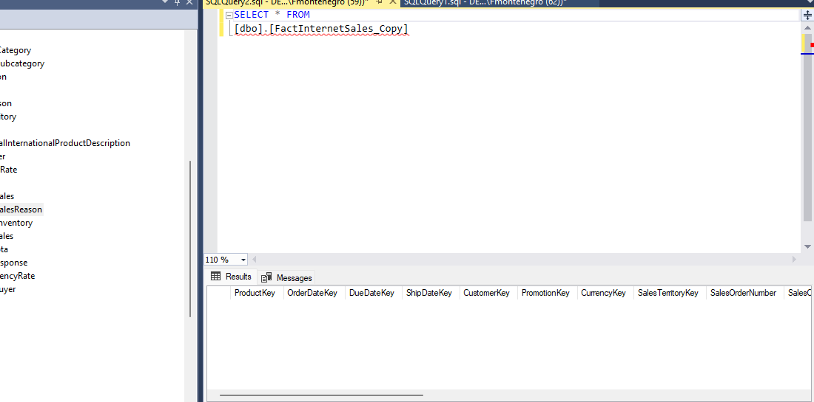

Cual es el paso siguiente? *Crear un Stored Procedure que realice la copia de los datos de la tabla original a la tabla de copia.*

**Qué es un Stored Procedure? Para qué Sirve? Cómo podemos utilizarlo para este ejemplo?**

Un stored procedure, o procedimiento almacenado en español, es un conjunto de instrucciones SQL precompiladas que se almacenan en una base de datos. Son utilizados comúnmente en sistemas de gestión de bases de datos (DBMS) para encapsular lógica de negocio o tareas repetitivas. Ejemplo: Copiar datos de una tabla a otra, Crear nuevas tablas, Eliminar datos innecesarios, crear particiones, etc.

**Cómo creamos un Stored Procedure para este ejemplo? Sencillo!**

En una nueva query, ejecutamos la siguiente sentencia para crear un Stored Procedure:

<pre><code>
CREATE PROCEDURE SP_CopyData_FactInternetSales
AS
BEGIN
    -- Se verifica si hay datos en la tabla de origen
    IF (SELECT COUNT(*) FROM [FactInternetSales]) > 0
    BEGIN
        -- Se eliminan datos existentes si es necesario,
        -- DELETE FROM TablaDestino;

        -- Copiar datos de la tabla de origen a la tabla de destino
        INSERT INTO [FactInternetSales_Copy]
        SELECT *, GETDATE() AS LastETL
        FROM [FactInternetSales];
    END
END;
</code></pre>

**Nótese que en el script agregamos la función GETDATE() para obtener la última fecha de ingesta en la columna LastETL**.

Otra opción? 

Desde Programmability (Clic derecho)--> New --> Stored Procedure.

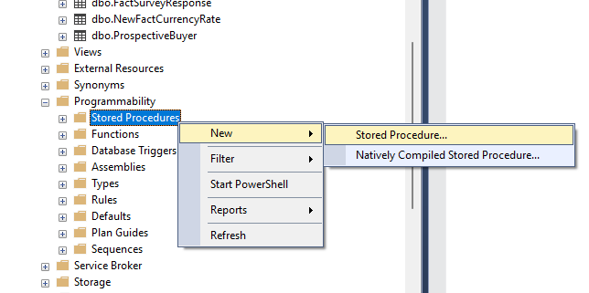

Esto genera un Script por defecto con el formato de un SP (allí deberiamos cambiar el código por defecto y escribir nuestro código, finalmente ejecutarlo)

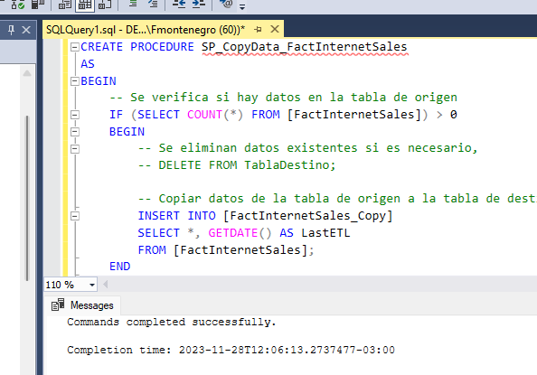

Verificamos en Programmability que nuestro SP se creó correctamente.

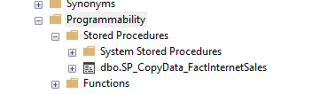

Creamos una query y ejecutamos el SP.

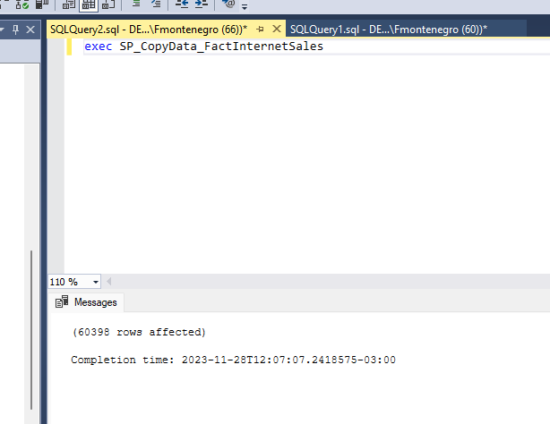

En una nueva query ejecutamos un Select de la tabla en la que se copió toda la data:

SELECT * FROM [dbo].[FactInternetSales_Copy]

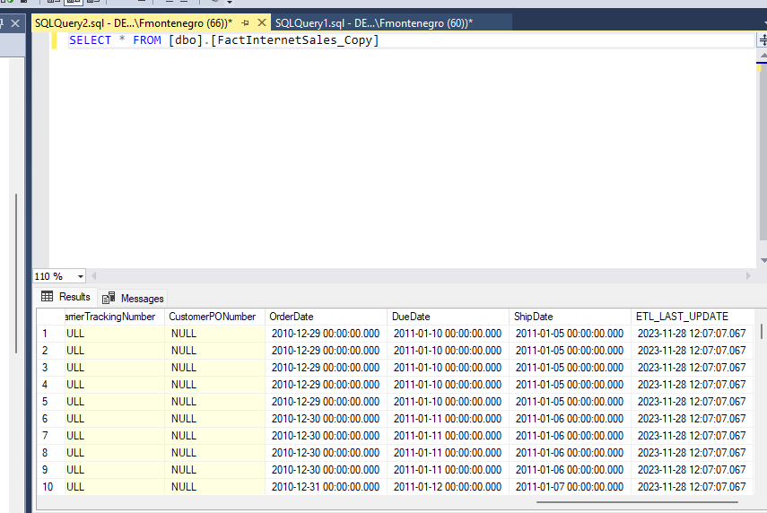

Entonces, ya copiamos la información de nuestra tabla de origen a una nueva tabla.

**Cómo importo estos resultados en Power BI? Muy sencillo!**

Abrimos Power BI Desktop, en Get Data seleccionamos el origen "SQL Server"

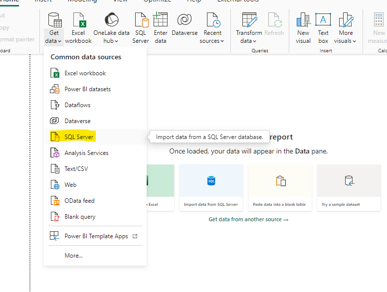

Escribimos el server de la DB y hacemos clic en OK.

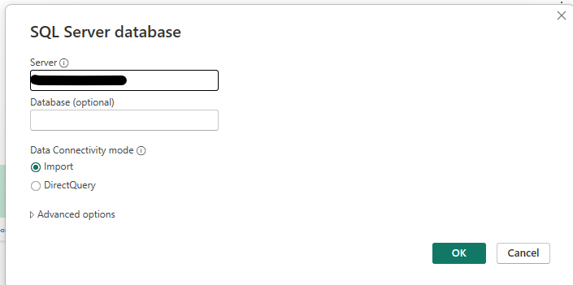

Buscamos nuestra tabla FactInternetSales_Copy y podemos visualizar que efectivamente se copiaron los datos correctamente.

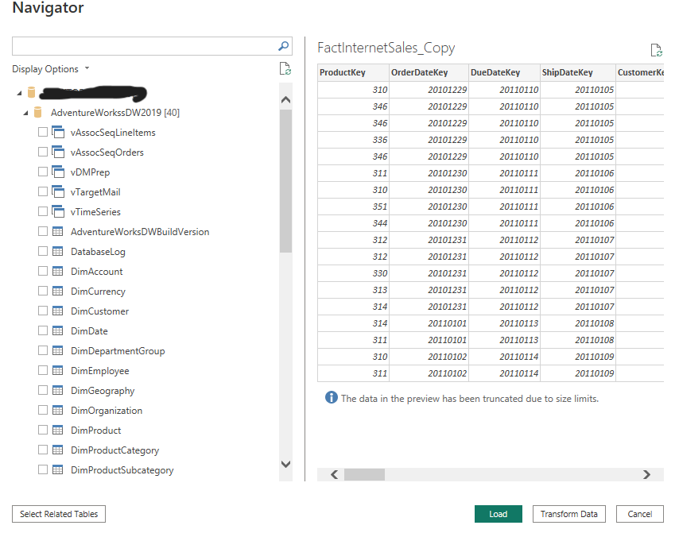

**En resumen, vimos la importancia de los Stored Procedures y como pueden automatizar operaciones que llevarían mucho tiempo ejecutarse de manera manual. Esto mismo puede invocarse desde una Pipeline en Data Factory que programe una fecha diaria para que este copiado de datos se ejecute todos los dias y tengamos una columna "LastEtl" para visualizar cuándo se ejecutaron las últimas ingestas.**

# Bibliografía

https://learn.microsoft.com/en-us/sql/relational-databases/stored-procedures/create-a-stored-procedure?view=sql-server-ver16

https://www.w3schools.com/sql/sql_stored_procedures.asp

https://learn.microsoft.com/en-us/azure/data-factory/quickstart-hello-world-copy-data-tool

https://www.javatpoint.com/sql-copy-table

https://learn.microsoft.com/en-us/power-bi/connect-data/service-gateway-sql-tutorial

---
By **Facundo Montenegro**
