# SSAS - Cómo crear una tabla de manera manual en Tabular Model? 

Muchas veces me han preguntado cómo se crean tablas cargando datos de manera manual en Tabular Model de la misma manera que en Power Query. Por qué es diferente? Que diferencias tiene crearla en SSAS y en el Power Query de Power BI Desktop?

Consideraciones: 
-Se omite la creación de un modelo tabular en Visual Studio 
-Ya contamos con medidas y tablas creadas en un modelo tabular. 
 
-Comenzamos:  

Nos ubicamos en Visual Studio en nuestro modelo tabular:

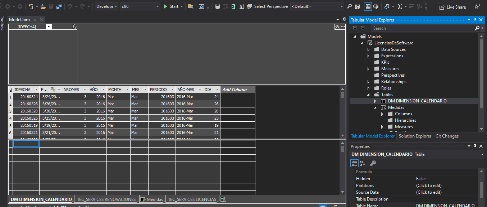

Seleccionamos una tabla aleatoria (en este caso la dimensión calendario) y hacemos clic derecho --> Table Properties.

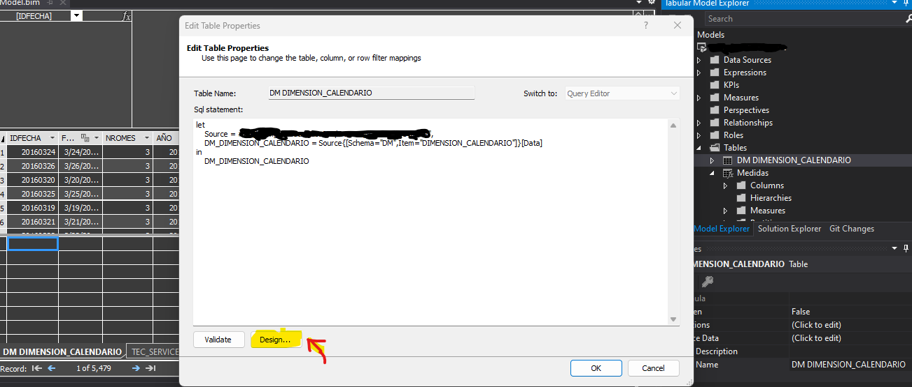
Luego se hace clic en Design. Esto abrirá una nueva pantalla casi idéntica al Power Query Editor de Power BI.

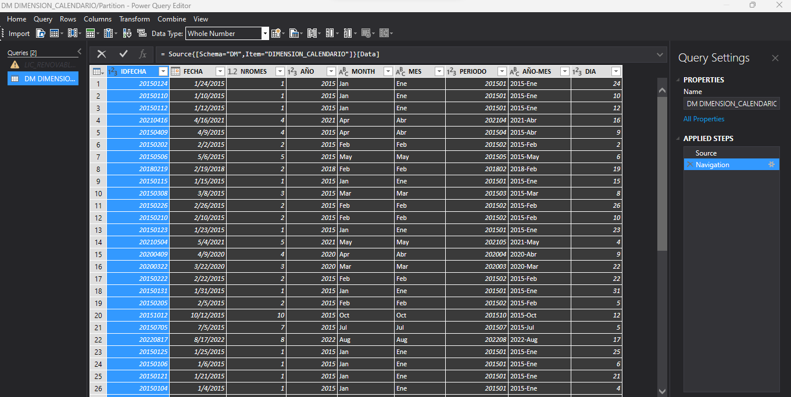

Una vez dentro del editor de consultas, se procede a seleccionar la opción "Query" en el toolbar de menú. Luego se hace clic en "Enter Data"

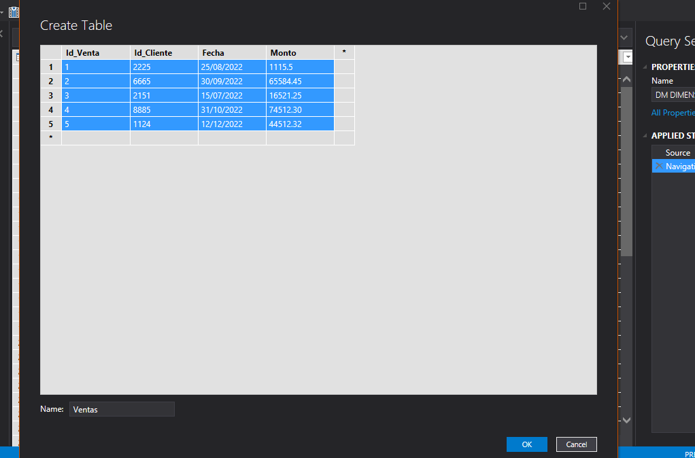

Cargamos la data que necesitamos (En mi caso fue un copy-paste de un excel), le asignamos el nombre "Ventas" a la tabla y se hace clic en "Ok"

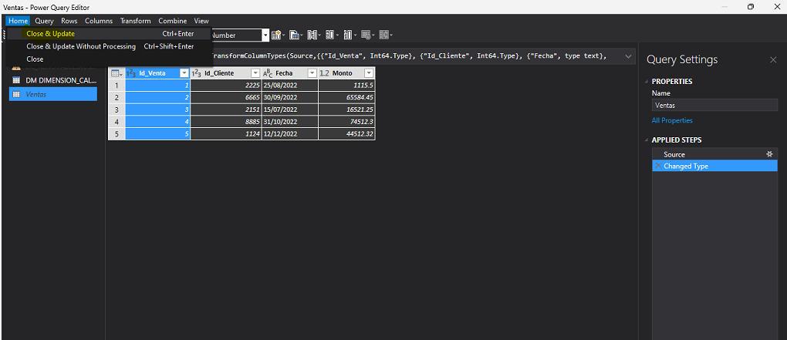

Una vez cargada los datos, ya vemos que se visualiza de manera tabular, lo siguiente es hacer clic en "Close & Update"? Aquí es dónde viene la duda...**Veamos qué sucede.**

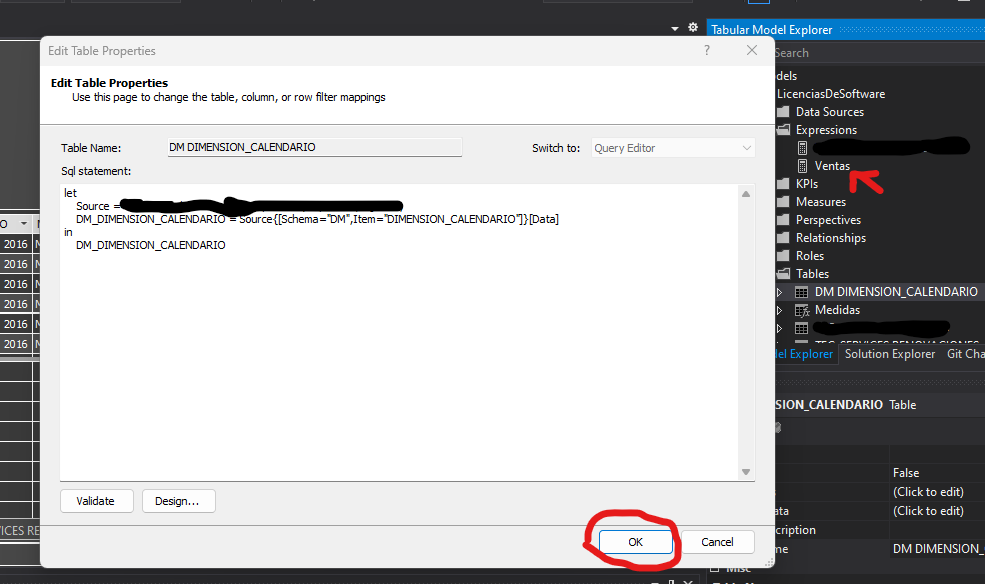

Aparentemente la data no fue cargada como una tabla, en su lugar se ve una expresión con el nombre "Ventas"? Claro, por que no especificamos que queríamos que fuese una tabla, si no una **Expresión de la tabla calendario.**
  
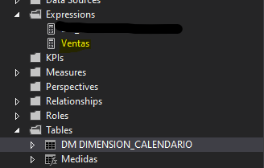

Y entonces, cómo lo cambiamos? Sencillo!

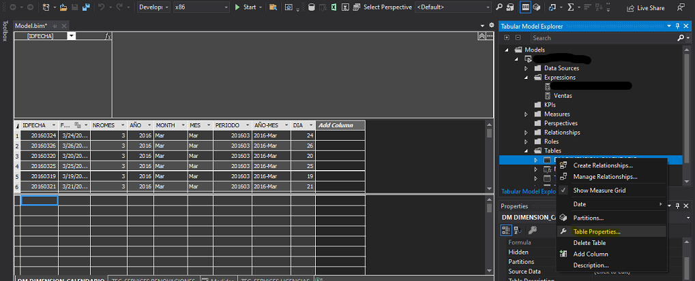

Vamos nuevamente a la tabla calendario, clic derecho y seleccionamos "Table Properties."

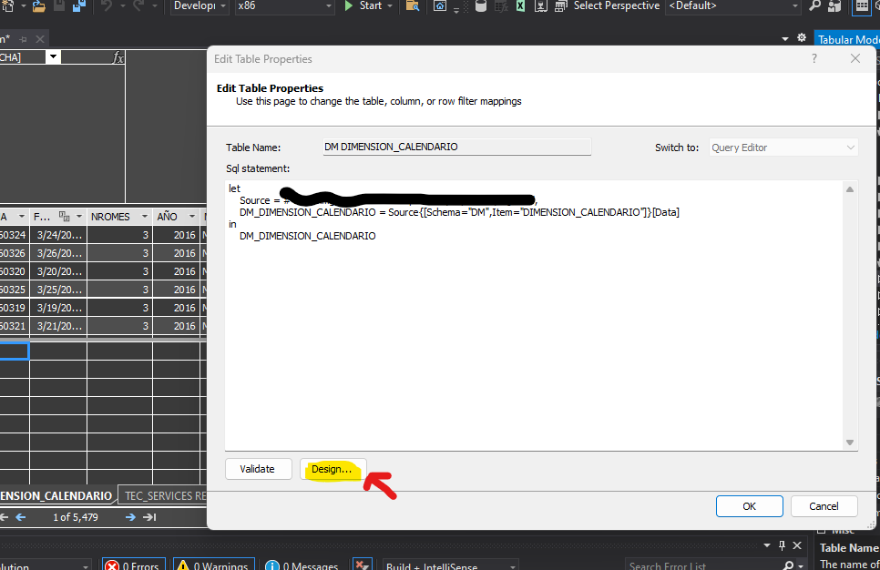

Nuevamente, clic en "Design"

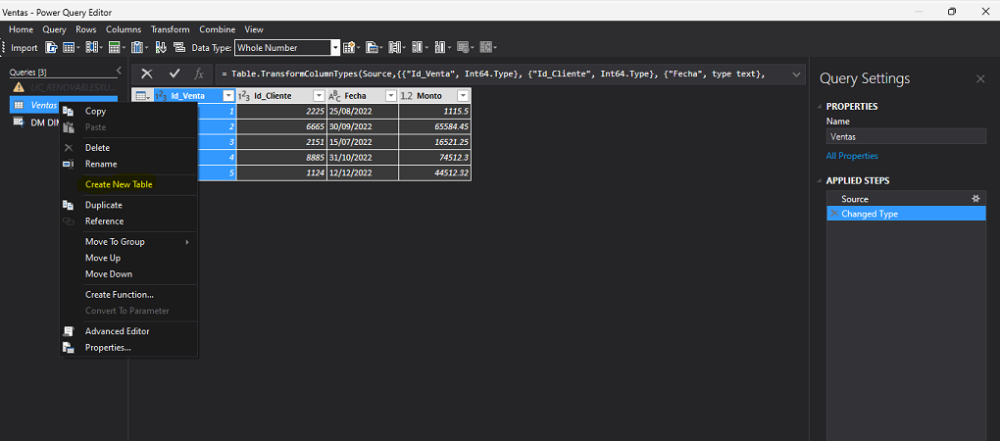

Seleccionamos la expresión "Ventas" y ahora lo importante... **Hacer clic en "Create New Table".**
 
Esto generará una tabla al modelo tabular y ya podrá procesarse con la data cargada.

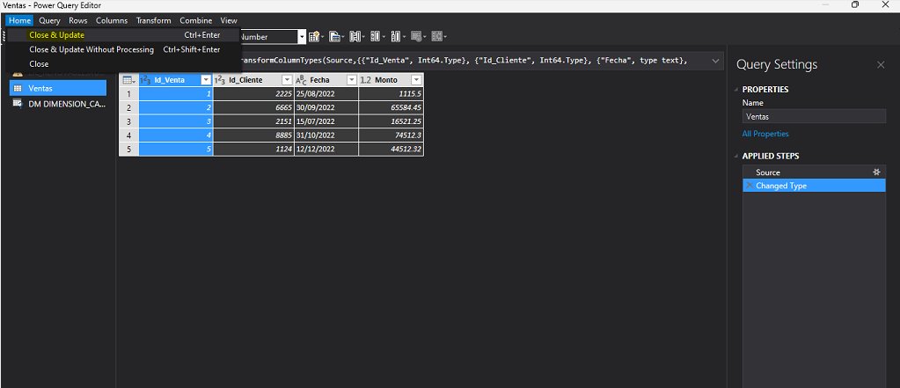

Cerramos y aplicamos cambios.

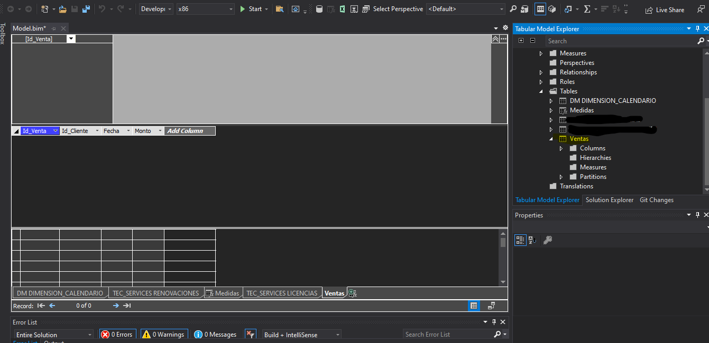

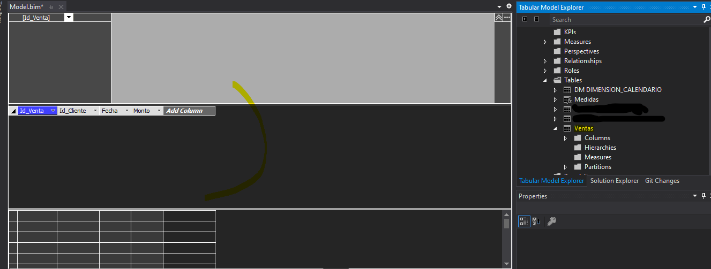

Ya está!! Podemos ver la tabla creada, el tema ahora es, **Por qué no tiene data?**  
Básicamente, la tabla una vez cargada necesita procesarse para sincronizarse en conjunto con el modelo tabular, en este caso, solo necesitamos procesar la tabla.

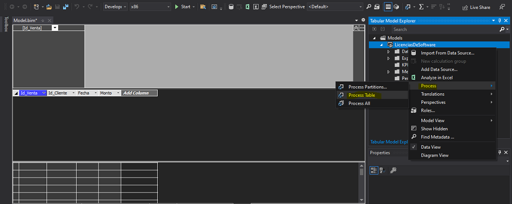

Clic derecho en el modelo, hacer clic en "Process" y luego en "Process Table".

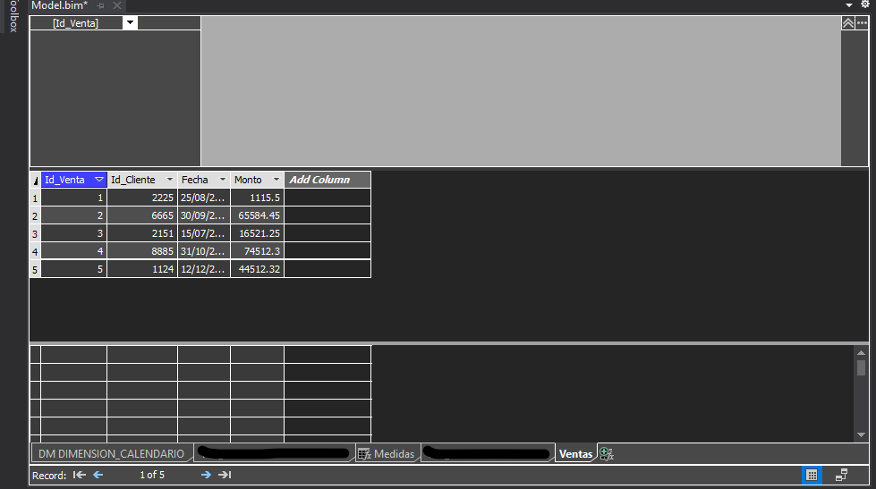

Listo! ya tenemos nuestra tabla creada de manera manual y sincronizada con el modelo tabular. 

# Bibliografía

https://learn.microsoft.com/en-us/analysis-services/ssas-overview?view=asallproducts-allversions

https://learn.microsoft.com/en-us/analysis-services/tabular-models/tabular-models-ssas?view=asallproducts-allversions

https://www.sqlshack.com/creating-first-ssas-tabular-model-database/

---

By **Facundo Montenegro**
