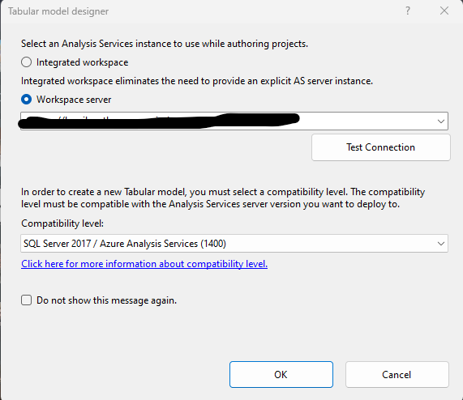

# SSAS - Cómo empezar un nuevo proyecto? 

Muchas veces me han preguntado cómo iniciar un proyecto en SSAS y luego conectarlo a Power BI? Qué es SSAS? Cómo se crea un nuevo proyecto? Que diferencias tiene crear un proyecto en SSAS y no directamente Power BI Desktop? Lo veremos paso a paso con ejemplos sencillos.

Consideraciones: 
* Contamos con Visual Studio y Power BI Desktop instalados.  

-Comenzamos:  

# Qué es SSAS?

SSAS es una herramienta de Microsoft que forma parte de la suite de productos de SQL Server y se utiliza principalmente para realizar análisis y procesamiento de datos multidimensionales y tabulares.

* SSAS Multidimensional : En este modo, SSAS permite crear modelos multidimensionales, también conocidos como cubos OLAP (Procesamiento Analítico en Línea). Estos cubos permiten analizar grandes cantidades de datos de manera eficiente y realizar análisis complejos utilizando dimensiones y medidas. 

* SSAS Tabular: se utiliza para crear modelos tabulares. Los modelos tabulares son similares a las bases de datos relacionales y permiten la creación de estructuras de datos tabulares en memoria para un acceso rápido y consultas eficientes. Nos centraremos en SSAS Tabular.

Abrimos Visual Studio (preferentemente en sus últimas versiones)

Creamos un nuevo proyecto.

Buscamos la extensión de proyecto "Analysis Services Tabular Project" y la seleccionamos.

Luego, nombramos a nuestro proyecto y seleccionamos la dirección en dónde se creara una carpeta con el proyecto.

Hacemos clic en "Create"

Se abrirá una pequeña ventana dónde debemos especificar si queremos seleccionar un "Integrated Workspace" o un "Workspace server" (En nuestro caso seleccionamos "Workspace Server")

Cual es la diferencia? 
* Integrated Workspace: se crea una base de datos de trabajo en memoria utilizando la propia instancia implícita de Visual Studio. El integrated Workspace reduce significativamente la complejidad de la creación de proyectos tabulares porque no se requiere un servidor explícito independiente.
* Workspace Server: Se necesita especificar un server de una base datos a la cual se conectará el modelo tabular.

Una vez que seleccionamos una opción, pasamos a chequear la conexión.

Verificamos que existe conexión al server especificado.

Lo siguiente que veremos es la interfaz con nuestro modelo tabular que aún no tiene ningún origen de datos. Entonces, agregaremos una tabla de prueba.

Se hace clic botón derecho en "Data Source" Y elegimos la opción "Import From Data Source"

Elegimos el origen al cual queremos conectarnos (En nuestro caso, una base de datos SQL)

Buscamos nuestra tabla test.

Luego seleccionamos la opción "Load" para cargar esta tabla en el modelo tabular (Si elegimos transform data, se abrirá una interfaz con Power Query para transformar dicha tabla)

Verificamos que los datos de la tabla se cargaron correctamente.

Vemos nuestra tabla de la base de datos cargada correctamente en el modelo tabular.

# Cómo hago para conectar un modelo tabular a Power BI?

Muy sencillo! Primero Debemos hacer un deploy del modelo tabular.
Para eso nos ubicamos en nuestro proyecto en la pestaña "Solution Explorer"

Clic botón derecho en el proyecto y seleccionamos la opción "Deploy" 
Una vez finalizado el deploy, podremos dirigirnos a Power BI Dekstop para conectarnos a nuestro modelo tabular.

Abrimos Power BI Desktop.

Buscamos y seleccionamos la opción "SQL Server Analysis Services Database"

Especificamos el server y buscamos nuestro proyecto, una vez seleccionado hacemos clic en "Ok"

Listo! Ya creamos nuestro modelo tabular y lo conectamos en Power BI, lo que sigue depende en los requerimientos para continuar desarrollando el proyecto.

# Por qué crear un proyecto en SSAS y no directamente en Power BI?
El desarrollo de soluciones de análisis y modelos de datos en SQL Server Analysis Services (SSAS) en lugar de hacerlo directamente en Power BI puede tener razones como:
- Escalabilidad y Rendimiento: SSAS se especializa en la creación de modelos de datos altamente escalables y optimizados para el rendimiento.
- Reutilización de Modelos: Si la compañía necesita utilizar los mismos modelos de datos en varias soluciones y herramientas, como Power BI, Excel y aplicaciones personalizadas.
- Gestión Centralizada: SSAS proporciona una forma centralizada de administrar y asegurar modelos de datos. 
- Mayor Flexibilidad en el Desarrollo: SSAS, especialmente en su modo Multidimensional, ofrece un mayor grado de flexibilidad en el modelado de datos en comparación con Power BI. 
- Necesidades de Integración con otras Soluciones: Si necesita integrar sus modelos de datos con aplicaciones empresariales existentes o bases de datos corporativas.

# Te interesa aprender más sobre SSAS?

**Post sobre la creación de una tabla manual en SSAS**: https://github.com/PiConsulting/Pensadero/blob/master/Bi/Resoluciones/Post%20SSAS%20New%20Table/Post_SSAS_NewTable.md

**Video sobre los distintos tipos de refresh en SSAS**: https://www.youtube.com/watch?v=TYGGhWLu-rw

# Bibliografía

https://learn.microsoft.com/en-us/analysis-services/ssas-overview?view=asallproducts-allversions

https://learn.microsoft.com/en-us/analysis-services/tabular-models/workspace-database-ssas-tabular?view=asallproducts-allversions

https://www.sqlshack.com/creating-first-ssas-tabular-model-database/

---

By **Facundo Montenegro**
