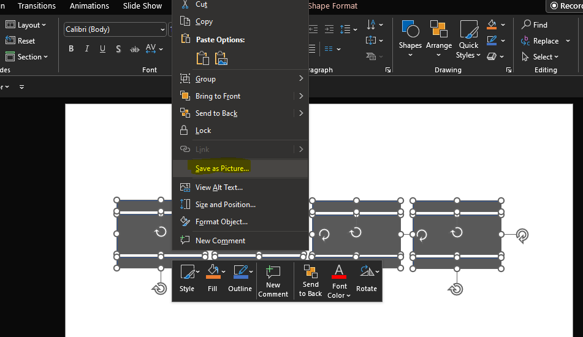

# Cómo crear tus propios mapas y paneles interactivos e importarlos en Power BI?

En este nuevo post abordaremos algunos conceptos más avanzados en cuanto al uso de Power BI y una custom visual llamada "Synoptic Panel". La misma nos permitirá crear visualizaciones interactivas que podremos explotar en Power BI.

*Antes de comenzar, es necesario explicar que utilizaremos Power Point para crear el mapa, y una herramienta llamada "Synoptic Design" que nos ayudará a delimitar las áreas en nuestro mapa o panel.*

**Objetivo: Crearemos una serie de formas que van a simbolizar las calles de una avenida muy transitada de la Ciudad De Córdoba,Argentina. luego exportaremos la imagen y finalmente, la podremos consumir desde Power BI mediante la Custom Visual Synoptic Panel.** 

Comenzamos:

Lo primero es abrir Power Point, crearemos una forma, el rectángulo central simboliza la calle y los rectángulos más angostos son las veredas que separan la calle.

Realizamos el mismo procedimiento copiando y pegando las formas hasta tener una calle al lado de la otra para simbolizar cuatro calles:

Seleccionaremos todas las formas y apretamos clic derecho --> "Save as Picture" para poder exportar la imagen:

Una vez que ya tenemos listo el diseño, nos dirigimos a la URL: https://synoptic.design , esta herramienta permite importar la imagen generada en Power Point y empezar a delimitar las áreas que corresponden a cada calle

Hacemos clic en dónde dice "or insert an image path/URL" y seleccionamos la imagen que creamos en Power Point, el resultado sera algo así:

A partir de acá, empezamos a marcar cada rectángulo que referencia a cada calle y le asignamos un nombre o ID, utilizaremos una secuencia partiendo desde "ID1"

Una vez finalizado el proceso de pintado, se debe hacer clic en el botón amarillo "Export to Power BI" y guardar esta imagen en formato .SVG

Ahora, nos dirigimos a Power BI, luego abrimos Power Query, hacemos clic en "Enter Data" 

y cargamos una serie de valores manuales a modo de ejemplo en dónde nombraremos a la tabla como "Fact_Progresiva_Calle" con los siguientes valores:

Hacemos clic en ok, luego cerramos y aplicamos los cambios:

Para este ejemplo ya se dispone de una tabla calendario y una dimensión de estados, lo que haremos será verificar que el modelo está correctamente relacionado con sus tablas de hechos y dimensiones:

Finalmente, habiendo terminado la parte de diseño, nos dirigimos a nuestro dashboard e iremos al marketplace:

Buscamos la custom visual "Synoptic Panel". Basta con hacer un clic sobre la misma y luego en el botón "Add" para importarla.

Ya tenemos nuestra Custom Visual y la podemos llamar en Power BI, pero esta vacía! Qué falta? 

Bueno, nos falta importar nuestra Imagen en formato .svg, arrastrar el campo ID de la tabla "Fact_Progresiva_Calle" y luego crear una medida para tomar el estado de la calle cada día.

Entonces, empezamos creando una medida llamada "Último estado" para traer el estado de la calle en un determinado día.

Luego arrastramos el campo ID --> Category  
Arrastramos la medida Ultimo_Estado --> Measure

Hacemos clic en "Local maps" para añadir nuestro archivo .svg

Cargamos el archivo

Ok! Ya tenemos casi todo. Solo le faltan los colores que llevaran las calles según el criterio de estados definidos.

Debemos agregar los números que corresponden a cada estado, es decir: 
1 --> Malo  
2 --> Regular 
3 --> Bueno 

Así es el resultado final ordenando un poco los gráficos y agregando un filtro de fecha:

Podemos ir viendo los distintos estados en los que se encuentra la calle con el filtro de fecha y como van variando. 

Y así, es sólo un ejemplo. Podemos crear grandes mapas interactivos de rutas, e incluso, se puede extender el análisis a mucho más que mapas como puede ser, el cuerpo humano con sus distintos órganos,sectores de un edificio,circuitos combinatorios,entre otros ejemplos que pueden encontrar en la pagina oficial de Synoptic Panel.

Espero que les sirva.

Se adjunta el .pbix y las imagenes de la resolución.

# Bibliografía

Power BI https://powerbi.microsoft.com/es-es/

Uso de función Max() https://learn.microsoft.com/es-es/dax/max-function-dax

Synoptic design https://synoptic.design/

Synoptic panel https://okviz.com/synoptic-panel/

 
 

By **Facundo Montenegro**
