# Power BI - Extraer Preguntas de ChatGpt e importarlas en PBI

En este último año la aplicación de la IA se hizo notar muy fuerte en cada ámbito de nuestras vidas, desde lo laboral, lo cotidiano y hasta en el deporte! Ahora.. Alguien probó en extraer las preguntas que le hacemos a Chat GPT  e importarlas en Power BI?
 

En este post, descargaremos el archivo Conversations.json desde la plataforma de OpenAI , lo trabajaremos con Python y luego guardaremos las preguntas en una base de datos de SQL, finalmente, importaremos las preguntas en Power BI.

Consideraciones: 
-Se requiere contar con una cuenta de OpenAI gratuita o no.  
-Contamos con Power BI Dekstop. 
-Contamos con un Server y una base de datos SQL.  
-Utilizaremos notebooks Python con Vb Code.
  

 
-Comenzamos:  
 
Nos dirigimos a https://chatgpt.com/auth/login y hacemos login con nuestro usuario.

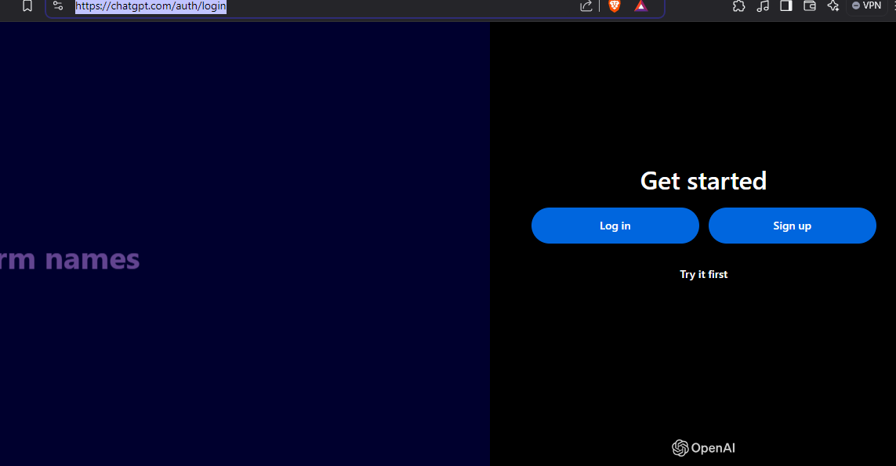

Una vez dentro de la plataforma de OpenAI, vamos a descargar el archivo .json de las preguntas que le hacemos al chat.

* Cómo lo haremos?

Muy sencillo! Nos dirigimos al ícono de nuestro perfil de usuario y hacemos clic en settings.

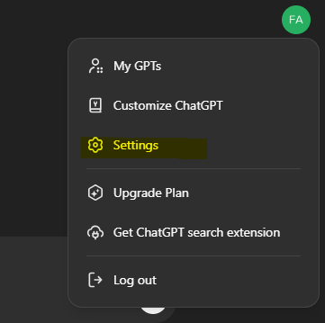

Ahora, hacemos clic en Data Controls -> Export data 

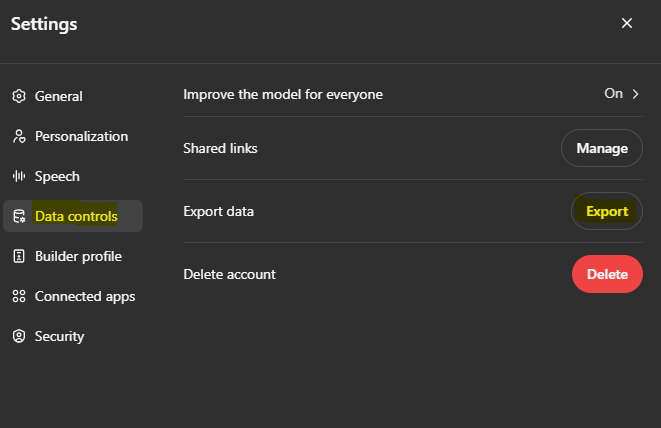

Debemos confirmar que autorizamos el export que nos llegará un archivo .zip al correo de nuestra cuenta.

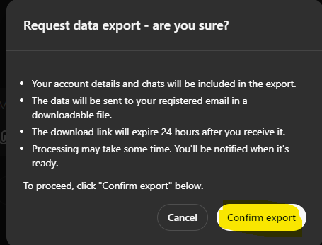

Ahora, nos dirigimos a nuestro correo con la cuenta asociada a OpenAI y podemos ver que ya tenemos el archivo .zip que contiene la información de las preguntas.

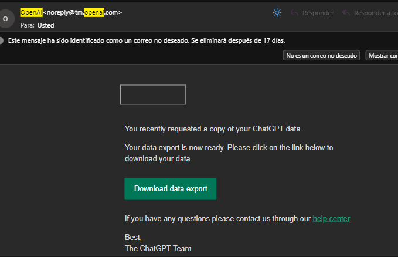

Descomprimimos el .ZIP y utilizaremos el archivo Conversations que lo trabajaremos con Python. (Pueden usar el Ide que deseen, en este caso utilizaremos VB Code)

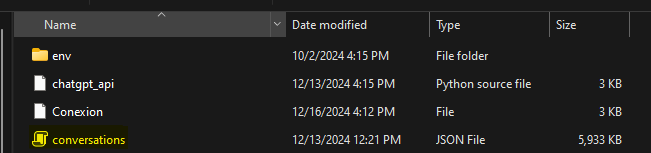

Abrimos VB Code y utilizaremos un archivo ipynb para poder trabajar con dataframes al que le pondremos por nombre "Json_trabajado.ipynb"

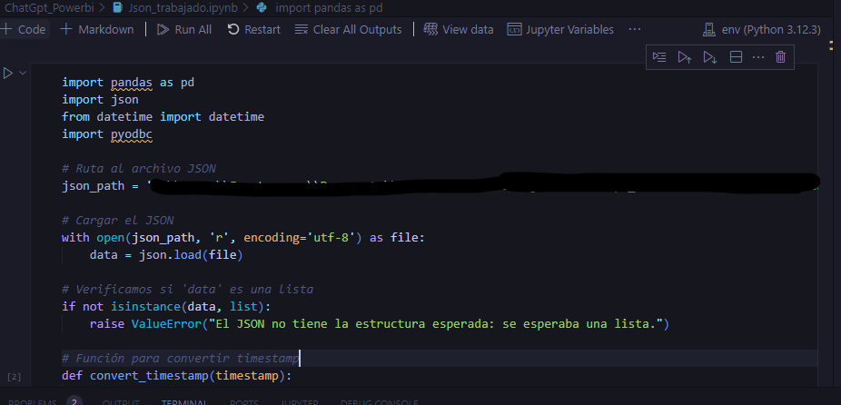

A continuación dejo el código que utilizamos con sus instrucciones y partes en las que deben completar con sus respectivos paths:

* Cabe destacar que no nos enfocaremos en normalizar el json, sino, en extraer sólo los elementos que nos interesan, que son la fecha, título y parts.

<pre><code>

import pandas as pd
import json
from datetime import datetime
import pyodbc

# Ruta al archivo JSON
json_path = 'su ruta'  # Cambia esto por la ruta correcta

# Cargar el JSON
with open(json_path, 'r', encoding='utf-8') as file:
    data = json.load(file)

# Verificamos si 'data' es una lista
if not isinstance(data, list):
    raise ValueError("El JSON no tiene la estructura esperada: se esperaba una lista.")

# Función para convertir timestamp
def convert_timestamp(timestamp):
    if timestamp is not None:
        return datetime.fromtimestamp(timestamp).strftime('%Y-%m-%d %H:%M:%S')
    return None

# Inicializamos una lista para almacenar los resultados
all_parts_list = []

# Recorremos cada elemento de la lista 'data'
for item in data:
    if not isinstance(item, dict):
        continue

    title = item.get('title')
    mapping = item.get('mapping', {})
    create_time = item.get('create_time')

    if not isinstance(mapping, dict):
        continue

    for value in mapping.values():
        message = value.get('message')
        if not isinstance(message, dict):
            continue

        content = message.get('content', {})
        parts = content.get('parts', [])

        extracted_parts = []
        for part in parts:
            if isinstance(part, str):
                extracted_parts.append(part)
            elif isinstance(part, dict):
                extracted_parts.append(part.get('text', ''))

        extracted_text = ' '.join(filter(None, extracted_parts))

        if extracted_text:
            all_parts_list.append({
                'title': title,
                'parts': extracted_text,
                'create_time': convert_timestamp(create_time)
            })

# Convertimos la lista a un DataFrame
df = pd.DataFrame(all_parts_list)

# Agrupar por título y reorganizar en pares
result = (
    df.groupby(["title", "create_time"])["parts"]
    .apply(lambda group: pd.DataFrame({
        "pregunta": group.iloc[::2].reset_index(drop=True),
        "respuesta": group.iloc[1::2].reset_index(drop=True)
    }))
    .reset_index(level=[0, 1])
)

# Renombrar las columnas
result.rename(columns={
    'title': 'Encabezado',
    'create_time': 'Fecha',
    'pregunta': 'Pregunta',
    'respuesta': 'Respuesta'
}, inplace=True)

# Validación y limpieza de datos
result['Encabezado'] = result['Encabezado'].astype(str).fillna('')
result['Fecha'] = pd.to_datetime(result['Fecha'], errors='coerce').fillna(datetime.now())
result['Pregunta'] = result['Pregunta'].astype(str).fillna('')
result['Respuesta'] = result['Respuesta'].astype(str).fillna('')

# Configuración de conexión a SQL Server
server = 'su sv de base de datos'
database = 'su base de datos'
username = 'usuario'
password = 'password'

# Crear la conexión
conn = pyodbc.connect('DRIVER={ODBC Driver 18 for SQL Server};'
                      f'SERVER={server};'
                      f'DATABASE={database};'
                      f'UID={username};'
                      f'PWD={password};')

# Crear un cursor
cursor = conn.cursor()

# Nombre de la tabla
table_name = 'dbo.HistorialChatGPT'

# Crear la tabla automáticamente si no existe
sql_create_table = f"""
CREATE TABLE {table_name} (
    [Encabezado] NVARCHAR(MAX),
    [Fecha] DATETIME,
    [Pregunta] NVARCHAR(MAX),
    [Respuesta] NVARCHAR(MAX)
)
"""
try:
    cursor.execute(f"IF OBJECT_ID('{table_name}', 'U') IS NULL BEGIN {sql_create_table} END")
    conn.commit()
    print(f"Tabla '{table_name}' creada o ya existente.")
except Exception as e:
    print(f"Error al crear la tabla: {e}")

# Insertar datos en la tabla
try:
    for _, row in result.iterrows():
        cursor.execute(f"""
            INSERT INTO {table_name} ([Encabezado], [Fecha], [Pregunta], [Respuesta])
            VALUES (?, ?, ?, ?)
        """, row['Encabezado'], row['Fecha'], row['Pregunta'], row['Respuesta'])
    conn.commit()
    print("Datos guardados exitosamente en SQL Server.")
except Exception as e:
    print(f"Error al insertar datos: {e}")
finally:
    # Cerrar la conexión
    conn.close()

</code></pre>

Si hacemos un stop hasta antes de crear la conexión con la base de datos podemos verificar que nuestro código se ejecuta correctamente solamente escribiendo la palabra "result" que almacena nuestra variable con el dataframe resultante.

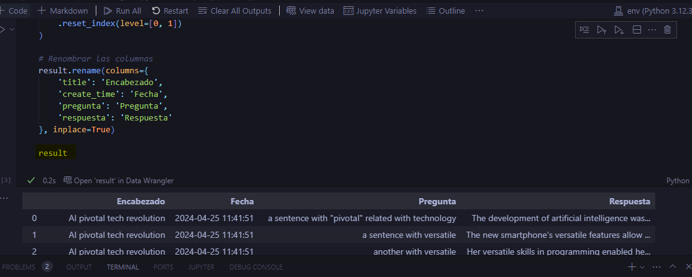

Ahora, agregamos la cadena de conexión con la db y el manejo de como se insertan los datos en nuestra tabla de SQL.

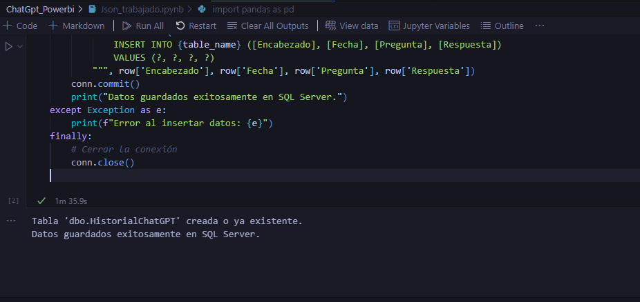

Listo! Ya insertamos los datos en la database, ahora, como podemos verificarlo? 
Simple. Solo hacer un select a la tabla en SQL

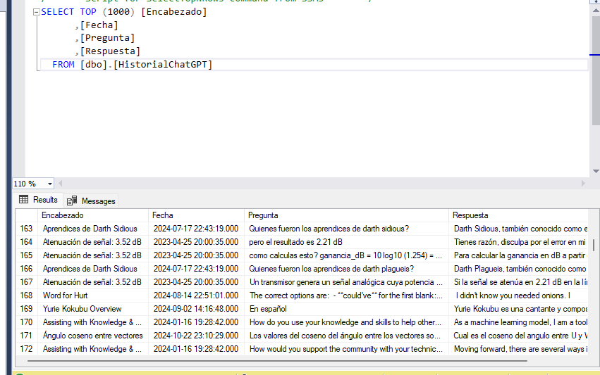

Como pueden ver, el tratamiento de este json hizo especial énfasis en el encabezado de la pregunta.

* Qué es el encabezado? Básicamente es la pregunta inicial que se le hace al chat y que luego continua con una serie de preguntas, las preguntas subsiguientes forman parte de una primera pregunta encabezado.

Le sigue la fecha de la pregunta, la pregunta y su correspondiente respuesta. 

Entonces, ya tenemos toda la data almacenada, y ahora....

# Como importamos la data en Power BI?

Simple! Primero, abrimos Power BI Desktop y luego en get data, elegimos "SQL Server database" y escribimos nuestro server

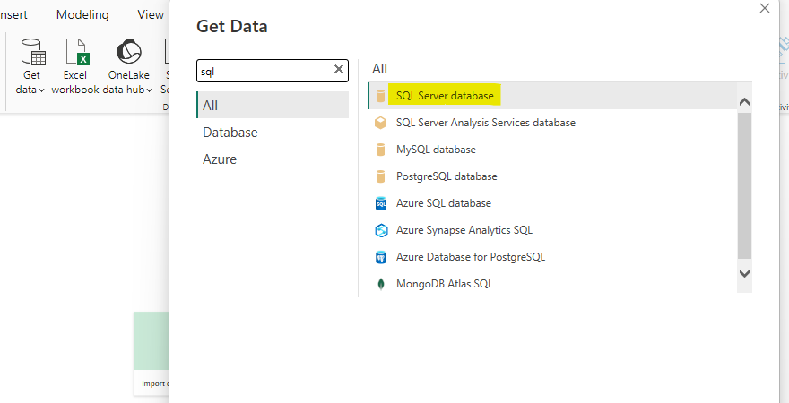

Una vez ingresado el server, seleccionamos la tabla que necesitaremos, en nuestro caso "HistorialChatGPT" y la cargamos.

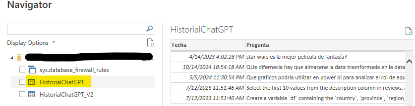

Ahora sí! con nuestros datos importados, Podemos utilizarlos para hacer analítica descriptiva en Power BI, por ejemplo, con un Wordcloud de las preguntas más frecuentes:

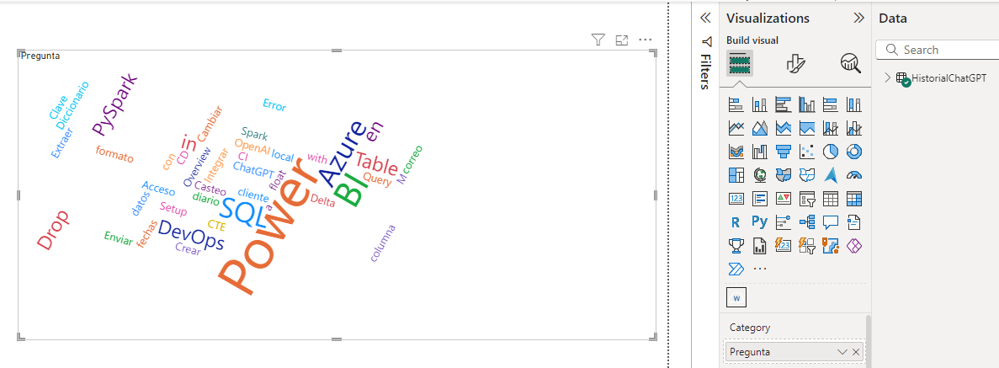

Y si! Lo que más le consulté al Chat fue de Power BI :D 

 

# Síntesis

Cómo una pequeña síntesis, lo que hicimos fue, descargar la data de la plataforma de OpenAI en un archivo .json, lo trabajamos en Python con notebooks, lo guardamos en una tabla SQL especialmente creada para este procedimiento, finalmente importamos los datos en Power BI. Podríamos automatizarlo? Claro, con un pipeline de Data Factory.

 

Esperamos que les sirva, muchas gracias.

# Bibliografía

https://app.powerbi.com/

https://jupyter.org/

https://pandas.pydata.org/

https://chat.openai.com/

---

By **Facundo Montenegro & Federico Soler**
