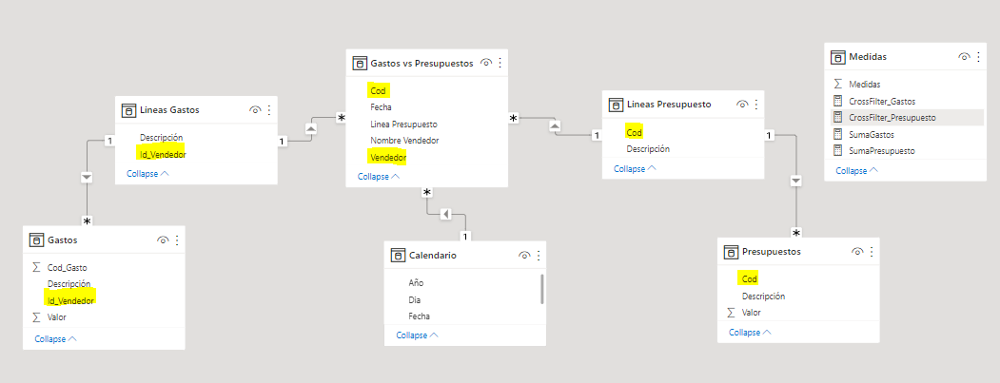
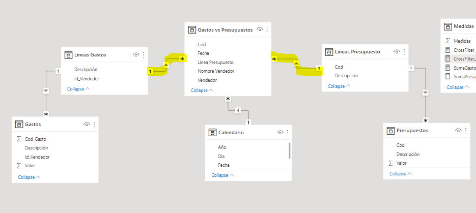
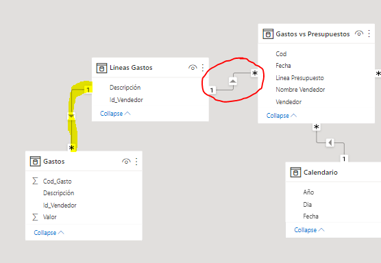
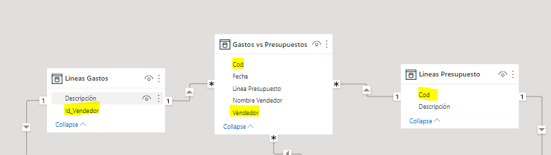
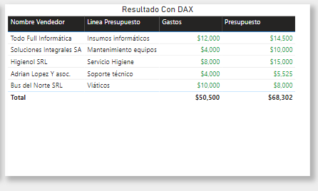

# Cómo crear una relación bidireccional usando DAX? 

Para los desarrolladores de BI se suele presentar un escenario particular en el cual necesitamos filtrar información de dos tablas por igual para obtener un resultado de otra relación con otra tabla. Estas relaciones son las llamadas **Bidireccionales**.

Generalmente, se debe evitar este tipo de relaciones ya que,pueden afectar negativamente al rendimiento de la consulta del modelo y, posiblemente, ofrecer experiencias confusas para los usuarios del informe, **sin embargo**, existe la posibilidad de no alterar el modelo de datos utilizando DAX.

**Existe una función de DAX para implementar este tipo de relación?**

**Sí!** La misma es CROSSFILTER()

Cuál es su formato?

- CROSSFILTER(columnName1, columnName2, direction) 

--- 

# Ejemplo de aplicación de relación bidireccional

Dado el siguiente modelo, queremos sumar el total de Gastos perteneciente a la tabla **Gastos** y el total del presupuesto perteneciente a la tabla **Presupuestos** y así obtener **Cuánto presupuesto tenemos para nuestros gastos**.

- La forma de relacionar la tabla **Gastos** con la tabla **Gastos vs Presupuestos** es mediante el campo **Id_Vendedor**.

- La forma de relacionar la tabla **Presupuestos** con la tabla **Gastos vs Presupuestos** es mediante el campo **Cod**.

Una vez creadas las relaciones entre nuestras tablas, podemos utilizar una herramienta de visualización como lo es Microsoft Power BI para visualizar los campos en una tabla como en la siguiente imagen:

En esta tabla Arrastramos los siguientes campos:

- 'Gastos vs Presupuestos'[Nombre Vendedor]
- 'Gastos vs Presupuestos'[Línea Presupuesto]
-  Medidas[SumaGastos]
-  Medidas[SumaPresupuesto]

Si observamos bien, pudimos establecer la relación entre la tabla **Gastos vs Presupuestos** con los nombres de vendedores y las líneas de presupuestos que le corresponden, pero no así, el valor de **Gastos** ni de **Presupuestos** para c/u.

Cuál es el problema y cual la solución en este caso?

El problema, es básicamente la falta de un filtro que llegue desde la tabla **Gastos vs Presupuestos** hasta la tabla **Gastos** y desde la tabla **Gastos vs Presupuestos** hasta la tabla **Presupuestos** .

 Si observamos bien, tomaremos el caso de Gastos, y veremos que el filtro desde la tabla **Líneas Gastos** a tabla **Gastos** se produce correctamente, pero **Nunca** llegaremos a la tabla **Gastos vs Presupuestos** si no cambiamos la relación. 
 
 La solución entonces, es una **Relación Bidireccional**.

Como implementarla sin afectar al modelo?

Sencillo, Utilizamos DAX, tanto para obtener las líneas de presupuestos como de gastos. Para eso crearemos dos medidas diferentes con el siguiente código:

~~~
Medida 1:

CrossFilter_Gastos = 
CALCULATE (
    Medidas[SumaGastos],
    CROSSFILTER ( 'Lineas Gastos'[Id_Vendedor], 'Gastos vs Presupuestos'[Vendedor], BOTH )
)

Medida 2:

CrossFilter_Presupuesto = 
CALCULATE (
    [SumaPresupuesto],
    CROSSFILTER ( 'Lineas Presupuesto'[Cod], 'Gastos vs Presupuestos'[Cod], BOTH )
)

~~~

Con esto logramos relacionar los campos de las tablas izquierdas con la tabla **Gastos vs Presupuestos** 

Y una vez que coloquemos nuestras medidas en la tabla podremos visualizar correctamente la aplicación de nuestra relación bidireccional con DAX sin alterar nuestro modelo de datos:

**Se adjunta el archivo .PBIX en la presente Folder para poder probar**

# Bibliografía

Dax CrossFilter https://docs.microsoft.com/en-us/dax/crossfilter-function

Uso de relaciones Bidireccionales https://docs.microsoft.com/es-es/power-bi/guidance/relationships-bidirectional-filtering#:~:text=Una%20relaci%C3%B3n%20bidireccional%20es%20aquella%20que%20se%20filtra%20en%20ambas%20direcciones.

---

By **Facundo Montenegro**
